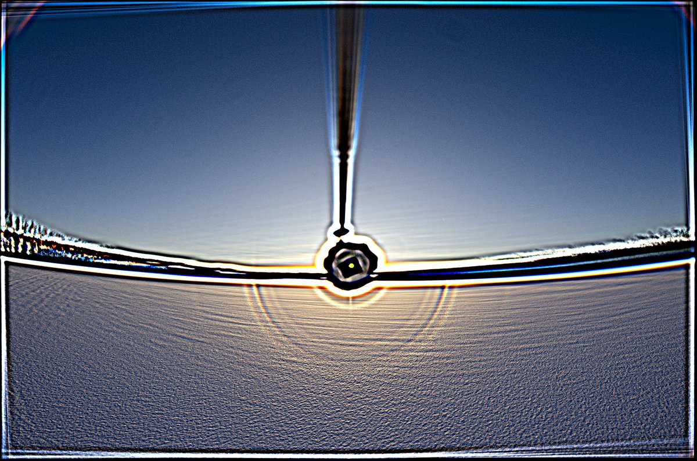
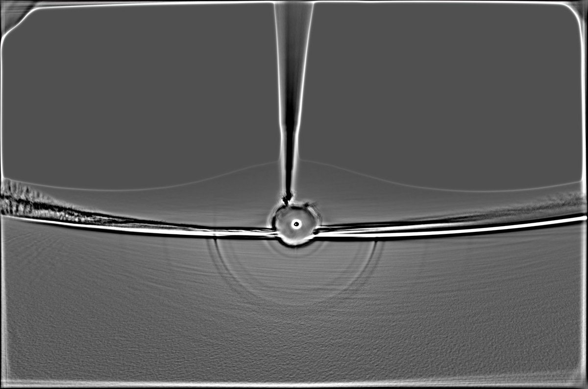
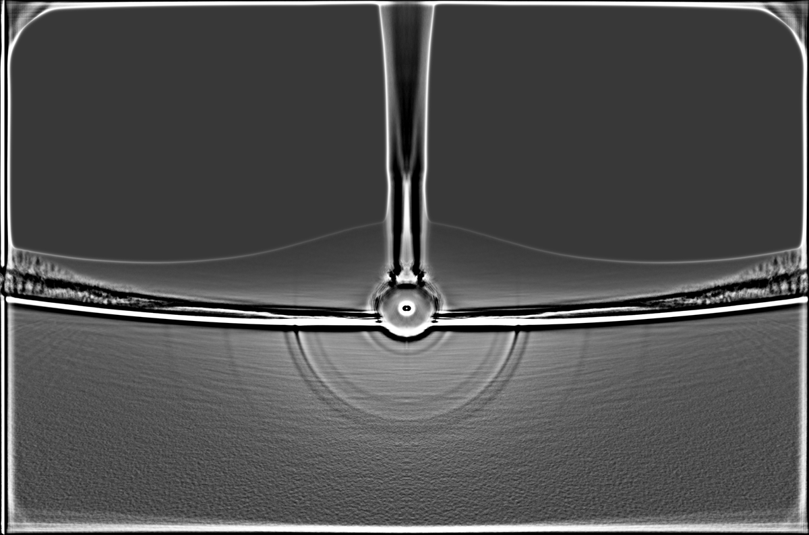
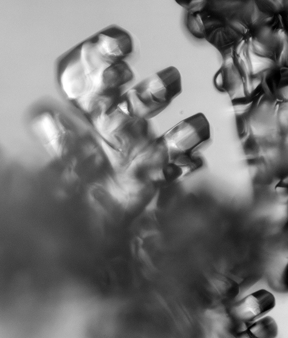
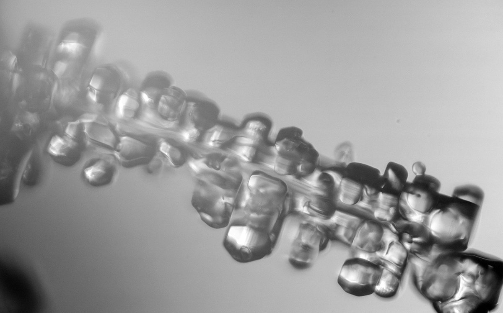
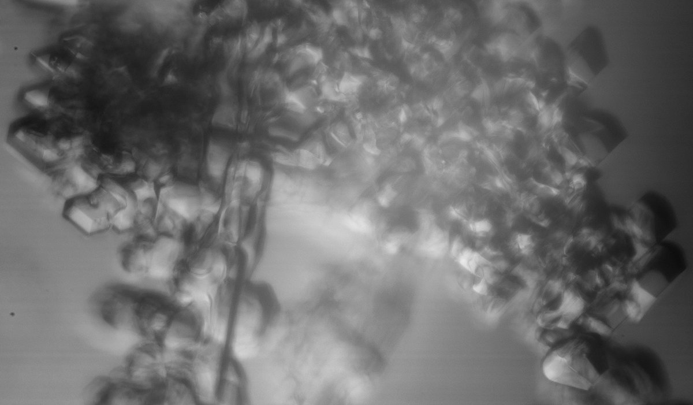
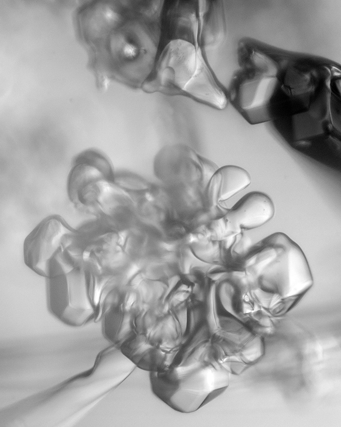

# Thread - 2023-11-20

**Original:** https://x.com/RiikonenMarko/status/1726519511539700218

---

### 1/2 - 2023-11-20 08:35 UTC

1/2. A surface odd radius halo display on lake Norvalampi in Rovaniemi on 11 November. 93 frame max stack and three versions of 1133f average stack (one flip-stacked). 9° halo was weakly visible to the eye as well as 24°.

---

### 2/2 - 2023-11-20 08:35 UTC

2/2. Crystals of the 11 Nov odd radius display. Some pyramids indeed seem to be present.

---

