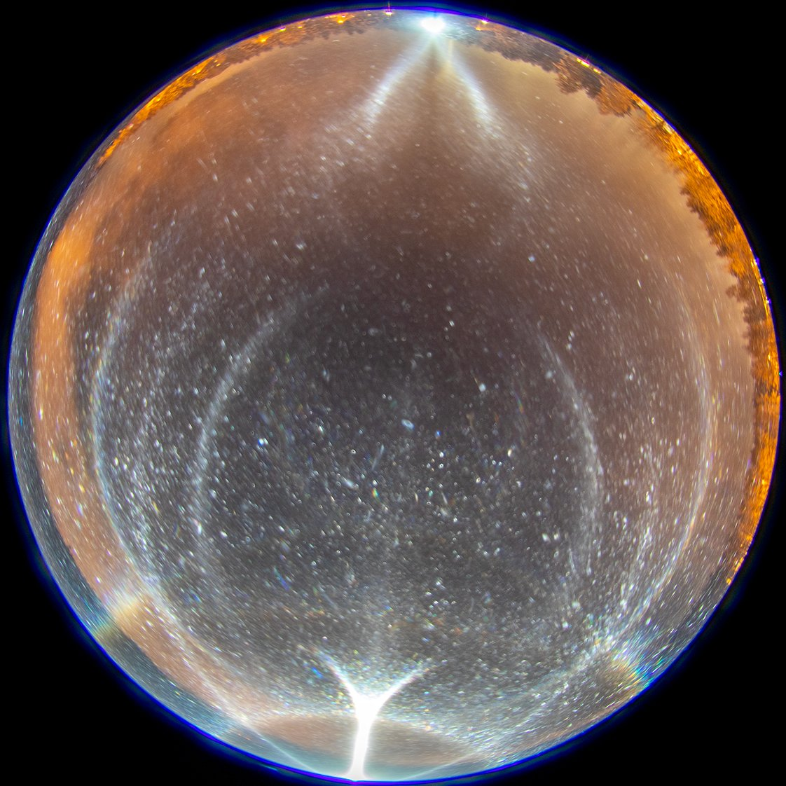
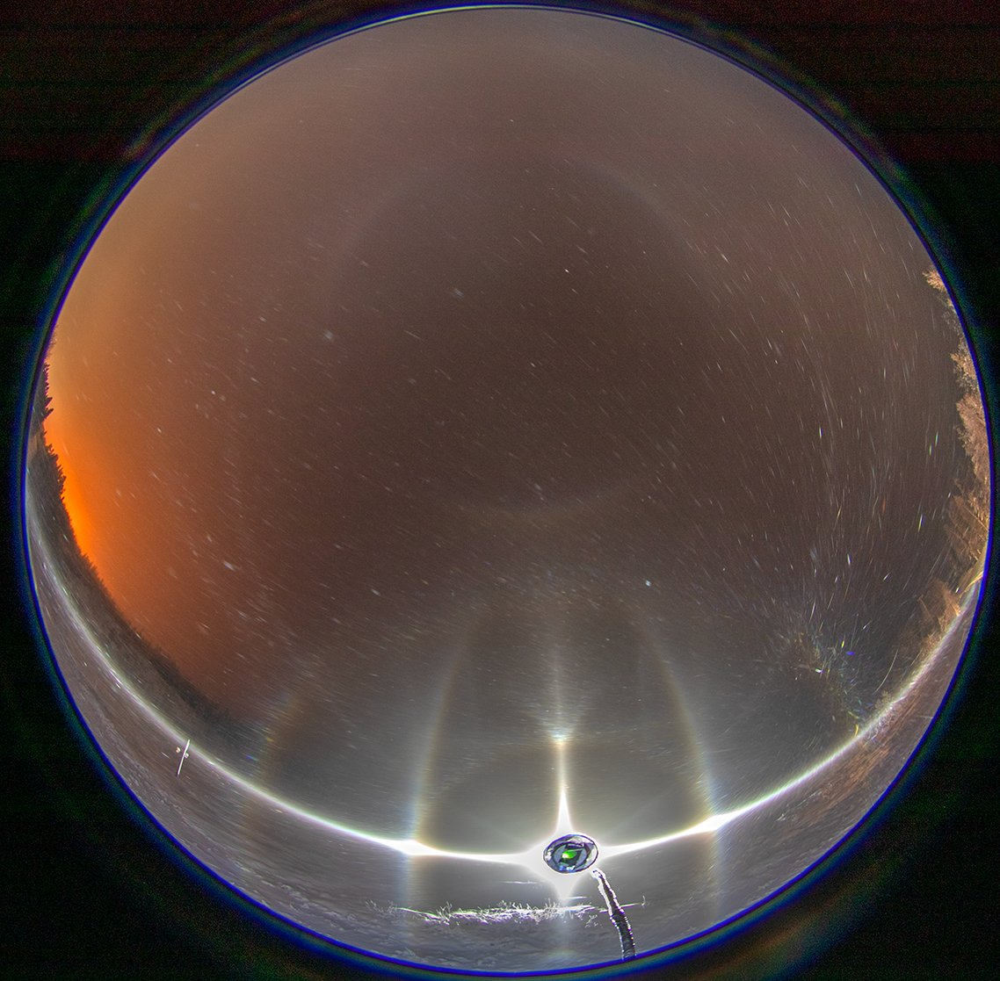
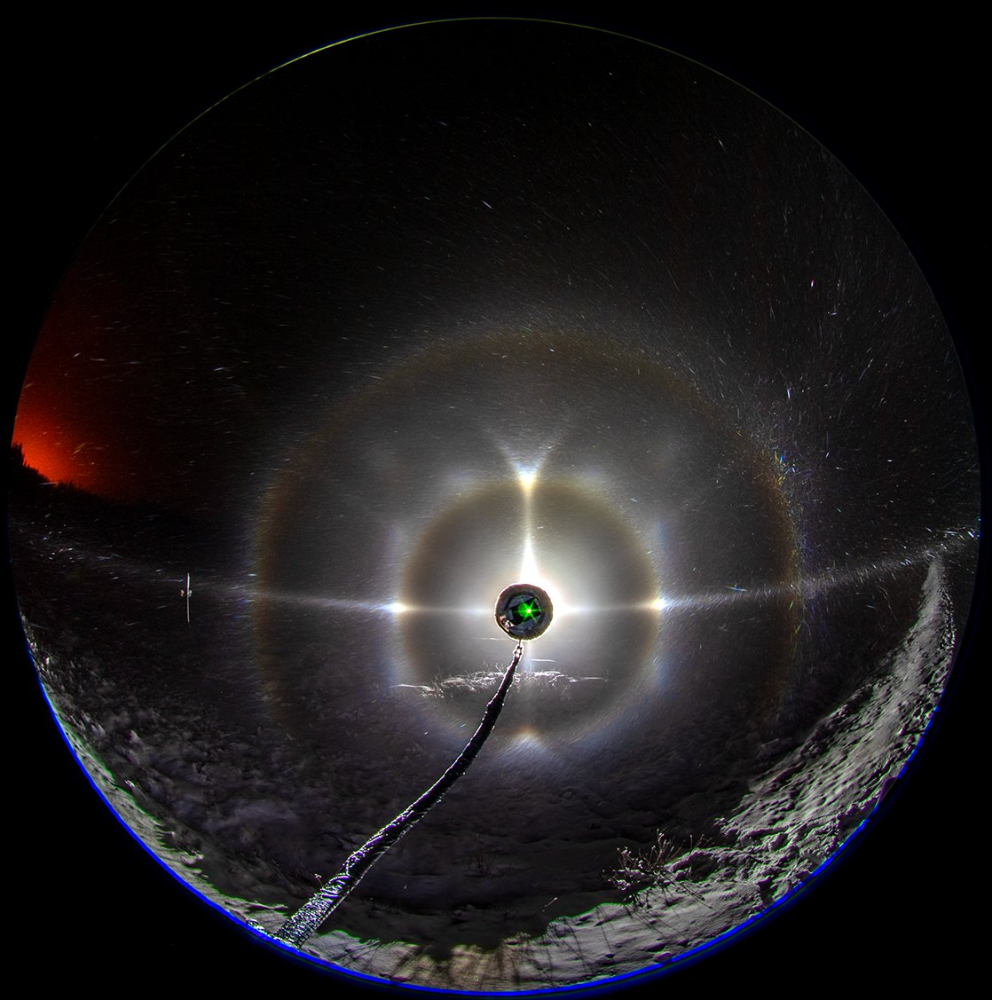
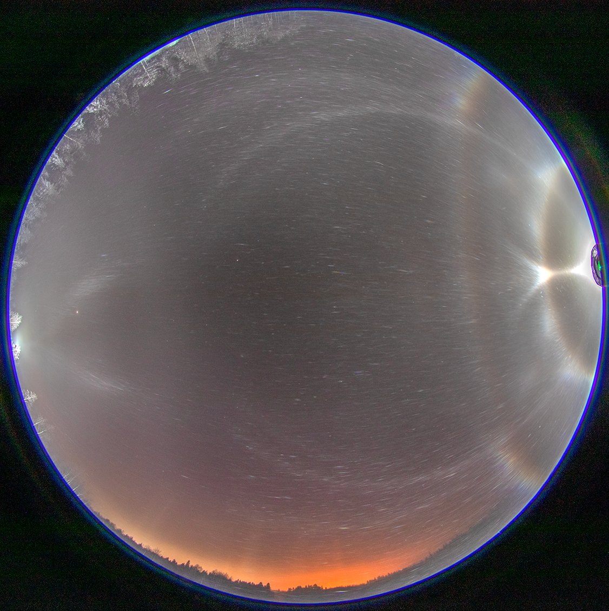

# Thread - 2023-11-20

**Original:** https://x.com/RiikonenMarko/status/1726581198372438326

---

### 1/1 - 2023-11-20 12:40 UTC

Preliminary single images from the night of 10/11 Nov in Rovaniemi. Fog / Stratus was turning into ice crystals. The odd radii was total surprise given the temps likely were no colder than -12 C. The identity of spots at 11 and 13 clock positions still need to be clarified.

---

