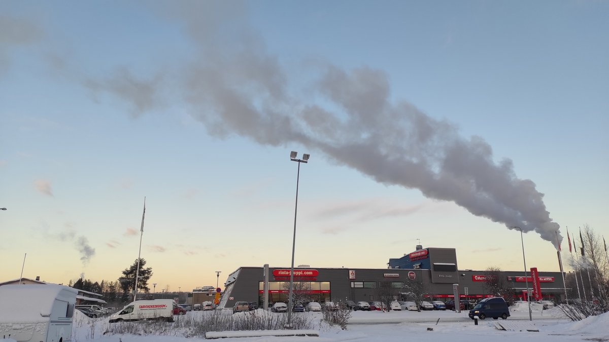

# Thread - 2023-11-27

**Original:** https://x.com/RiikonenMarko/status/1729128820714729752

---

### 1/1 - 2023-11-27 13:23 UTC

The temporary cloud area cleared up before midnight and I got up at 3:00 in expectation for conditions having gotten better. Nothing. Totally dry despite the calm and freeze. At the Toramo pit it was -32 C, on the other side of the hill at the ski center -22 C. Well, to be exact, there were microdisplays from my throwing of snow in the air at the Toramo pit, but those are just for passing fun in lack of the actual stuff.

So at 6:30 I called it quits. On a way back the river had started steaming at Jätkänkynttilä, so I gathered maybe daylight will bring ice fog. No such luck, as the threadbare power plant plume demonstrates. Was planning to photograph a surface display, but sun got behind Sc area (weak pillar was seen above and below it). Anyway, the surface display was poor.

Now waiting for the darkfall, but I have no high hopes for improvement.

---

