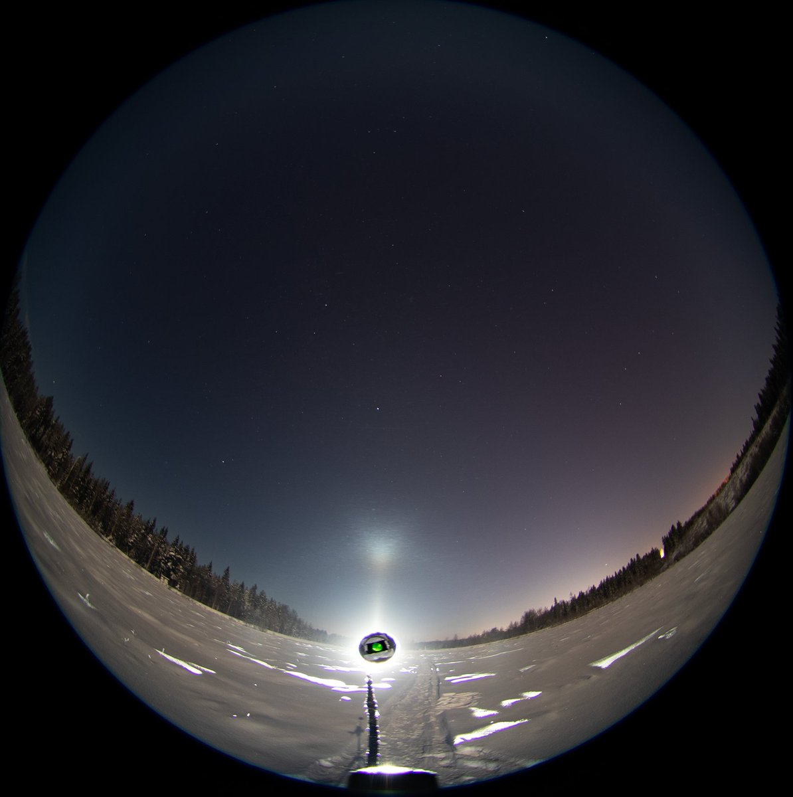
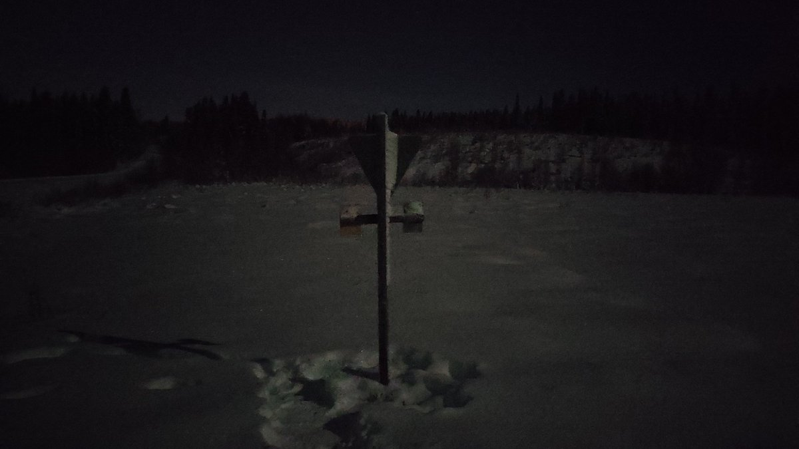

# Thread - 2023-11-28

**Original:** https://x.com/RiikonenMarko/status/1729451830696931583

---

### 1/1 - 2023-11-28 10:47 UTC

This first shot, of a fleeting tangent arc at the Toramo pit, is basically all I got last night. Probably it was caused by movements in the pit, most likely a passing car. I don't think any snow gunning stuff was coming this direction.

Even colder than previous night. The thermometer placed at about 1.5 meters elevation on the road sign (the other photo) at the pit gave -34 C when I left to the other side of Ounasvaara. There, at the golf course poor ice fog was present, but it vanished just when I got set up. I waited some but in the end the gunning plumes dried up so much that I left around 22.

Need to check that thermometer with another one I have. Maybe it is giving too low readings. But Toramo pit is one of the cold spots. The ski center on the other side hill is at about the same elevation, but is more like warm spot.

During the night the temp rose and wind increased. Possibly it is not until weekend that there are conditions again.

---

