# Thread - 2023-11-29

**Original:** https://x.com/RiikonenMarko/status/1729898684932887052

---

### 1/4 - 2023-11-29 16:22 UTC

Stage 1 - 1/4 - November 20/21.

A quite long run this night and I got crystal samples from different stages that were all plate dominated. In a couple of following threads I will present these stages with the associated samples. The ice fog was result of a stable weather period of fog / low hanging stratus. The preceding and following day had an all-day fogbow hanging in the sky. Interestingly, it was visible even as sun was not shining most of the time.

Here is video of the first (very stable) stage that I sampled. 71 frames 17:54-18:20, exposure times 10s for most.

[🎬 1729898684932887052-d2adCMgBj1P3Lks5.mp4](media/1729898684932887052-d2adCMgBj1P3Lks5.mp4)

---

### 2/4 - 2023-11-29 16:32 UTC

Stage 1 – 2/4 – November 20/21.

Average stacked versions of 69 frames in the video (17:56-18:20) and crystals. Collection started right after halo photography started, microscopy 18:08-18:20.

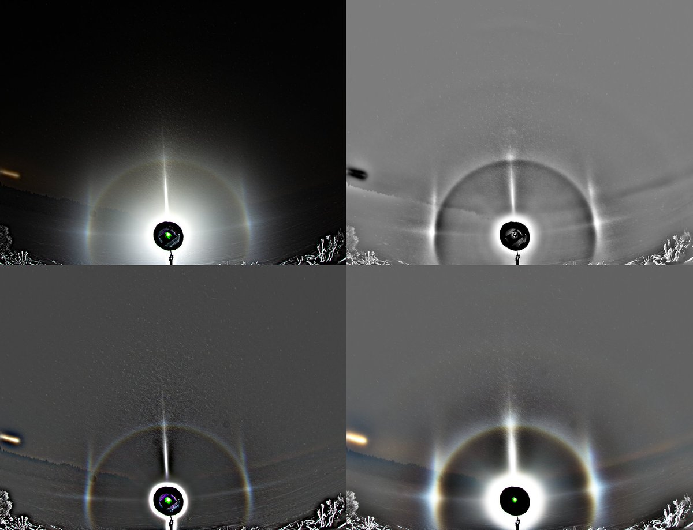

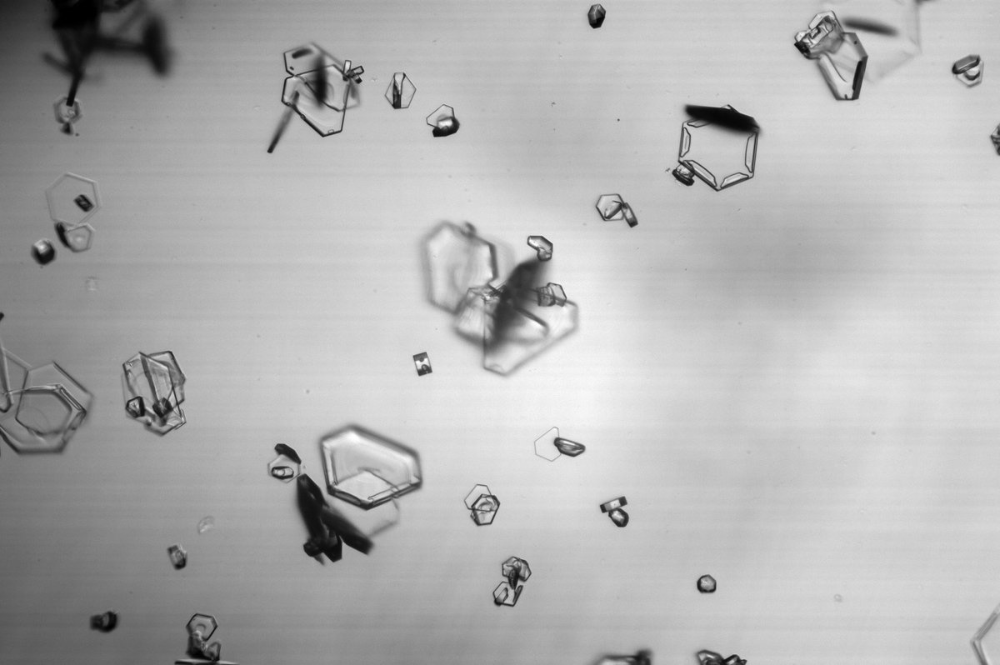

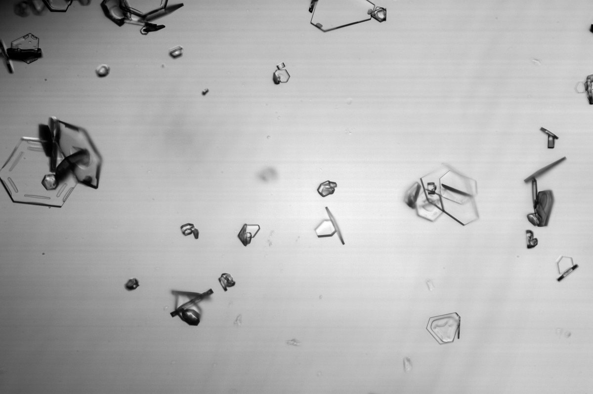

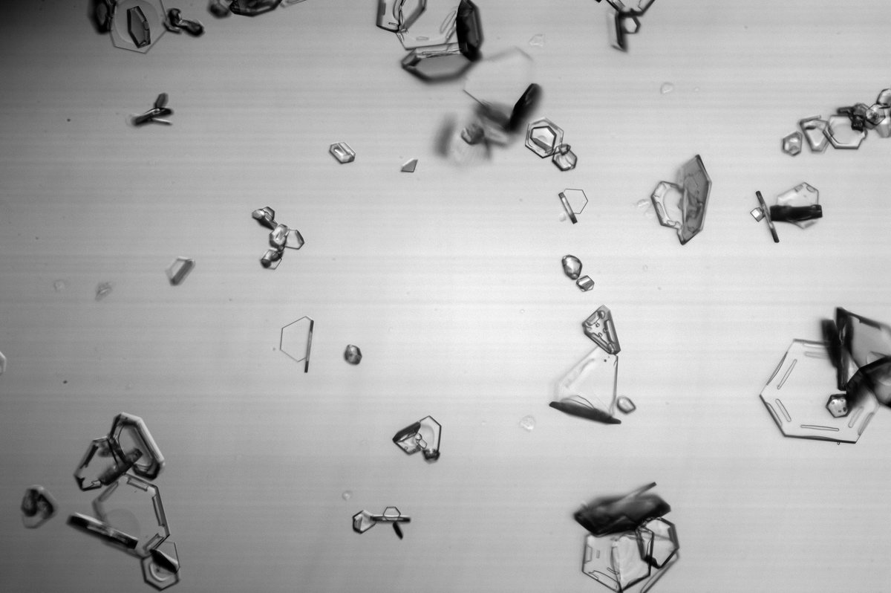

---

### 3/4 - 2023-11-29 16:35 UTC

Stage 1 – 3/4 – November 20/21.

More crystals. Given the diminutive 22° tangent arc / uppervex Parry in the display, notice the (almost) lack of columns.

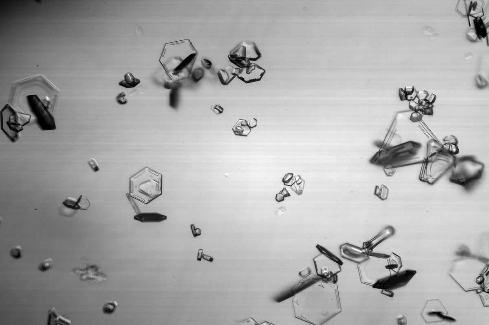

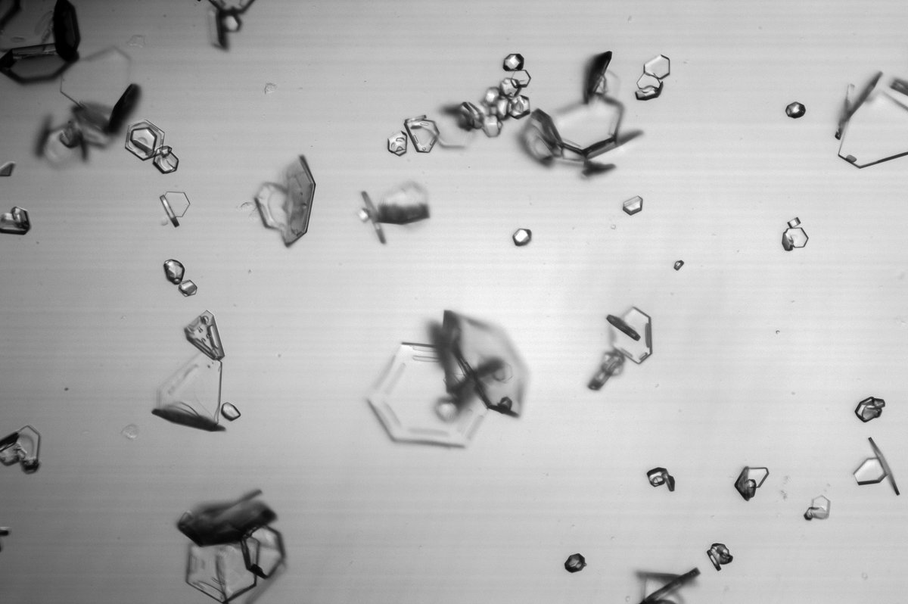

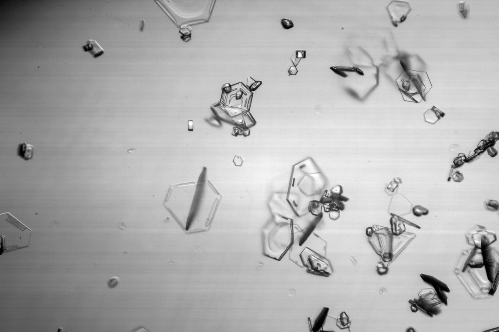

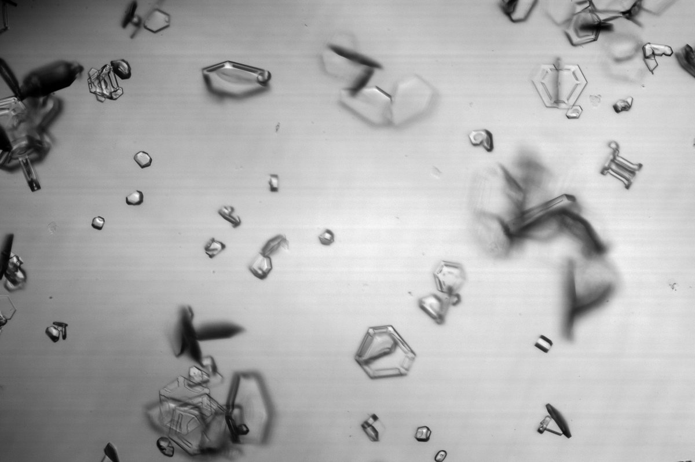

---

### 4/4 - 2023-11-29 16:38 UTC

Stage 1 – 4/4 – November 20/21.

More crystals. Looks like some pyramids in there. It is not unusual to see an odd pyramid even if there are no related halos, as is the case here. Or is there 9° halo? Not convinced because I see more funny rings outside it, best shown by the b-r image in the collage (2/4).

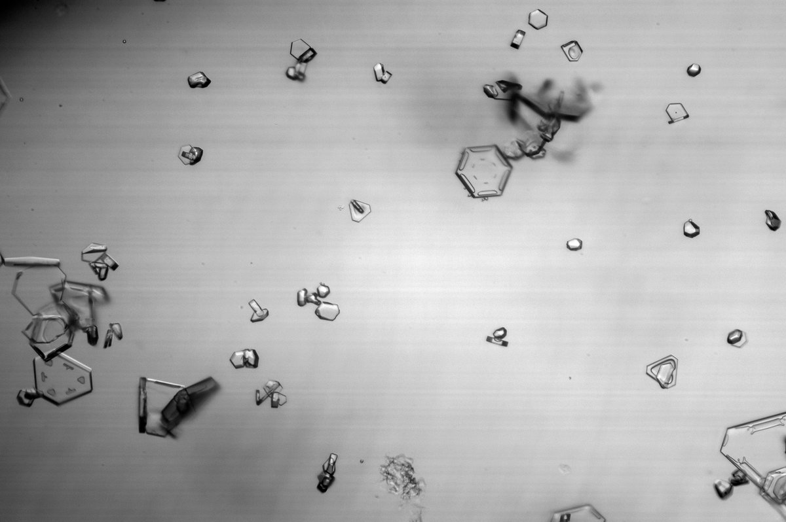

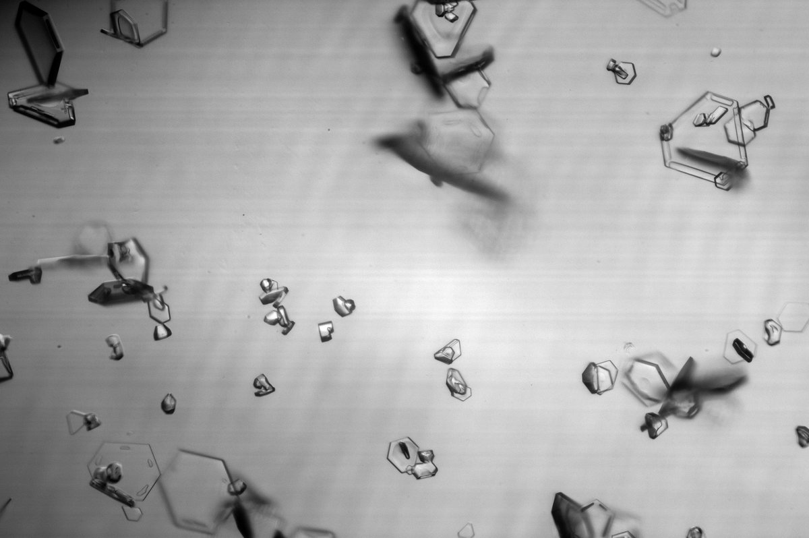

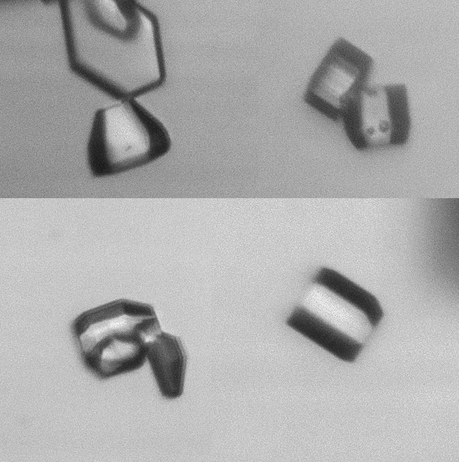

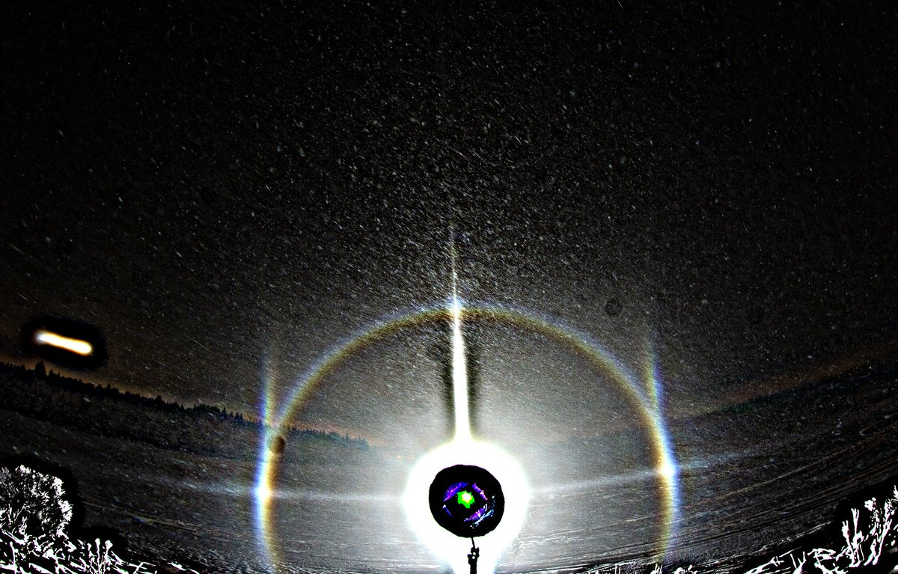

---

