# Thread - 2023-11-29

**Original:** https://x.com/RiikonenMarko/status/1729915596010102978

---

### 1/3 - 2023-11-29 17:29 UTC

Stage 2 – 1/3 – November 20/21.

This was really just continuation of stage 1, no change in the display. But as I happened to take a second crystal sample, I present it here separately.

32 frames 18:21-18:33, very stable display. Xtal collection start time not known, but later than stage 1. Microscopy 18:20-18:33 (crystals are continuously falling on the dish during microscopy). 

As to the crystal samples in general, I take them next to the camera. There is no trusting that, say, 100 meters away the display is exactly the same. The closer to the guns you are, the sharper the boundaries.

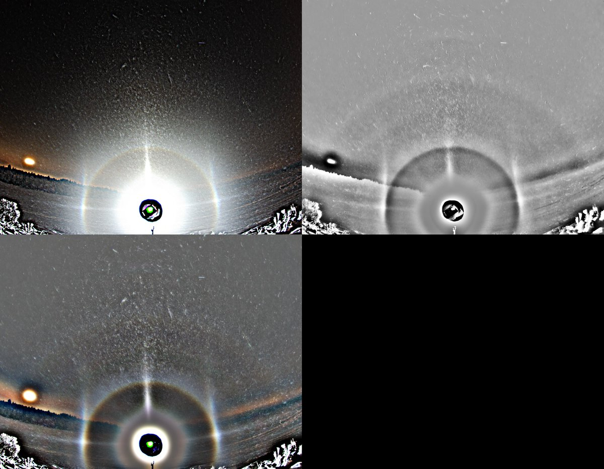

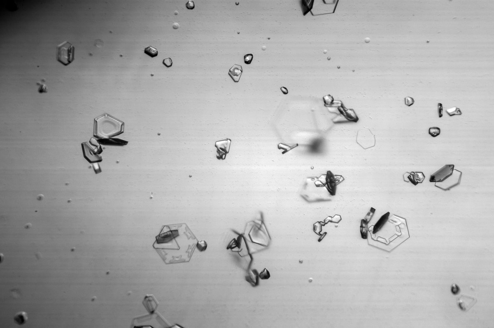

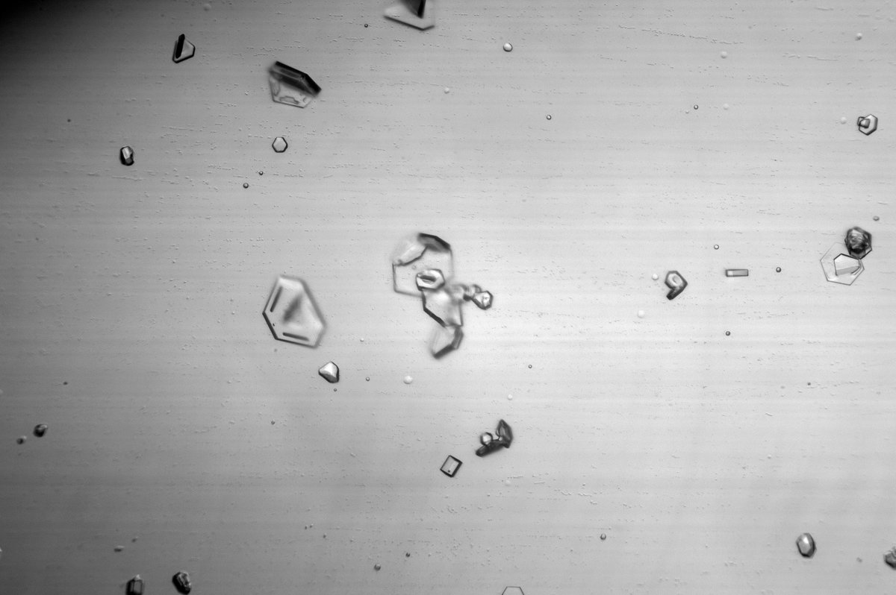

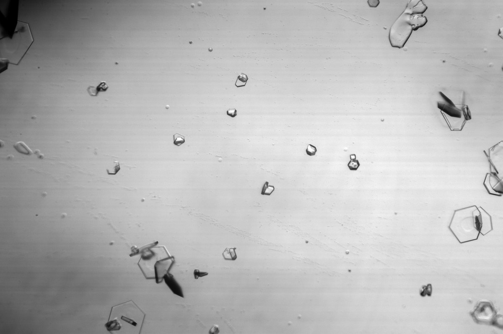

---

### 2/3 - 2023-11-29 18:15 UTC

Stage 2 – 2/3 – November 20/21. Perhaps a few more columns in this set than stage 1. I don't quite spot any pyramids, though it is not out of question that some of those small deformed crystals have pyramid faces. We have photographed an odd radius display with such unorthodox pyramids before.

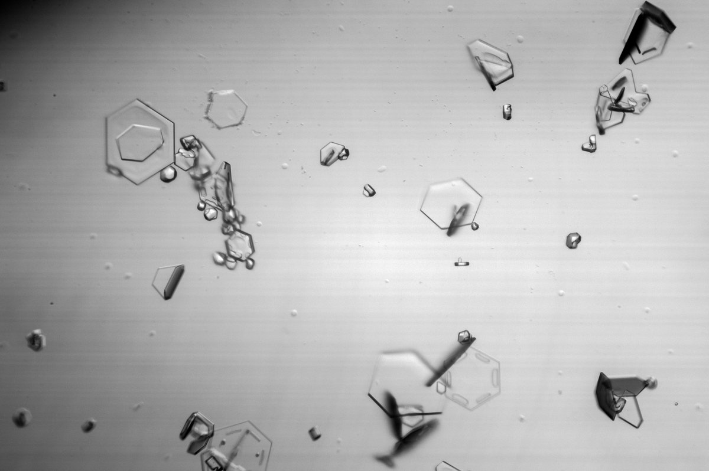

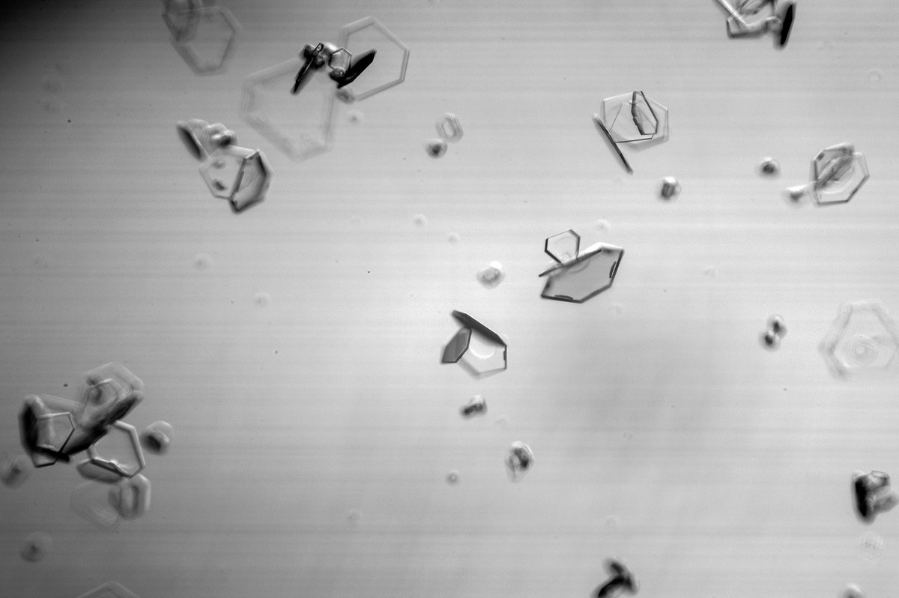

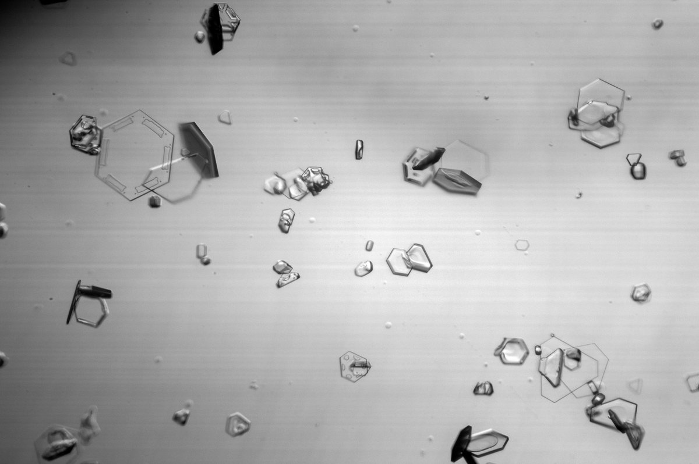

---

### 3/3 - 2023-11-29 18:17 UTC

Stage 2 – 3/3 – November 20/21. More crystals.

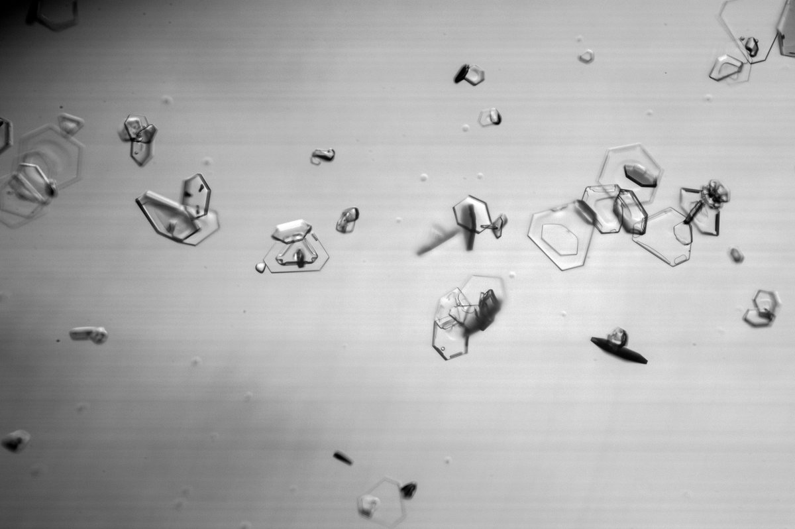

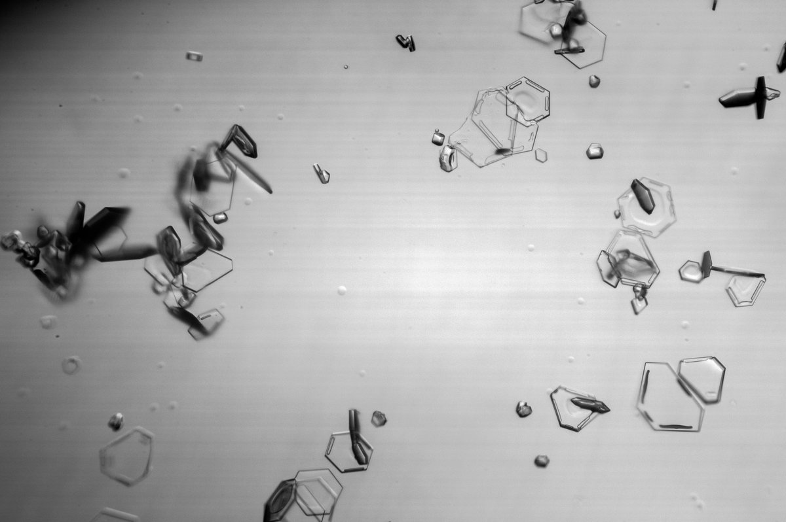

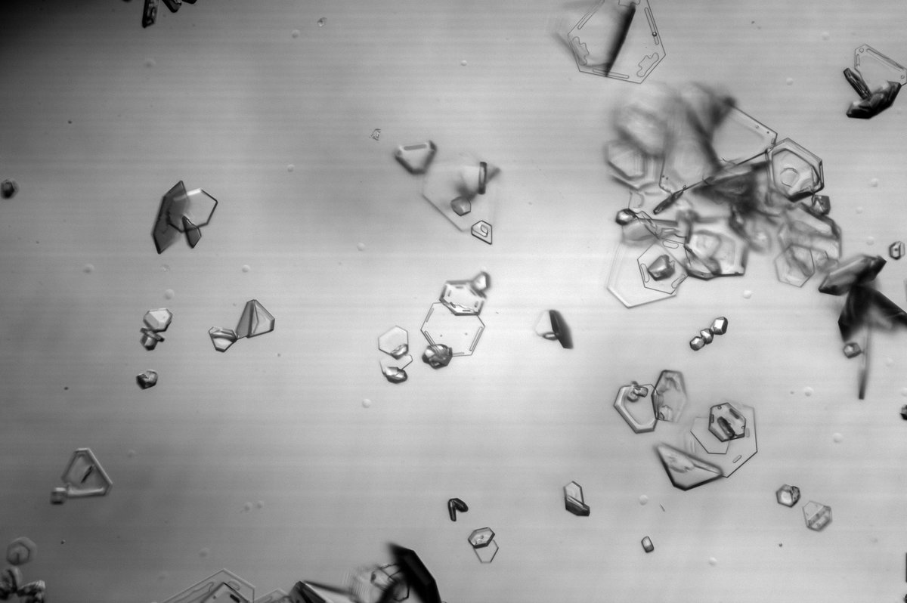

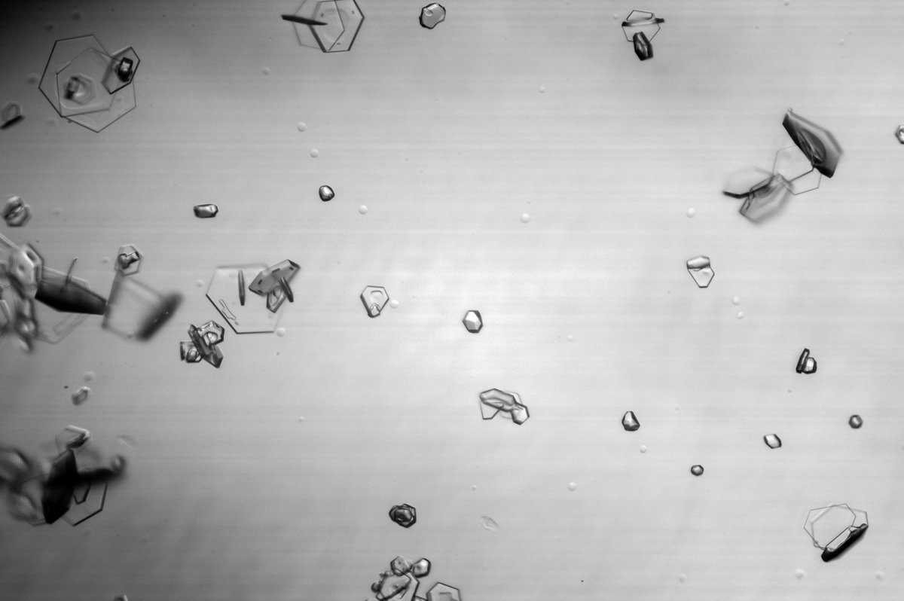

---

