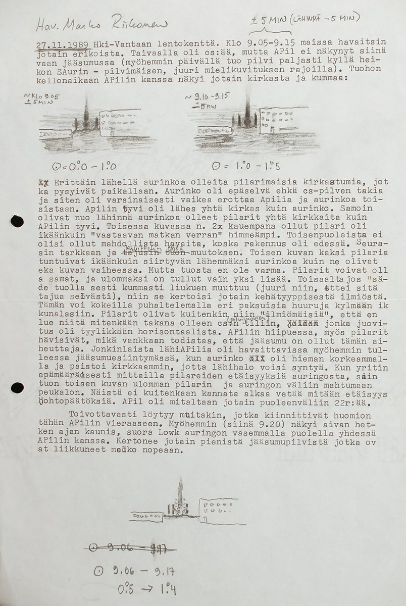

# Thread - 2023-11-30

**Original:** https://x.com/RiikonenMarko/status/1730324785916223798

---

### 1/1 - 2023-11-30 20:35 UTC

Let's add this observation of strange pillars flanking the sun that I made on 27 Nov 1989 at the Helsinki-Vantaa airport. I was working as a dishwasher and peeked out from a narrow ventilation window. This was ice fog with Cs in the background. In the account I tell about an appearance of another outer pillar and also about how their distance seemed to change at some point, though I say I am not sure about it. At 9:20 there was a momentary vertical parhelion visible, the strange pillars no more visible then as I understand it from the account.

---

