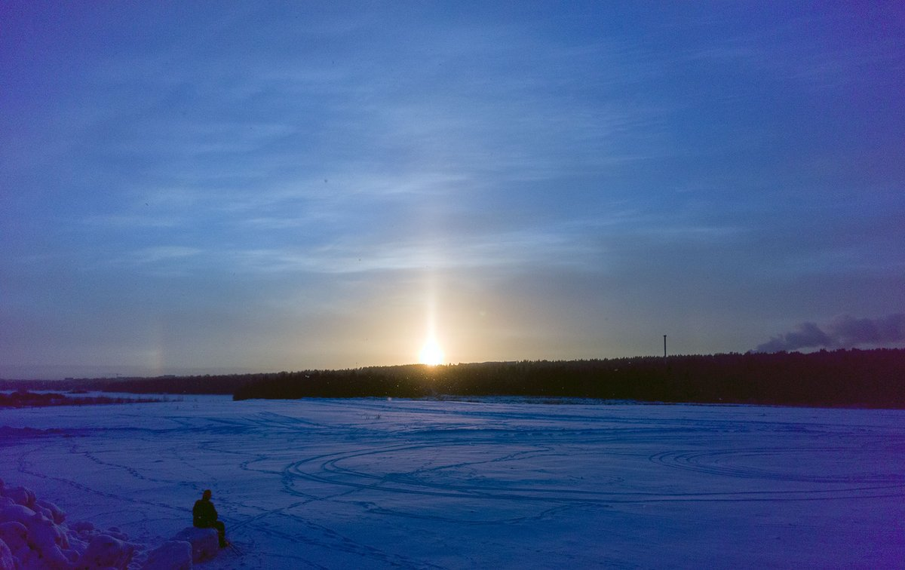
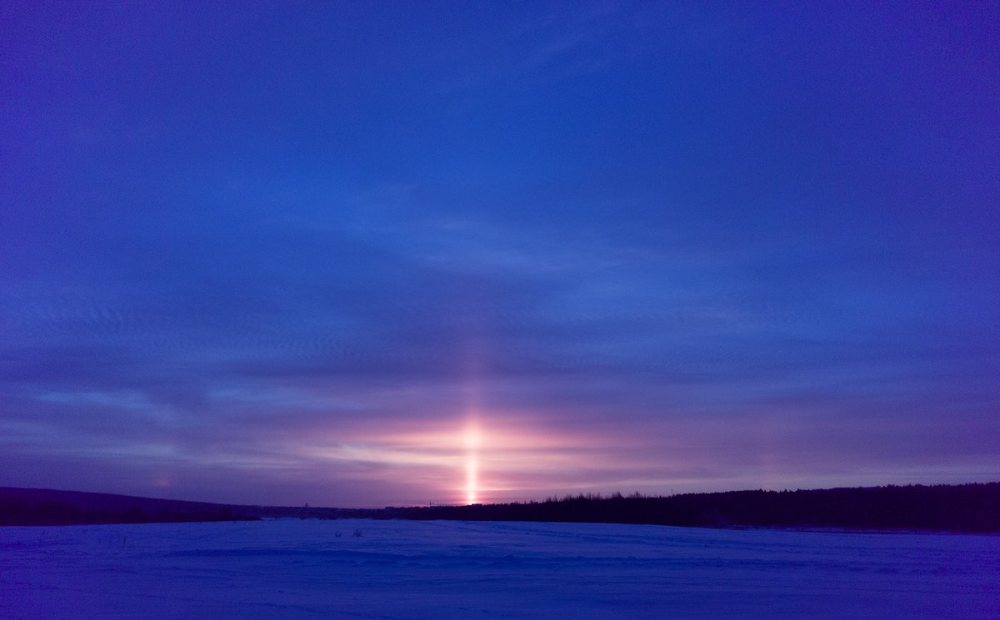

# Thread - 2023-11-30

**Original:** https://x.com/RiikonenMarko/status/1730181398449848723

---

### 1/1 - 2023-11-30 11:06 UTC

Two photos taken about 1 hour apart in light snowfall today (-8 C). Unlike the right side situation, the left side did not look formed in low stuff. I was thinking even high cloud. But it must have been from the same light snow fall as in the right side image, the difference in looks due to the fact that in the left side situation the sun is not shining on crystals any close to the observer.

The snowfall started last evening and accumulated a good fluffy layer.

---

