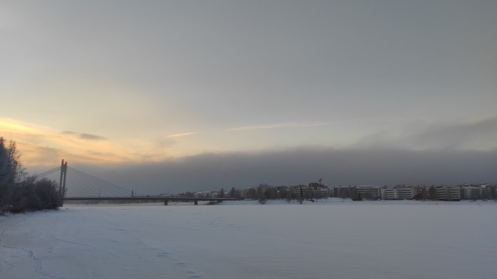
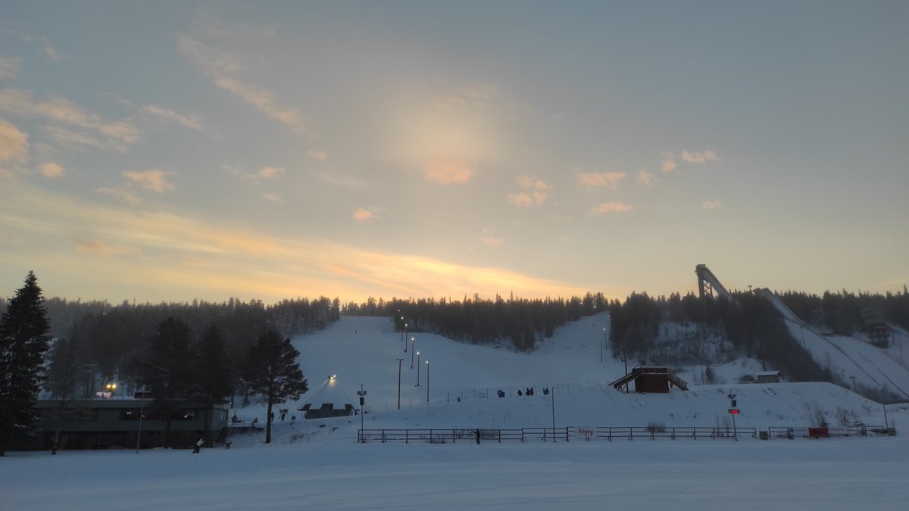
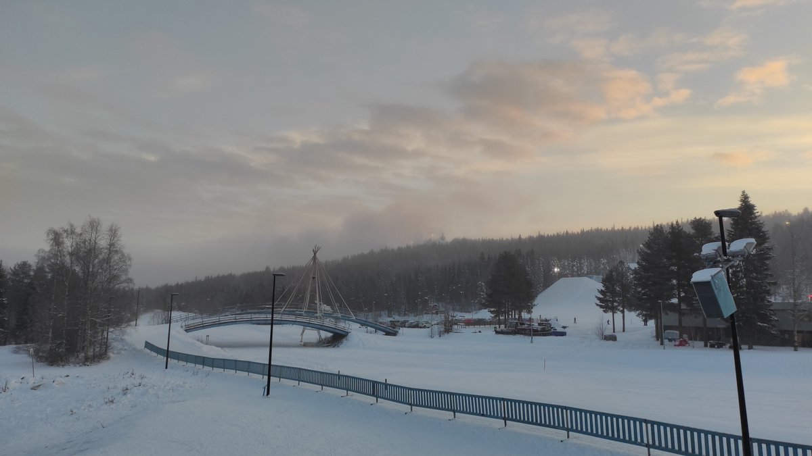

# Thread - 2023-12-04

**Original:** https://x.com/RiikonenMarko/status/1731647310822563922

---

### 1/1 - 2023-12-04 12:11 UTC

Wrong timing. Gunning punched a hole in Stratus / fog after sunrise, but with the sun being so low now it is hard to get any shine unless the horizon is totally clear. Which it wasn't. All on the offing was very tiny pillars from car headlights and tangent arc, which appeared to be in high cloud.

But soon it is dark and if the conditions still hold (snowfall coming), I will catch something. Temp -11 C both railway station and Apukka, so it can still be high quality plate.

The first photo shows the plume rising from the Totto slopes, second the tangent arc and third the edge of the punched cloud. When you are inside the hole you get a deceptive sense of clear sky conditions when indeed it is a very localized exception. Drive just one kilometer any direction and you are wondering where that clear sky disappeared.

---

