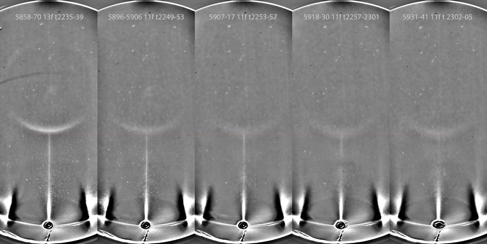
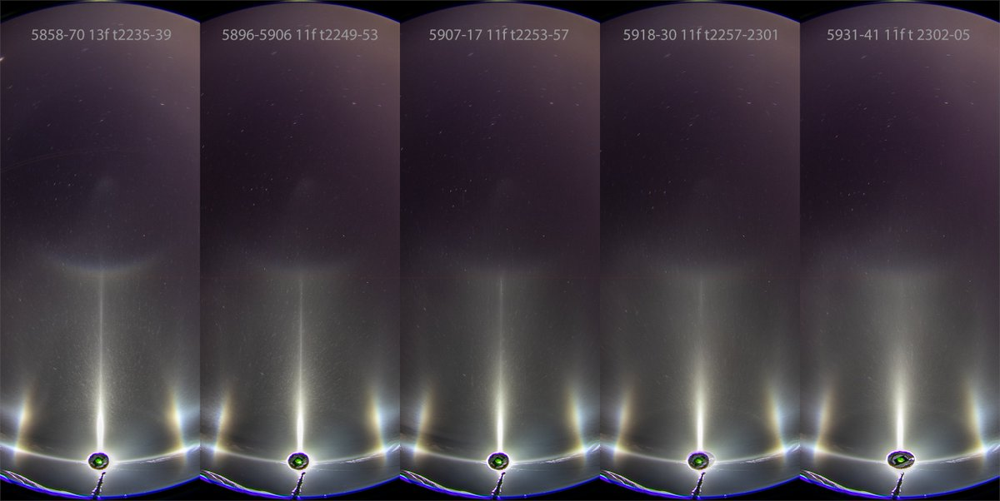
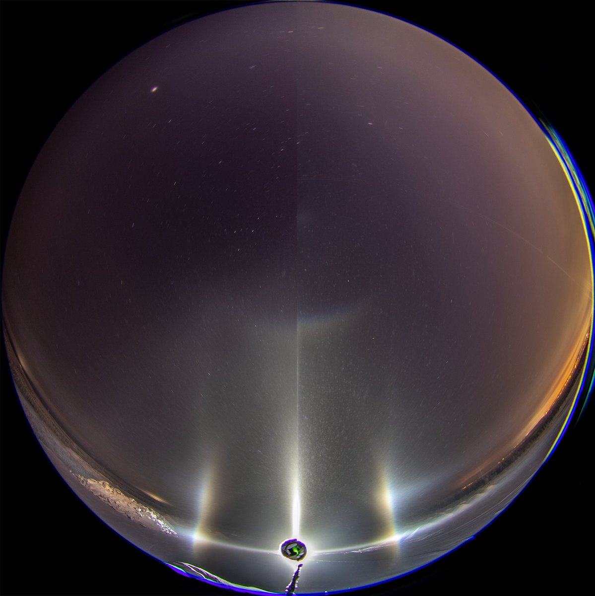
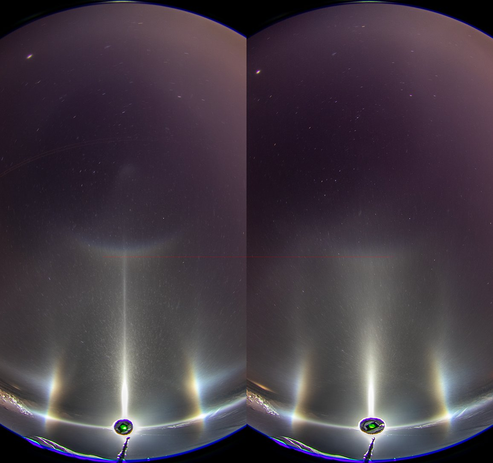

# Thread - 2023-12-08

**Original:** https://x.com/RiikonenMarko/status/1733134852596117690

---

### 1/2 - 2023-12-08 14:42 UTC

2023 Nov 20/21 - stage 4 and 5 - 1/9. After ice fog vanished from lake Salmijärvi, I found it across the river at the Anttilanvaara landfill. 9 or 10 km from the guns depending on which of the either two slopes they are running at, it is the desirable location to the west of the ski center to have to the stuff for its darkness and variable topography.

Like stage 3, this was an interesting swarm. Initially (stage 4) it had the "plate 213", which I call the countercircumnadir arc, but then the halo anomalized, shifting down towards the lamp (stage 5). Of the four images here, two show the progress of the display as 11 and 13 frame stacks. Other info in the stacks refers to the image numbers and time. The two additional images are side-by-side comparisons of the first and last stack.

I took two crystal samples. The first dish was put out right after the first photo in the first stack, photography at 2347-2358, meaning it ended at the beginning of the 4th stack. Thus this represents a mixture of stages 4 and 5 (unfortunately my current method allows for crystals to fall continuously on the dish during photography), but the emphasis is on stage 4 as the display was brightest in the beginning.

The time for putting out the second dish is not noted but from the other data it can be inferred to have happened with high certainty at 2353-54. This is right when the countercircumnadir arc had started it's downwards shift, meaning the sample is pretty much fully representative of the anomaly. I photographed crystals 2310-2315, immediately after which I stopped also the halo camera for the swarm was pretty much gone by then.

The camera was on top of a mound and the microscope at its foot, maybe some 10 meters apart. Temp -24 C in my portable thermometer.

As to the "countercircumnadir arc", you may have not heard it before applied for this arc from raypath 213 in plate oriented crystals. This will be clarified after I have published the new nomenclature for double oriented crystal halos I have been working on.

---

### 2/2 - 2023-12-09 15:44 UTC

2023 Nov 20/21 - stage 4 and 5 - 2/9. Video covers all frames used for previous post's stacks plus some more at the end. (Unfortunately this video gets very compressed when uploading despite the 1080p quality that I chose. Deleted and reposted a couple of times to no avail).

[🎬 1733513017080353075-IldUGFBUKdM3qiW1.mp4](media/1733513017080353075-IldUGFBUKdM3qiW1.mp4)

---

