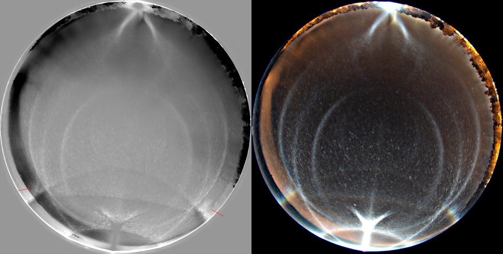
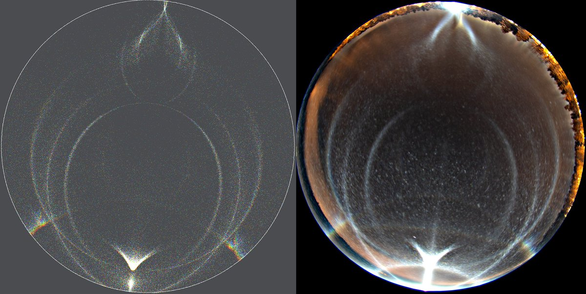
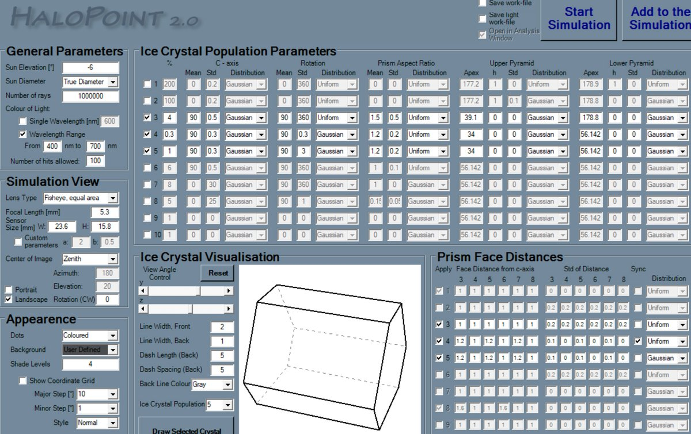
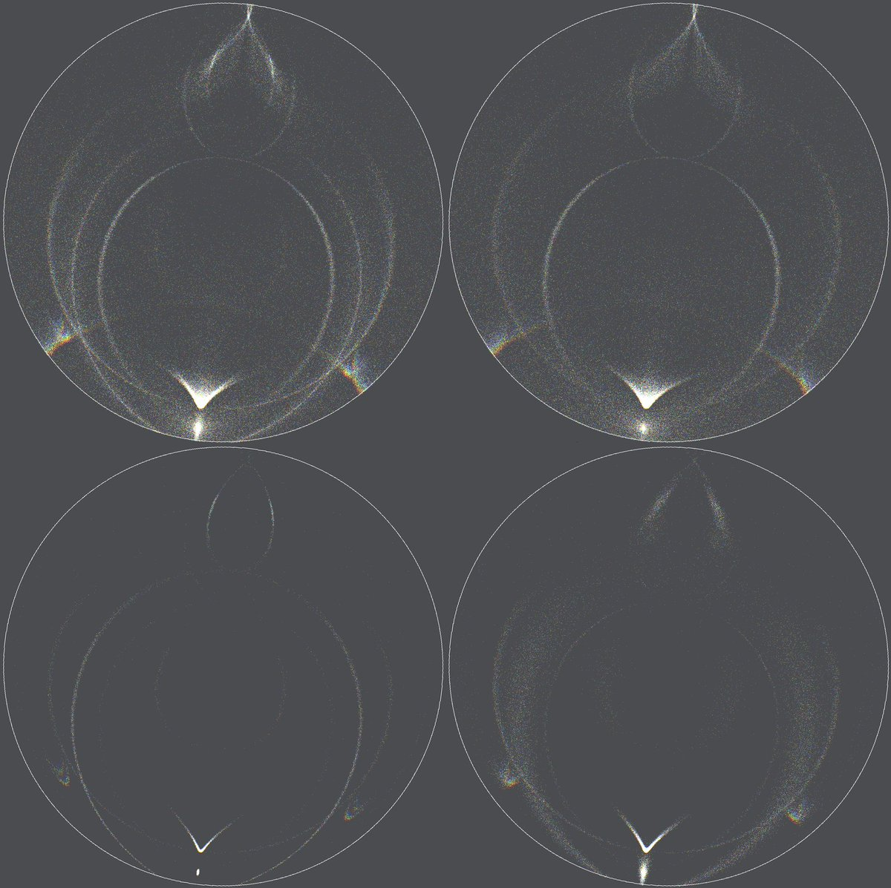
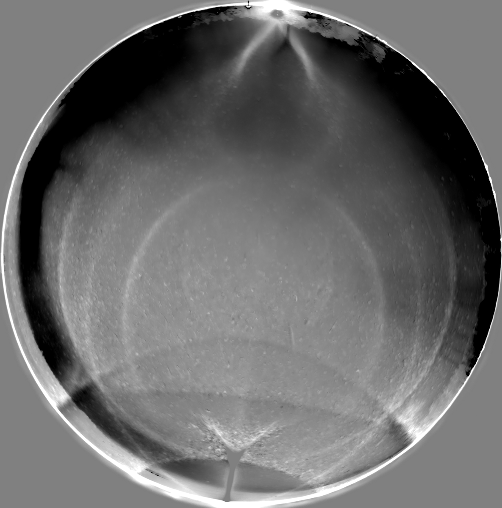
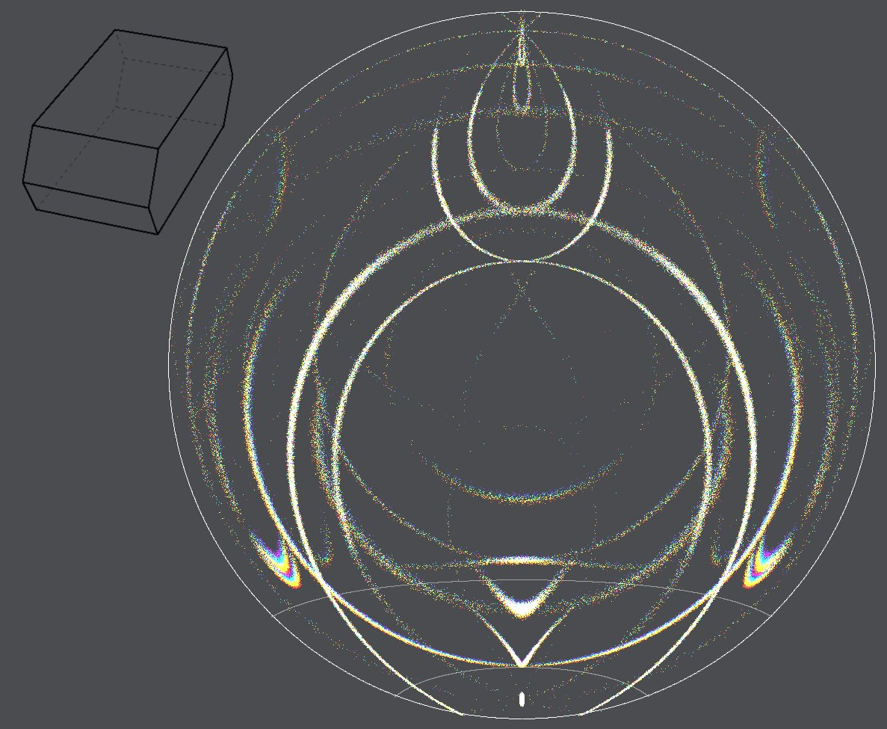
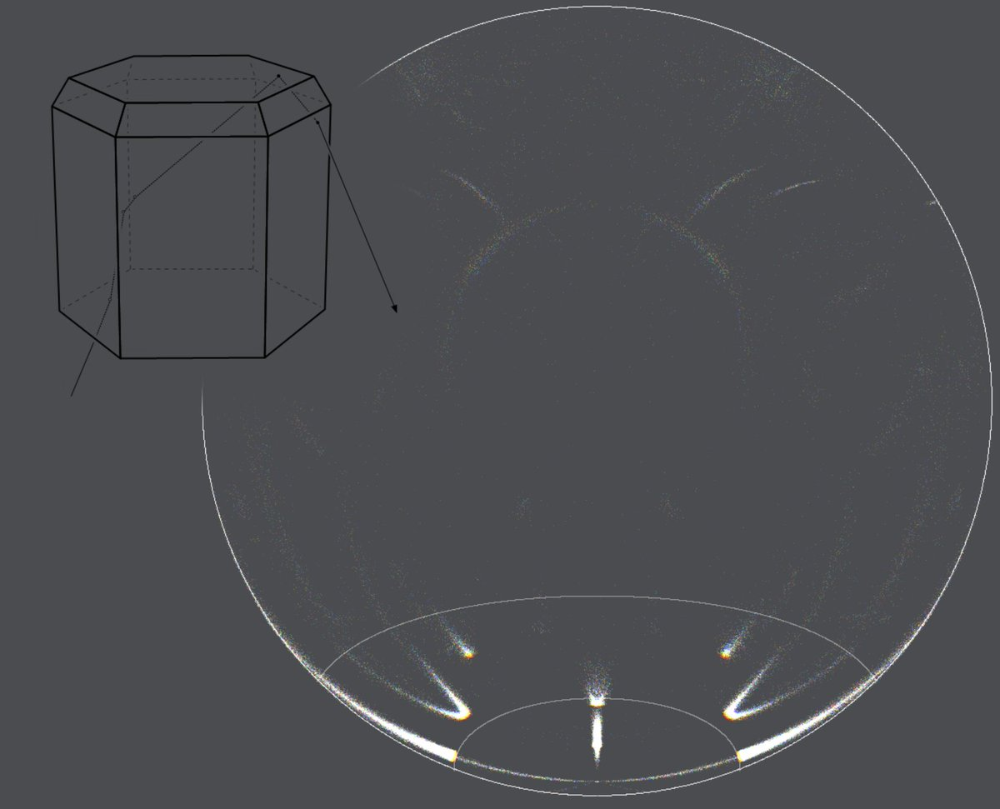
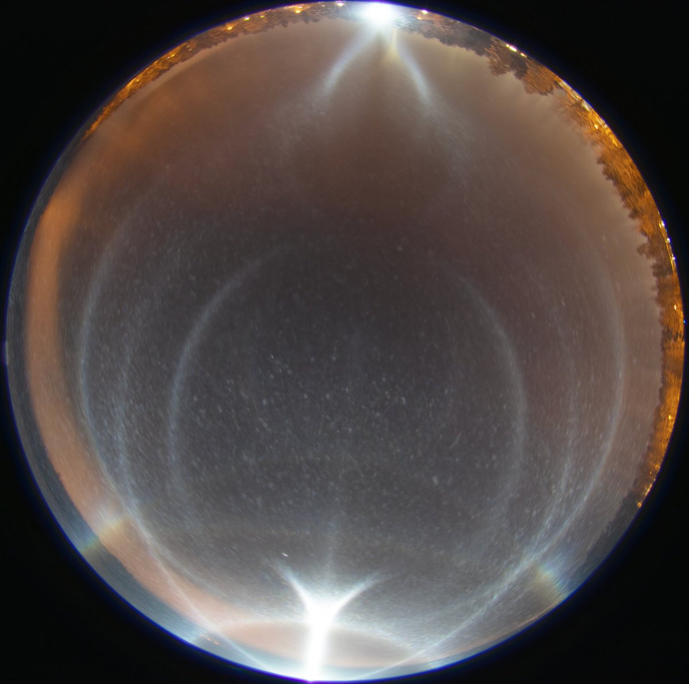

# Thread - 2023-12-10

**Original:** https://x.com/RiikonenMarko/status/1733856476647567725

---

### 1/2 - 2023-12-10 14:29 UTC

2023 Nov 10/11 - stage 1 - 1/n. Lots of details to discuss in the photos from this night. Fog / Stratus turned into ice and I got first to photograph at the east end of lake Salmijärvi. I placed the light on the lake ice and camera on an elevated landfill, the configuration giving about -6 degree lamp.

The photos have two things to talk about this stage. First, the Tape arc 14 (red arrows), which is seen outside the "common" Tape arc 41, is not really the expected hook shape especially on the left side (the right side arc is less well defined). What gives?

The answer is seen in the anthelic region. The subanthelic arc is not quite the same sharp arc you get from the strictly oriented Parry crystals, but a bit like an intermediary with the diffuse B arc, which forms from the same raypaths.

To reproduce this, one more population is required in addition to column and Parry: a Parry oriented population with slight rotation, here 3 degrees. Although this was not able to fully imitate the looks of the subanthelic arc in the display, it is better than a simulation without it. And most crucially, it gives the Tape 14 the shape we see on the left in the photo (which is a stack of eleven 30s exposures). It is really an intermediary between Tape 14 and 46° infralateral arc.

This is not the first time that Tape 14 is occurring outside Tape 41. We photographed an even better case on 23 Nov 2015 in Rovaniemi:

https://t.co/eYN5aHpPmi

For that we had used in the simulation 5 degree rotating Parry population. Actually, many a display need such population. I first time encountered the issue in a display in 2010 in Tampere:  

https://t.co/SeBgZBhF9T 

Back to the display at hand, in the simulation I had not introduced population to make the 22 and 46° halos. One of the images shows the simulation separated to its constituent parts, the 3 degree rotation population on the bottom right.

As to the temperature, I didn't take measurements. At the time of the swarm, 01:36-41 on 11 November, the official measuring stations, Railway station and Apukka, both stood at around -7 C.

---

### 2/2 - 2023-12-13 08:29 UTC

2023 Nov 10/11 - stage 1 - 2/n. The second thing is mystery: there is a weak counternadir Kern (raypath 2135) despite no-show subparhelia and countercircumnadir arc. The issue is really about the absent subparhelia. In simulations you can do away with ccna yet keep its Kern by just having thick enough plates, but this does not remove subparhelia. And who knows there is a faint ccna there, it's just succumbed to the glitter from column and random populations in that area.

Like with so many anomalies we have encountered, it is typically sooner than later that we find out that they are not one-off, and this case came to accompany an earlier case caught in winter 2020/21:

https://t.co/sdqAgvErbD

My recollection is that there was parhelia in the current display, that I was wondering why no subparhelia are seen. Unfortunately the view cuts the parhelia location just out, but maybe we see at the image edge some brightening in the 22° halo indicative of it.

This emphasizes the importance of composing the view right. But it is hard to know at the thick of it what is the right view. Tilt camera one way and you may be cutting out something important from the other end, something that you realize only when you look later at the photos. Side-view of course would include it all, but you get a better grasp of the display when you have both sides. Two cameras is one solution, but has also its problems. Perhaps the way to go are even wider angle fisheye lenses. Laowa, for example, has 210 degree fisheye.

Let's not forget the importance of simple notes. Had I recorded on paper or in audio note that there was indeed parhelia, we wouldn't need to be guessing here. And of course you can quickly take documentative photos with phone.

I have included below two alternative takes on the counternadir Kern. Parry crystals can make it only weakly at this elevation. Pyramid crystals actually could make it without both subparhelia and countercircumnadir arc. These scenarios are far removed from the actual display, yet the pyramid scenario might hint at something - there maybe something going on that works in a similar manner.

---

