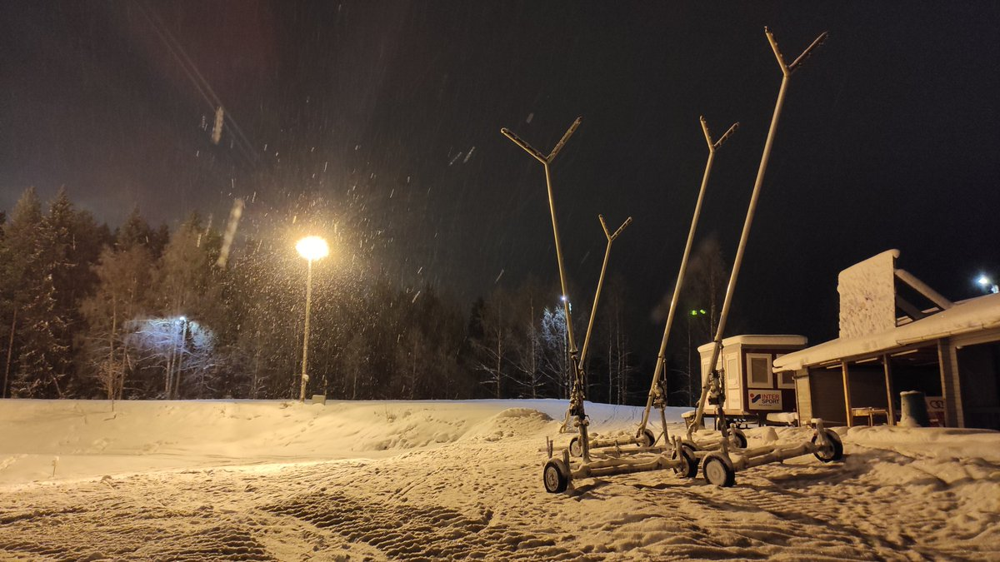

# Thread - 2023-12-13

**Original:** https://x.com/RiikonenMarko/status/1734866792827285675

---

### 1/1 - 2023-12-13 09:24 UTC

The early winter has been very cold around these parts and the reality must be accepted that they seem to have wrapped up the slopes at Ounasvaara. There has been no gunning since the weekend started despite low temps. Took this photo last evening at the base of the Totto slopes at around -19 C. But they still have the deposit pile to make for the next season. With the weather seeing a change to much warmer Atlantic airmasses now, we probably don't see the start of it until after Christmas.

---

