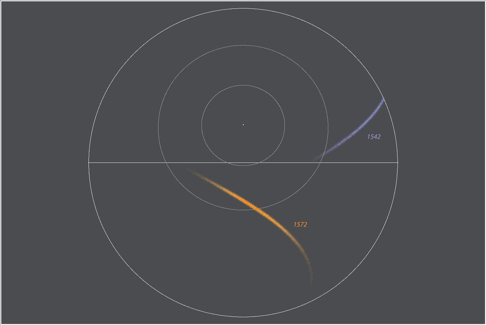
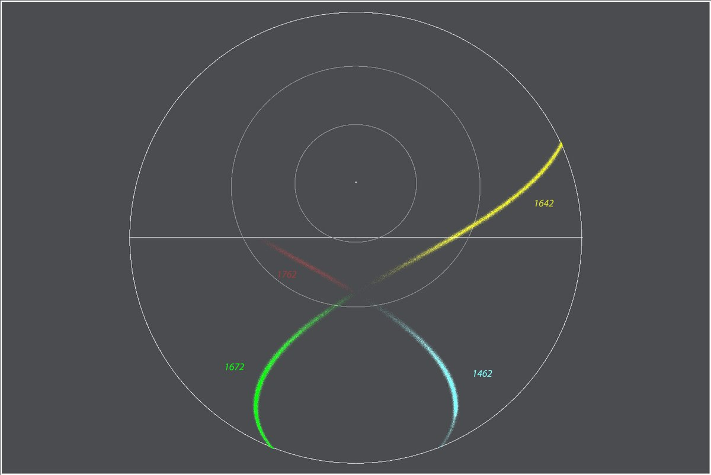
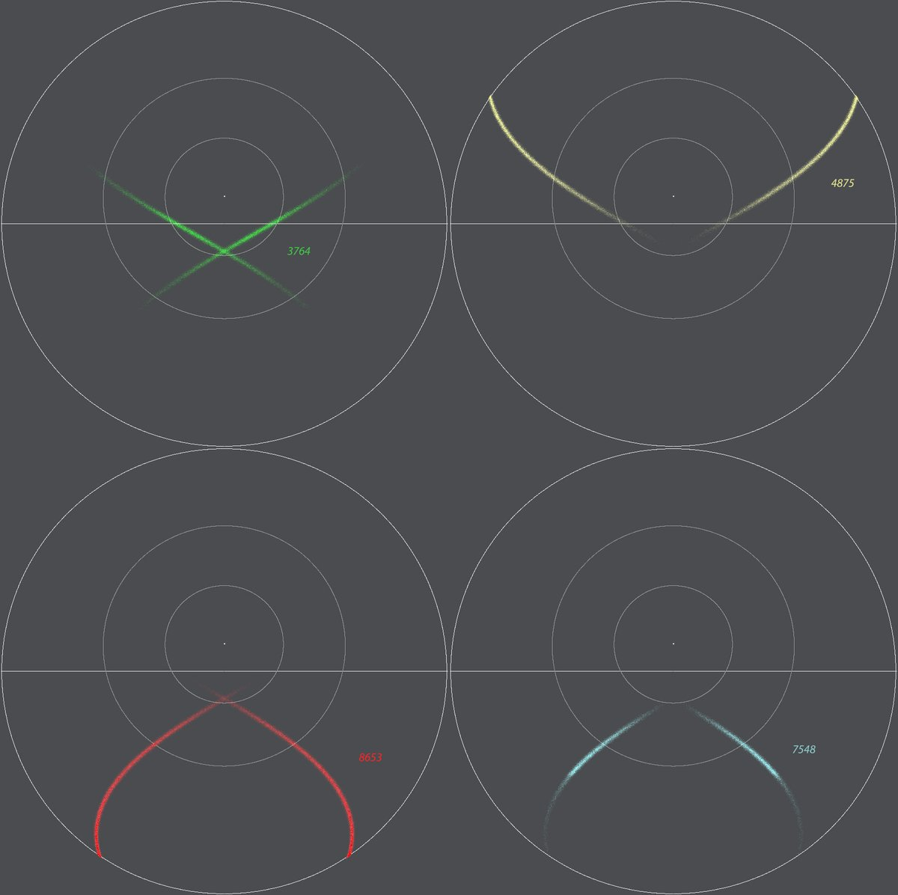

# Thread - 2023-12-14

**Original:** https://x.com/RiikonenMarko/status/1735270943268778471

---

### 1/1 - 2023-12-14 12:10 UTC

A useless study of 4 hit counterhelic arc (subhelic arc) raypath components in Parry oriented crystals. In basal face entry-exit raypaths the components don't cross the subsun if reflection from horizontal face is involved. If no, then horizon makes the no-cross line. For the prism face only raypaths, which might be understood as 3568 type (responsible in plate oriented crystals for 120° parhelion at low sun), I have no "rules" to offer.

I used optimal crystals for each arc, some of which in the last group would not realistically assume Parry orientation. Light elevation 20 degs for basal face raypaths, for prism face raypaths 10 degs because one of the arcs was very weak at 20 degs.

---

