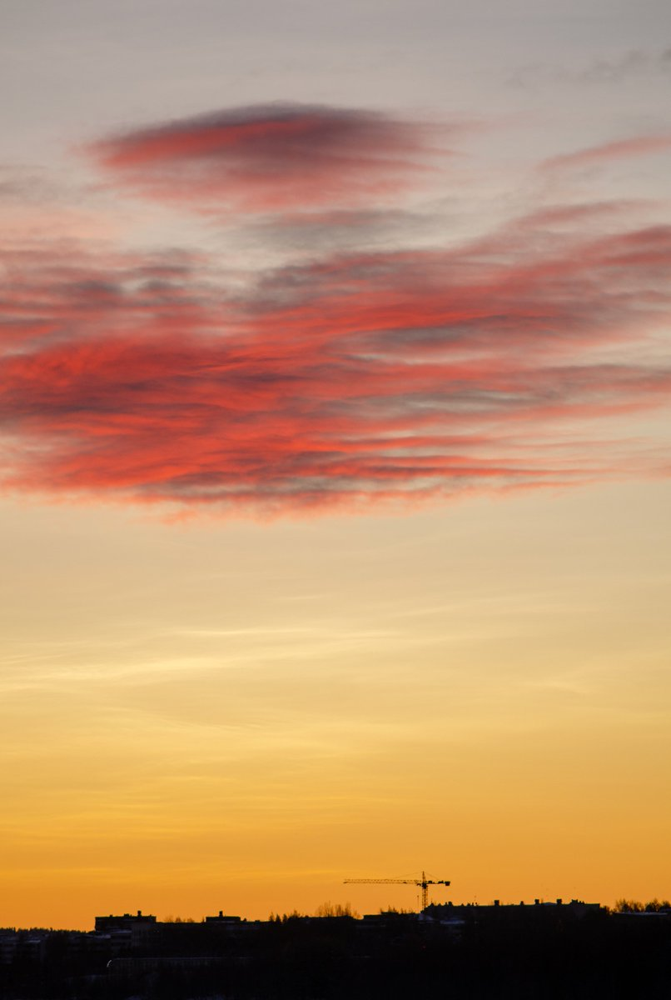
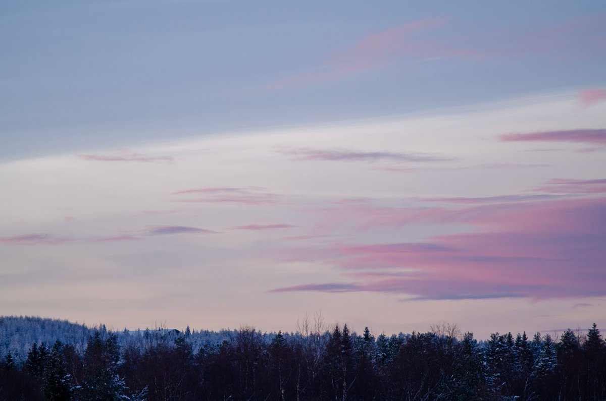
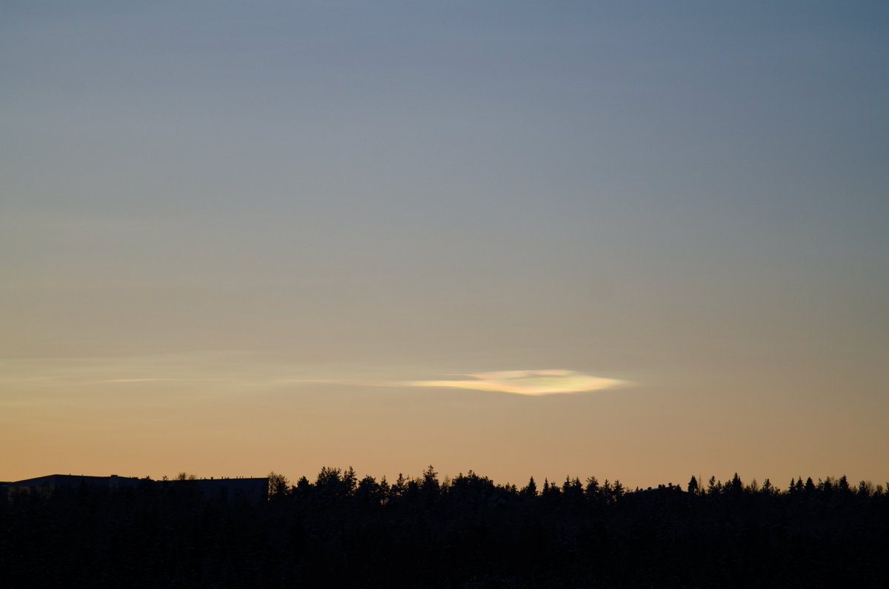

# Thread - 2023-12-17

**Original:** https://x.com/RiikonenMarko/status/1736326499706302637

---

### 1/1 - 2023-12-17 10:04 UTC

Low pressure was sweeping past north of Scandinavia and that's dead-cert nacreous clouds. So I walked to the vantage point of the snow deposit area about one hour before sunrise. Of course Rovaniemi got only the scraps. The big mass was to the west-northwest, as shown by the third image here. Muonio, as usual, must have had a good show.

The reddish low clouds seen in that image then took over. Maybe at sunset, which will be soon (daylight is 2h20m), it will be again clearer.

---

