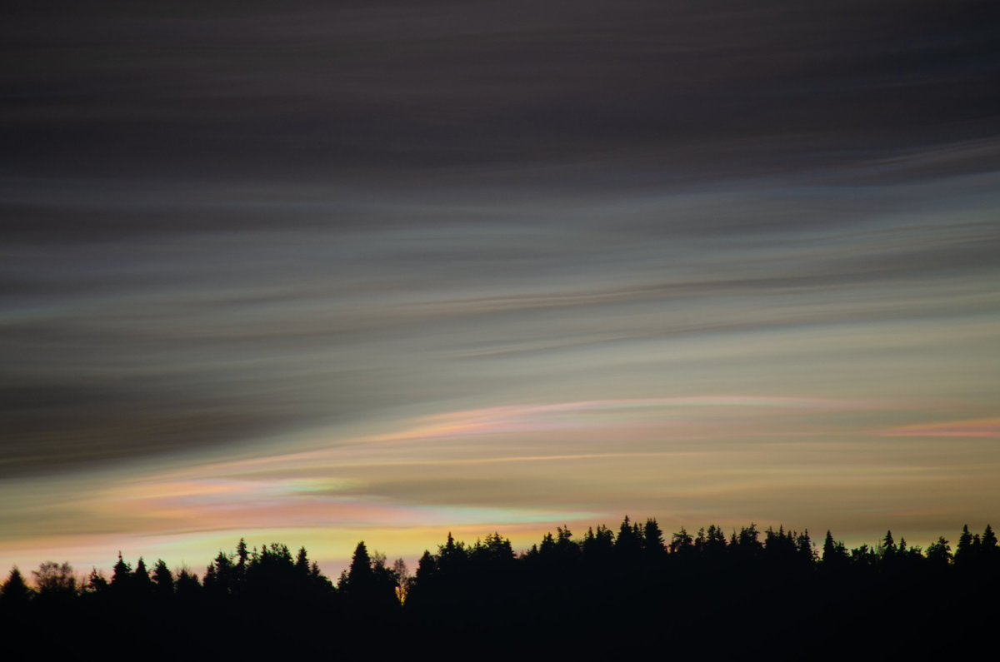
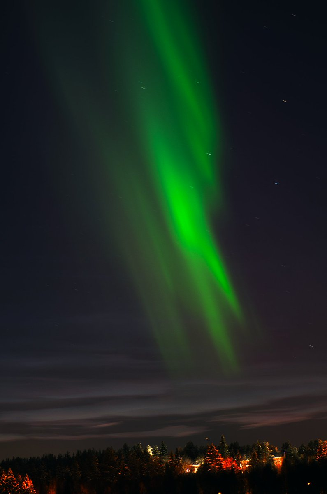
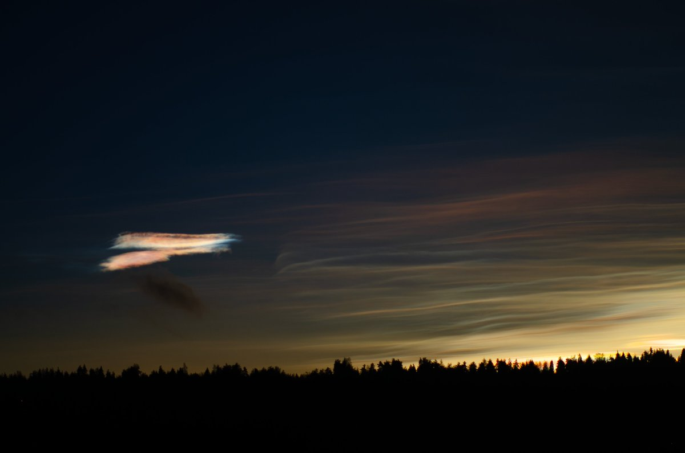
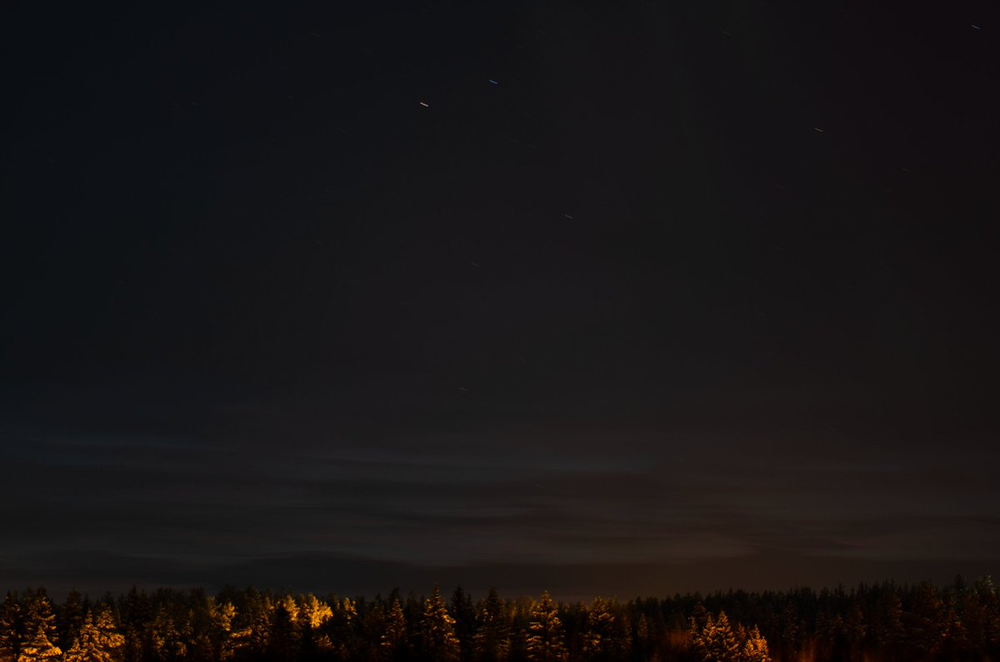

# Thread - 2023-12-18

**Original:** https://x.com/RiikonenMarko/status/1736772781537145265

---

### 1/1 - 2023-12-18 15:37 UTC

It cleared up (yesterday) and I went out before sunset. Followed the nacreous clouds late. They were still weakly visible to the eye 3h 50m after sunset, sun elevation -15.5 (the last photo). That's when I called it quits and came back to apartment.

---

