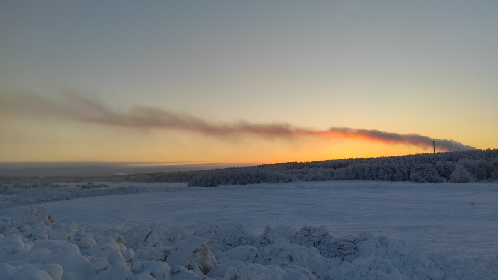
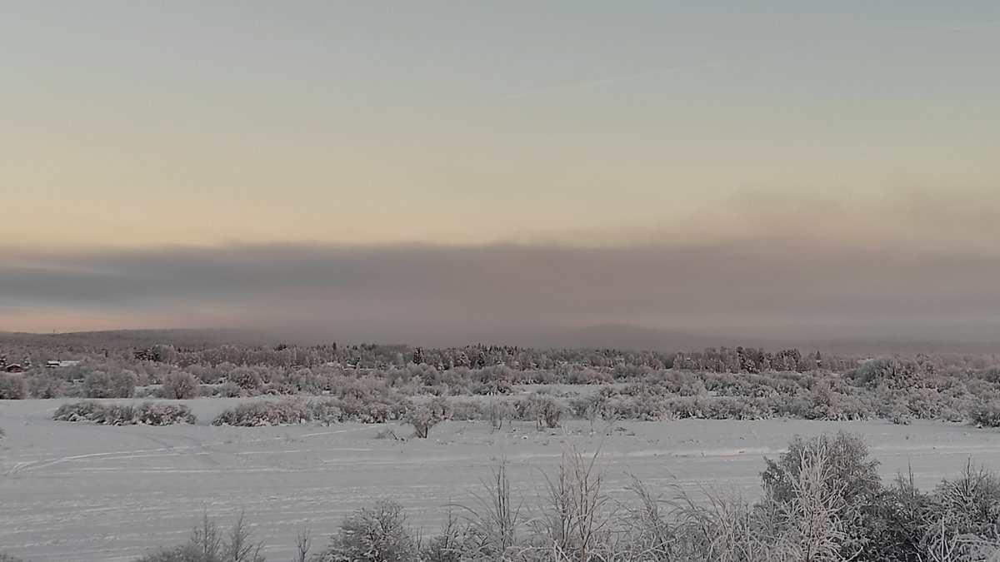

# Thread - 2024-01-04

**Original:** https://x.com/RiikonenMarko/status/1742881100181991614

---

### 1/1 - 2024-01-04 12:10 UTC

And that's how a big stack plume drops to the ground as ice fog. It is quite localized area typical of smoke stack plumes, snow guns give much more extensive swarms. Which makes chase difficult as the place of action may not be amenable to spotlighting – chances are it's all bright leds and buildings.

Here would have been for sure the best action of this cold snap. There has been not much anything to party during the previous three nights. Last night I quit 3 am after having been out 11 hours (got only poor stuff in natural precipitation though crystal samples made it more interesting). But that was stupid because the persistent thin stratus had just cleared and the plume started extending. For certain this ice fog was there already before dawn, which was still 6 hours ahead (sunrise at 1052).

The webcam seem to show it having now started thinning, so going at dark probably draws a blank. Temp now at railway station -25 C, Apukka -32 C. Last night I got my personal lowest this winter in Anttilanvaara, -39 C.

---

