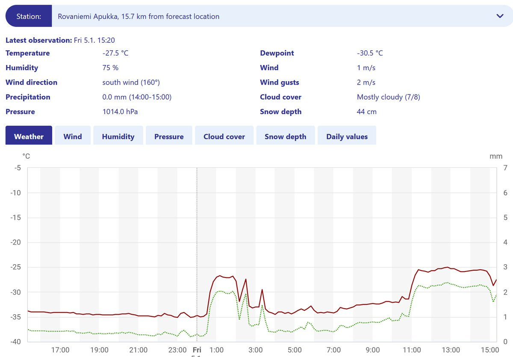
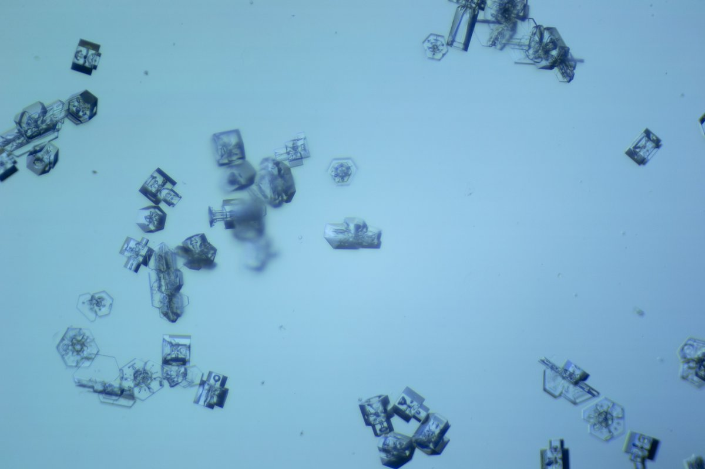
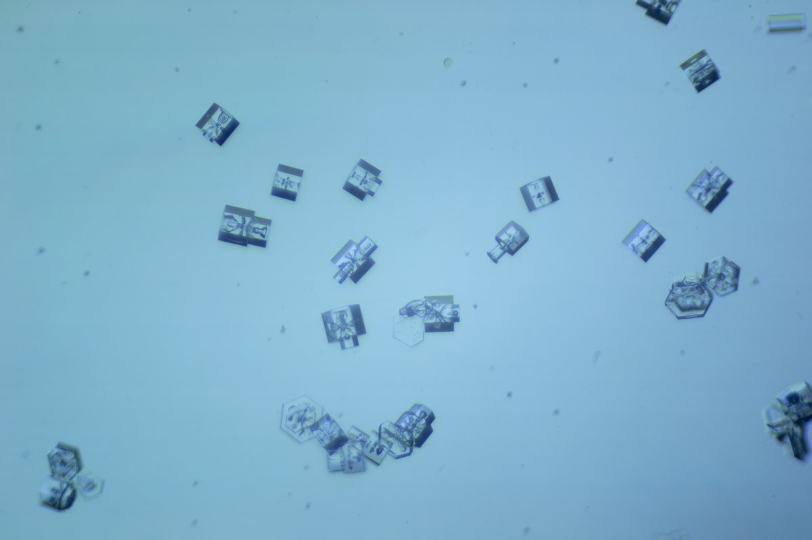
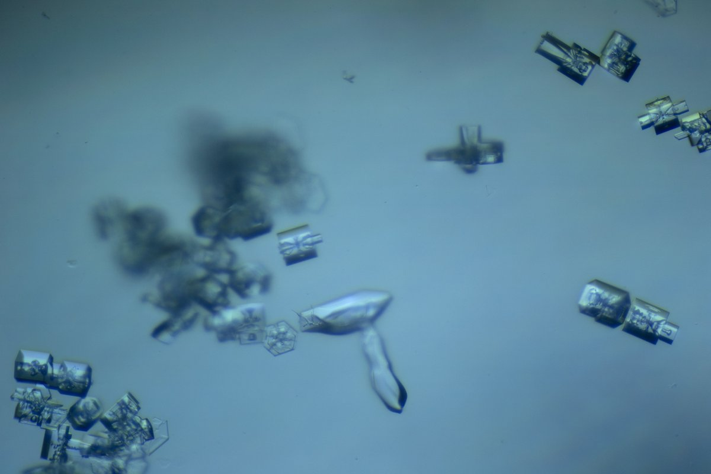

# Thread - 2024-01-05

**Original:** https://x.com/RiikonenMarko/status/1743268602357113112

---

### 1/1 - 2024-01-05 13:49 UTC

Last night finally got proper action. The most interesting thing was in the crystal samples. Bottle crystals galore!

Still as cold as it's been from the start of this week. At the Ylikylä snow deposit area where I operated -35 C. At one point I felt oddly warm. A little breeze had risen and it gently caressed my face. A look at the thermometer: it stood at a balmy -28 C! This sharp rise came also later to Apukka, as shown by the FMI station graph.

Got half of my fingers frostbitten from handling the microscope. These are demanding temps for microscopy because the thing gets so stiff.

The ice fog was from Suosiola power plant, creating a rather steady swarm at the snow deposit. I started the day at 1630 and the action was still ongoing when I quit at 3 am. Should have continued but was totally shagged.

---

