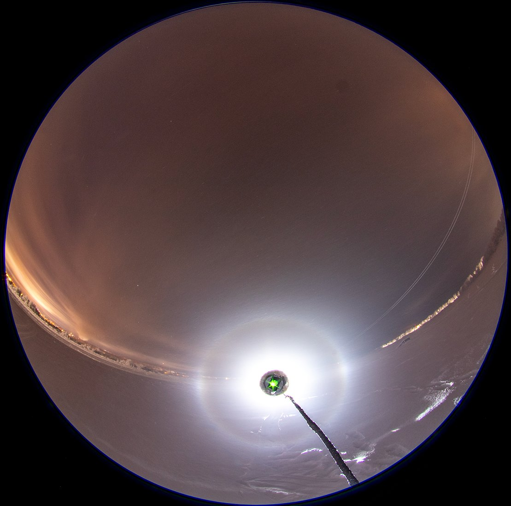
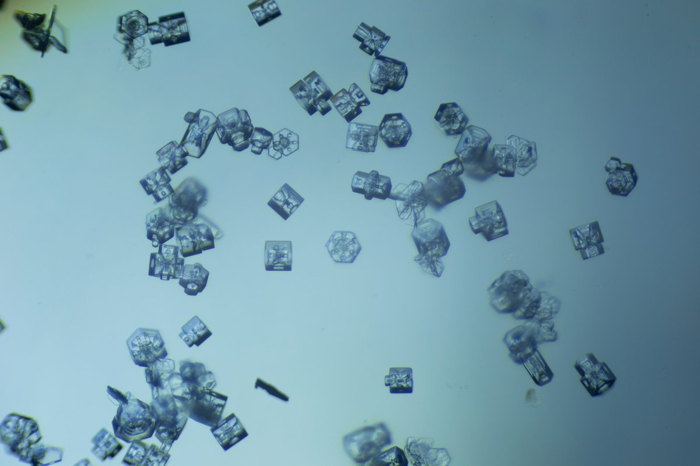
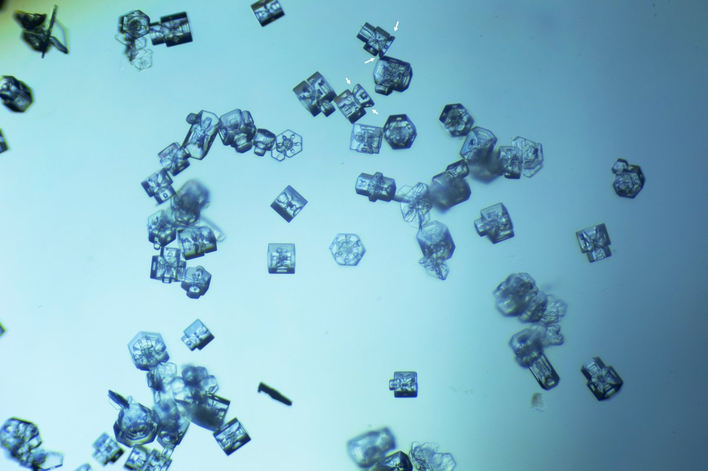
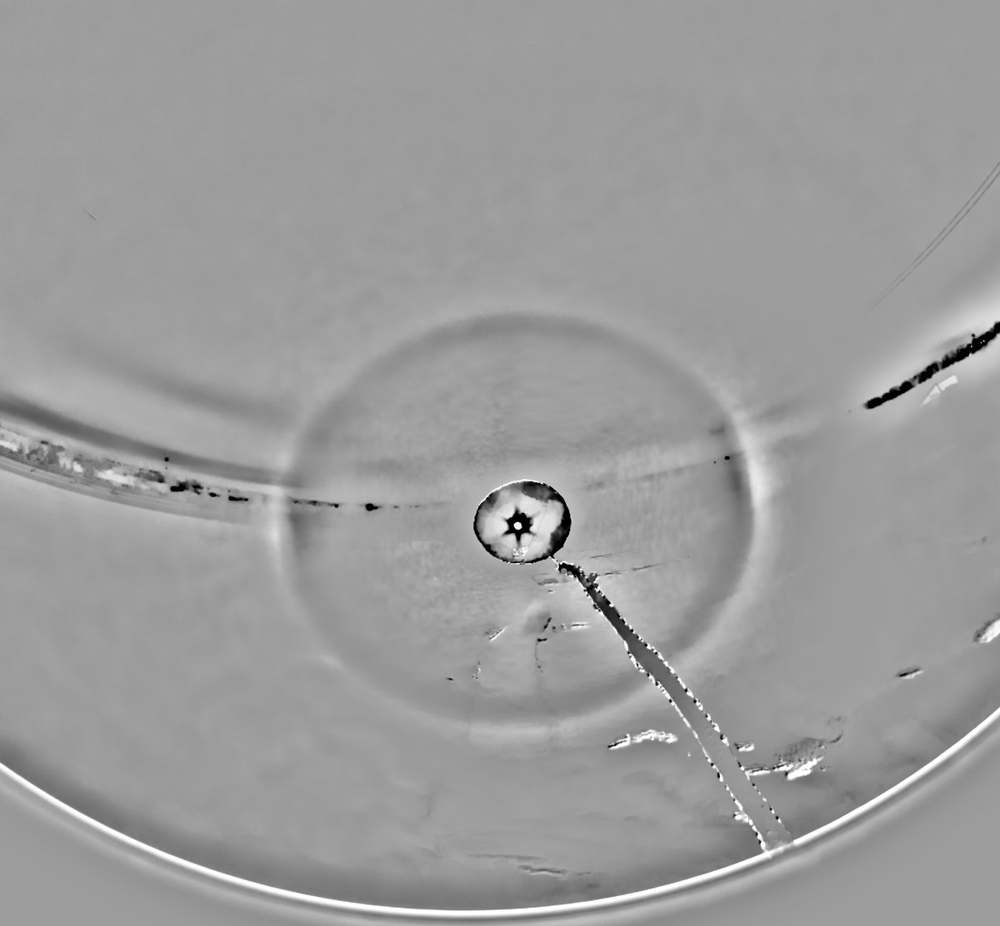
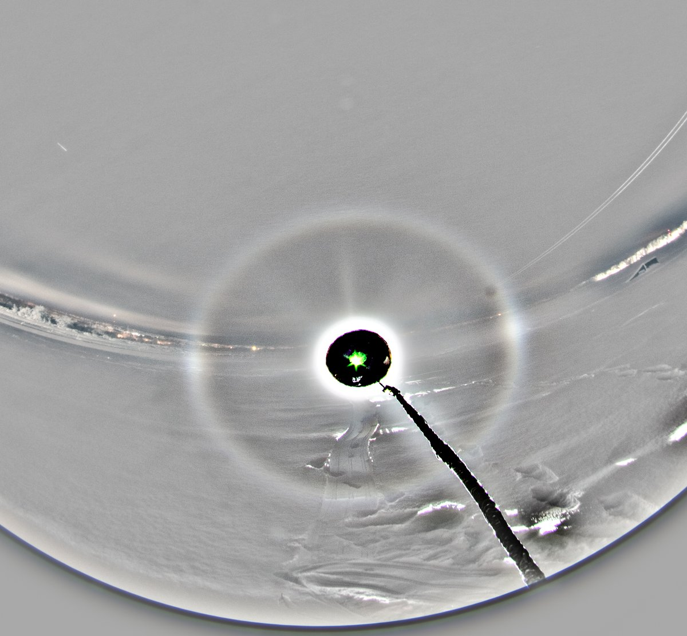

# Thread - 2024-01-11

**Original:** https://x.com/RiikonenMarko/status/1745485644527247604

---

### 1/2 - 2024-01-11 16:39 UTC

The night following the bottle crystal night on 4/5 January was pretty much actionless, but on the 6/7 I was lucky to catch again a swarm from the Suosila power plant plume with another set of bottle crystals. A little preview here with a single photo of the display. This was at the Ounaspaviljonki, the temp -25...-27 C.

Was it the crystal shapes that account for the largely random orientations evident from the display? This shortlived swarm co-incided with a little breeze and there is some earlier evidence that near to the ground wind had tendency to make orientations less stable. But given the display on the 4/5 occurred in more calm conditions and looked similar, I think we can chalk the unstable orientations up largely on the crystal shape (and size) here.

---

### 2/2 - 2026-04-21 11:47 UTC

6/7 Jan 2024, Rovaniemi. Wonder if there are pyramid faces in some these bottles? Had another look at the display, but was not able to dig any odd radii.

---

