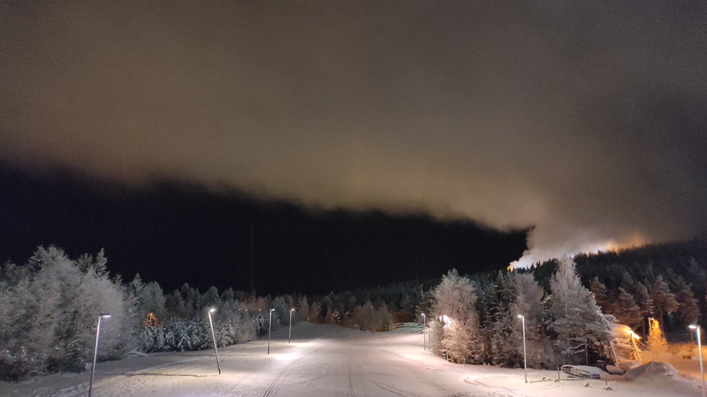

# Thread - 2024-01-11

**Original:** https://x.com/RiikonenMarko/status/1745558043104772251

---

### 1/1 - 2024-01-11 21:27 UTC

Bad news for the Rovaniemi ice fog halo hunter. I hopped into the car and drove to the slopes. There happened to be at the bottom of one of the western slopes a guy in snow groomer, just about to drive away, so I hurried to talk to him. Asking him why they haven't been making snow, he told me they had. That they had made snow the whole cold snap at Tottorakka, which is the eastern slope complex. I was struck completely befuzzled until he added that because of the extraordinary cold they had not used pressurized air, just water.

You don't have ice fog from just water. You need the pressure air to break the water into microscopic, invisible particles that act as nuclei for ice fog formation.

Such a waste! I asked him when they make snow next time and he told likely next week as it's gonna be cold. I didn't ask what is the temp threshold for turning off the pressure air, but definitely there is now a palpable sense that the good old times are gone.

---

