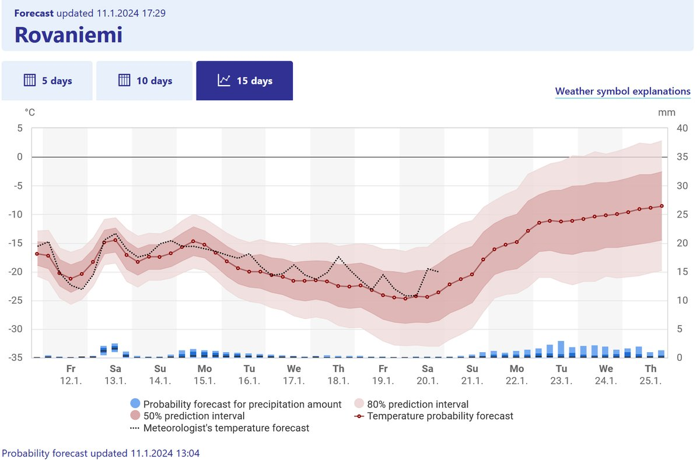

# Thread - 2024-01-11

**Original:** https://x.com/RiikonenMarko/status/1745486656881254881

---

### 1/1 - 2024-01-11 16:43 UTC

After a warm snap during which temperature peaked on two successive days above freezing, we are back in business. But not in the halo business. These temps in the FMI graph are not quite enough for smoke stack ice fogs and at the slopes it is still silent. I am getting to wonder if they are going to make the storage snow mountain at all. That would be unexpected in the light of the news on Ounasvaara website on 31.8.2023 (https://t.co/shDpLLo5YN) that they have made changes to their slopes to get more room for the stored snow.

But on the whole it looks like it is not anymore like the good old times. Another news from last year I found on another site (https://t.co/Me6p6hRnQT) tells they have shaped the base for the jumps, which lessens significantly the amount of snow needed making them.

---

