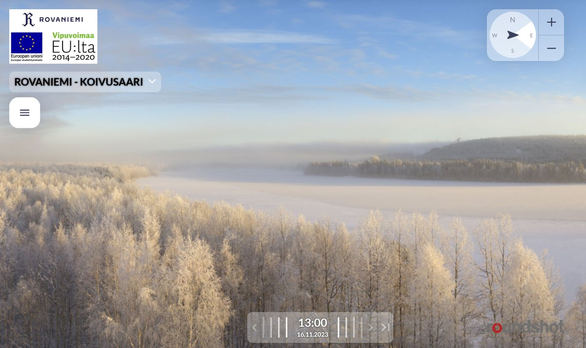
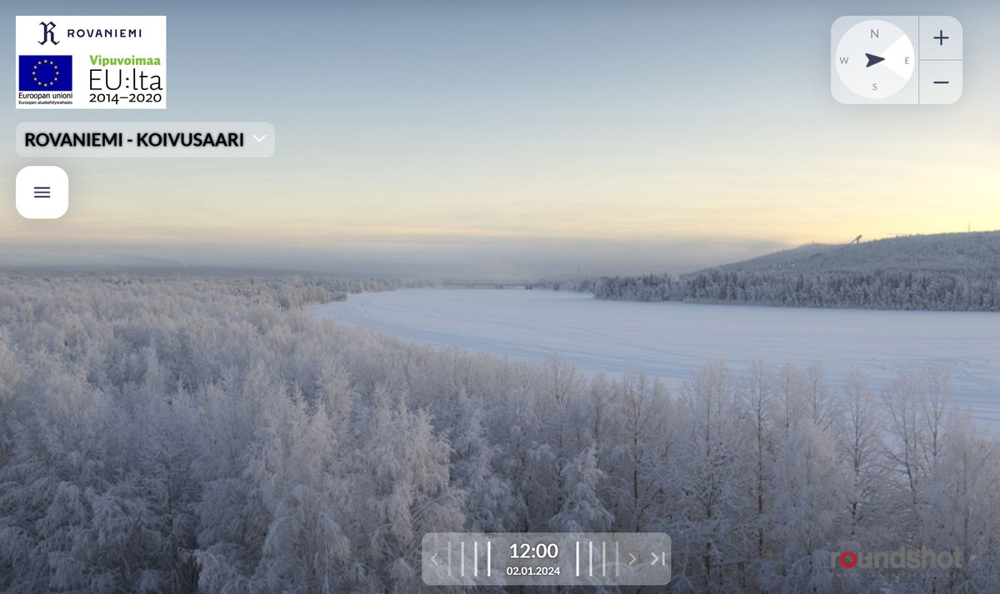
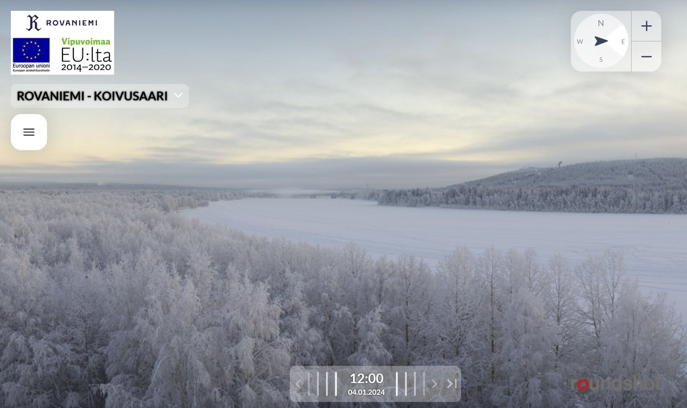
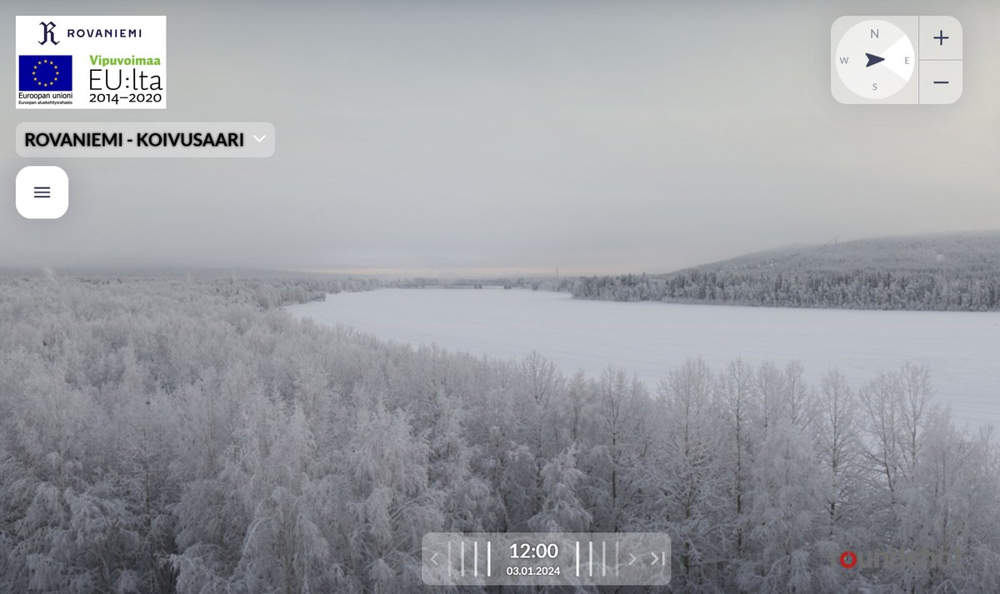

# Thread - 2024-01-12

**Original:** https://x.com/RiikonenMarko/status/1745723526890340526

---

### 1/1 - 2024-01-12 08:24 UTC

Here is a how Ounasvaara looked on 2, 3 and 4 January 12:00 local time when – as I gathered it from the chat with the snow groomer operator – the guns at Tottarakka were on but without the pressure air. No cloud whatsoever. For comparison, the fourth image shows how it looks when the pressure air is on – you have the characteristic cloud there.

The 12:00 temps at the railway station on these three January days were -29.6, -29 and -27.5 C. At such temps usually you would expect a massive cloud if the guns were operated normally, easily enveloping the whole city in ice fog and possibly blocking the view to the slopes from this camera. But even in "dry" conditions there would be a distinct local cloud above the guns.

The photos are from Koivusaari webcam:
https://t.co/uF9RF8tT34
It you look at the 16.11 archive, you will see a halo display.

---

