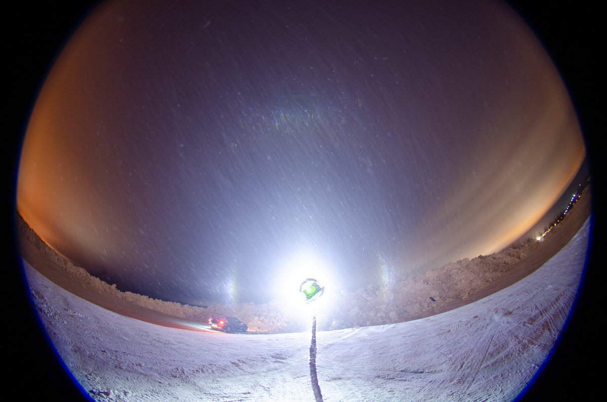
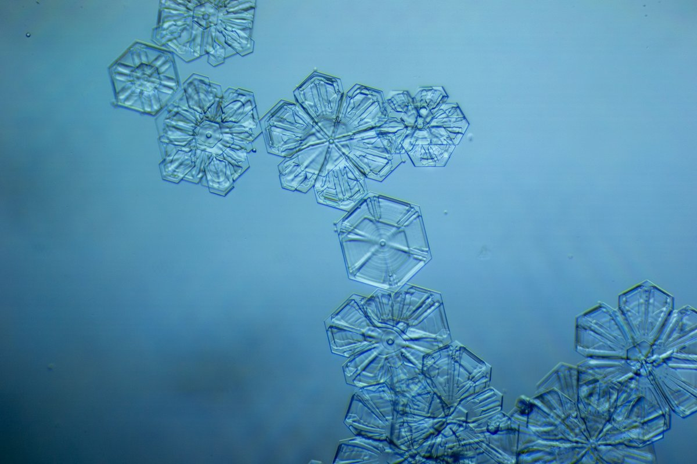

# Thread - 2024-01-13

**Original:** https://x.com/RiikonenMarko/status/1746147790521061643

---

### 1/1 - 2024-01-13 12:30 UTC

Just a quick post of last night's result. Was again lucky to catch a swarm from the Suosila power plant. The plume was dropping down crystals along it's narrow length until at the end it turned completely to ice fog at the distance.

I tried to catch it with car, but it was all in vain because the plume was in constant move. In the end it swept over my regular place, the snow deposit area in Ylikylä which is a good vantage point to see where in the city the action might be going on.

This is an interesting display as these kind of branched crystals have been speculated to be able to cause halos by a double hit through two adjacent branches. This idea, that was first voiced out for random oriented crystals by Auguste Bravais and later by Jarmo Moilanen for plate oriented crystals, is presented here with a crystal figure and raypath:

https://t.co/k6yNrD5K7Y

There is no parhelia in this photo around 46 degrees and I don't think stacking the couple of more photos that I have will make any difference. The lamp may be also too high. It would be best to have the light source level with camera to coax out this possible effect.

Temp was -28 C at the time of the display. The light is Olight Javelot Turbo.

Earlier in the evening I saw a display in sparse glitter which seemed to have a segment of parhelic circle opposite to the lamp. On the lamp side very weak parhelia. I don't think the parhelic circle can be fleshed out from those few glints upon stacking, but we will see. The crystals had really narrow branches.

---

