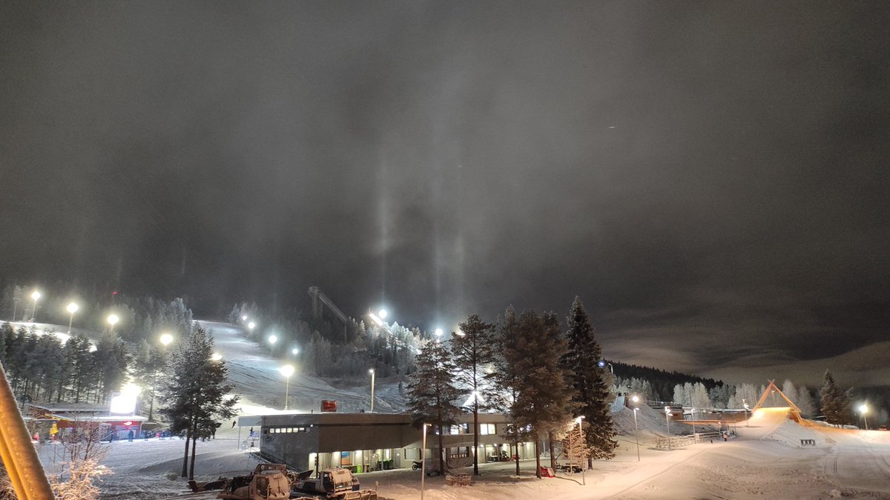

# Thread - 2024-01-13

**Original:** https://x.com/RiikonenMarko/status/1746121613530017881

---

### 1/1 - 2024-01-13 10:46 UTC

I drove yesterday again to the ski center after I saw from the distance some pillars from the lower yellow lights of the Tottorakka slope. Suitably, there was again a worker around as I arrived, ready to go off with some stuff he had loaded on a snow mobile.

I asked about the temperature threshold for turning off the air and learned it's around -25 C. I thought it is a cost saving measure – that at cold enough it is not so imperative to use the pressure air to freeze the droplets. This seemed to be a part of the answer but he also told there is an issue of air hoses tending to freeze when it goes below -30 C. They can become seriously blocked.

Just to be sure that I have not lost touch, I asked if there was any ice fog from the guns during the cold snap when no air was used. That perhaps some low lying stuff might have drifted to the east over the golf track and I had not been able to see it from my distant vantage points in the west. He said there was only some little stuff in the very vicinity of the guns during the cold snap. He was fully aware of the totally opposite situations when the whole city is wrapped by ice fog.

So you need pressure air to make ice fog. No surprise there. If you think making your own ice fog with pressure washer, it won't work. You have to have also the air.

-25 C threshold is pretty disenchanting. Many an ice fog potential will be left unrealized, a good proportion odd radius displays.

As to the alternatives for Rovaniemi, the big fell ski centers like Ruka, Levi and Ylläs frustrate the halo hound because the likelihood of ice fog hitting a location where it is hard or impossible to photograph is much higher. Also distances are long to go around the mountain if the wind changes 180 degrees. I have personal experience from the last two. Once in Ylläs, I remember watching helplessly how the plume was trailing along the fell side in the distance with no roads whatsoever to approach it. Only snow mobile could have reached it.

The only place worthy of Rovaniemi would seem to be the 260 km more southern Sotkamo, where Kern arc was first photographed by Mikkilä. It has relatively big ski center, lots of roads criss-crossing and plenty of open fields and lakes to catch the ice fog whichever way it goes. And unlike Rovaniemi, Sotkamo has the tendency to offer also an occasional massive and even supermassive display.

What about those pillars I saw? There was nothing on my arrival the slopes. The guns were not on. It had been just some random swarm of unknown origin, that also the guy I talked to had paid attention to. Towards the end of our chat some sparse glitter returned, sketching a subsun against the ground.

---

