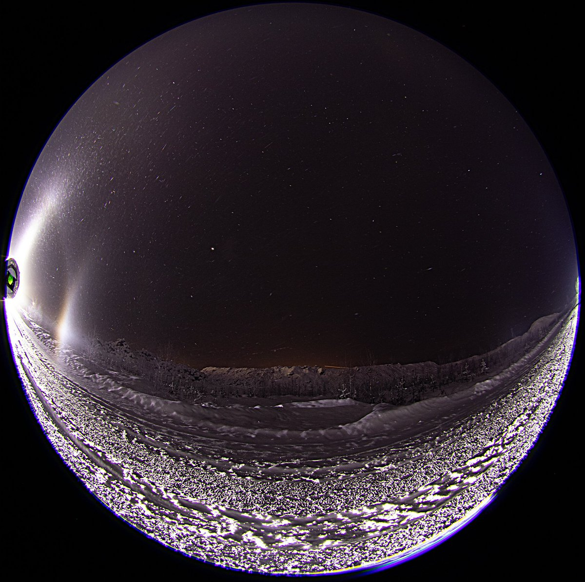
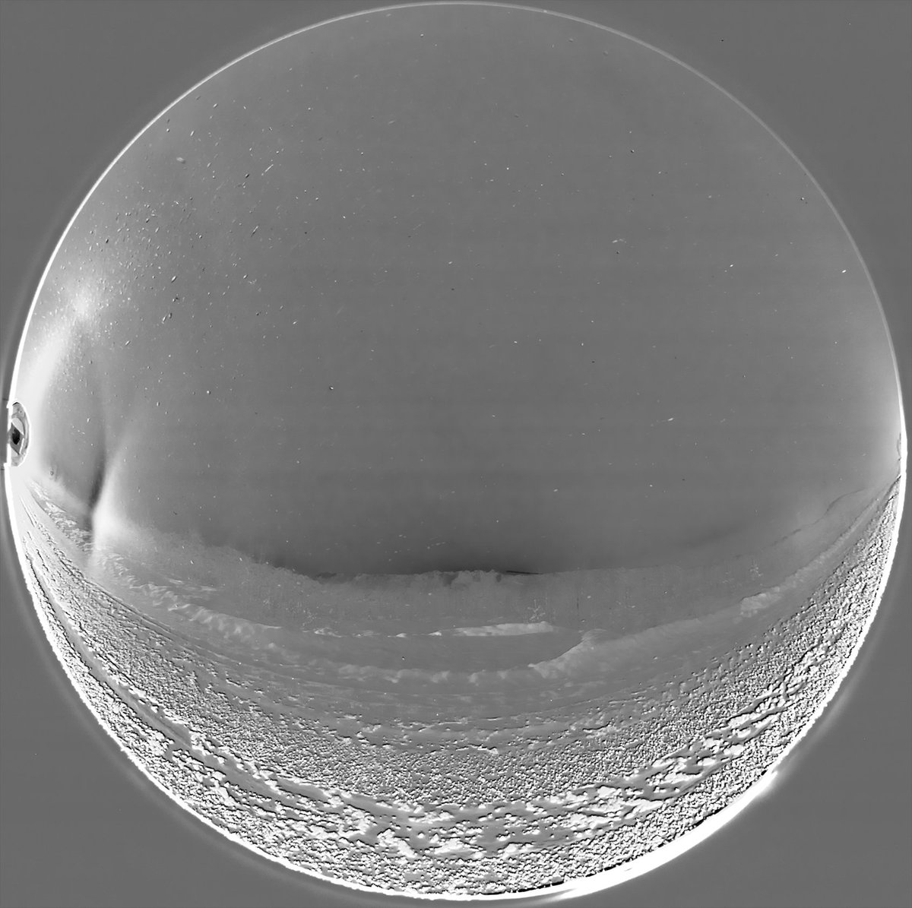
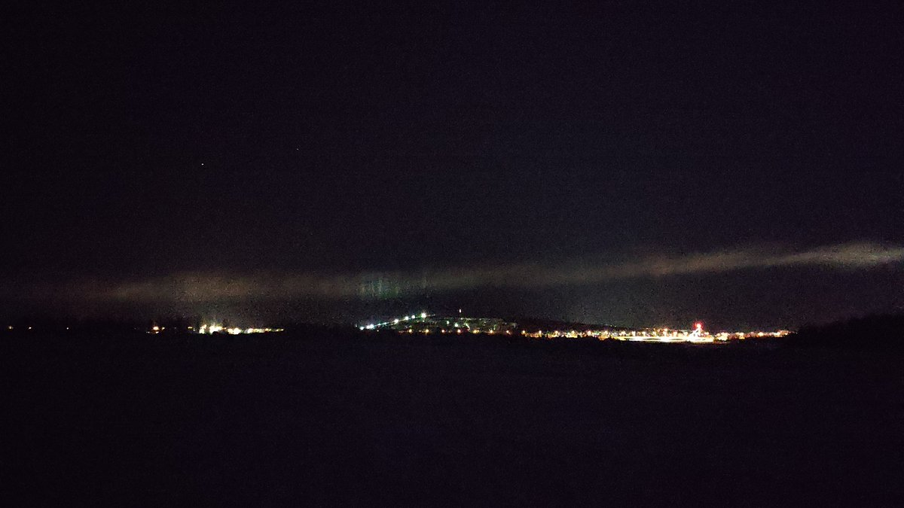
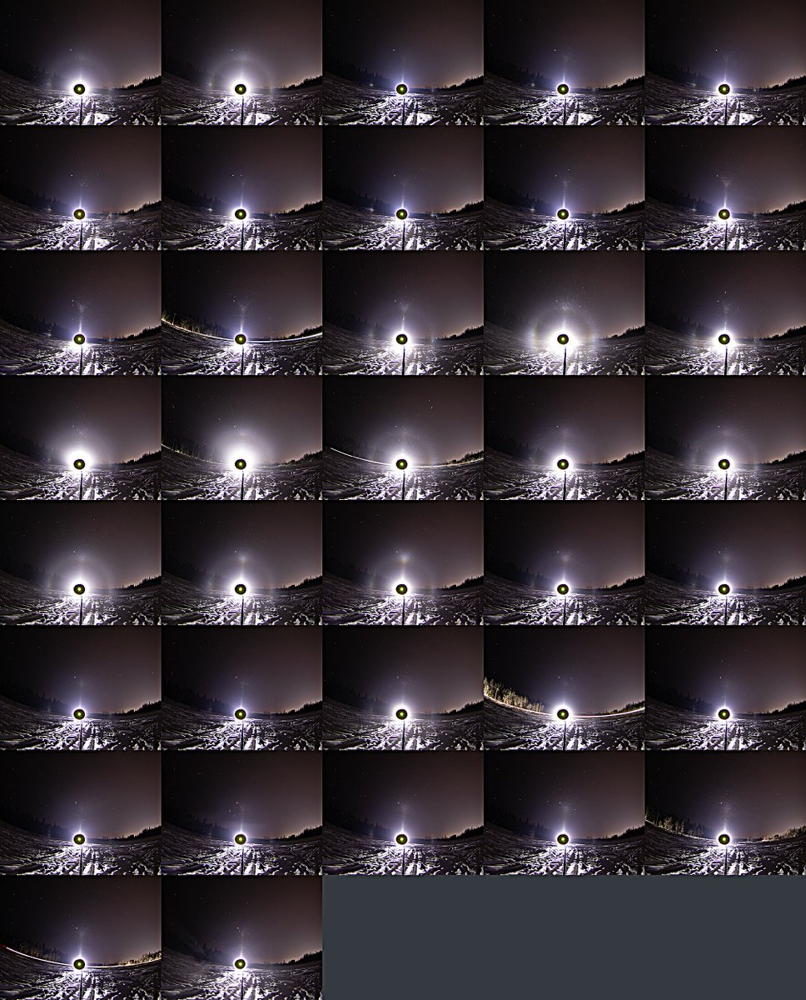
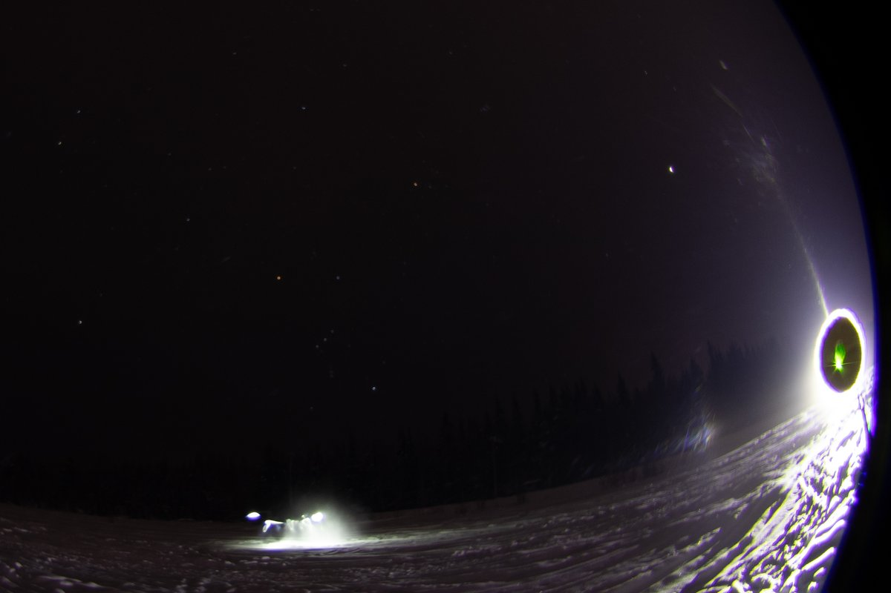

# Thread - 2024-01-14

**Original:** https://x.com/RiikonenMarko/status/1746489041170653327

---

### 1/4 - 2024-01-14 11:06 UTC

Short-lived action in Anttilanvaara last night, 13/14 January. Phone captured the Liljequist parhelion so much better from the side of the beam than camera in the middle of the beam. Yes, that's Liljequist, not 120° parhelion. My head was not fully there in the heat of the moment. You always have Liljequist first and then maybe 120° to accompany it – which this time didn't materialize. But it is a deceptively spot-like Lilje – a sign of not crystals deviating not much from perfect hexagon. 

No big chimney plume was coming to Anttilanvaara and this was anyway snow gun quality swarm. But guns were not on, so where the swarm came from? These just don't appear out of nothing.

A little earlier in a more urban setting nearby at Teollisuuskylä I had watched under streetlamp 22° halo in ice fog made by truck plowing snow off the road. So conditions were really sensitive for ice fog formation.

However, in Anttilanvaara the wind came from the opposite direction. I can only offer this: just a little distance upwind there is a snow deposit area, so some disturbance there had lifted icy nuclei in the air. Possibly from unloading a truckful snow.

Temp was actually -30 C, the thermometer hadn't had time to settle yet at this point.

[🎬 1746489041170653327-iRMotgX_EZxcDlZV.mp4](media/1746489041170653327-iRMotgX_EZxcDlZV.mp4)

---

### 2/4 - 2024-01-14 11:21 UTC

Four best frames stacked of the 13/14 January Anttilanvaara display. 30s exposures. Liljequist is best seen in the br image (white spot). I had also dish out, but inspection found nothing other than some crystals from the ground snow that my walking about had kicked in. This was too short-lived for any swarm crystals to land in. The lamp and camera are about level.

---

### 3/4 - 2024-01-14 11:30 UTC

The 13/14 January night started out with this. I had walked to the Ylikylä snow deposit to appraise the situation. Just then a plane landed to airport and soon this long plume came from the direction of the airport, making, as it aged, pillars in the ski center lights.

---

### 4/4 - 2024-01-14 12:39 UTC

When snow guns are not on a halo man must become the snow gun. As nothing was happening after the Anttilanvaara swarm, I went to a place I call the Toramo pit. It is a bog and one of the cold spots. This time the thermometer settled at -33 C. But I was not cold in the slightest for I was shoveling snow in the air with a plastic tray to make little swarms of ice fog. The collage of successive 30s exposures shows how these clouds came and went. Also cars that passed initiated the ice fog formation.

Typical to these situations, there was a slight breeze that restlessly circled around. So I had to shovel left and right of the camera to try to make the swarm go in the camera direction.

Never have shoveled anything more than 22 & 46° halos, parhelia, tangent arc and submoon into existence. As these are best formed at the lowest temps, possibly one day odd radius stuff is formed.

After having sweated enough I went back to other side of the river, where in Alakorkalo the Suosiola plant plume had started precipitating some crystals. But it was crap and I didn't want to wait if it gets better, so called it a wrap at 1 am.

---

