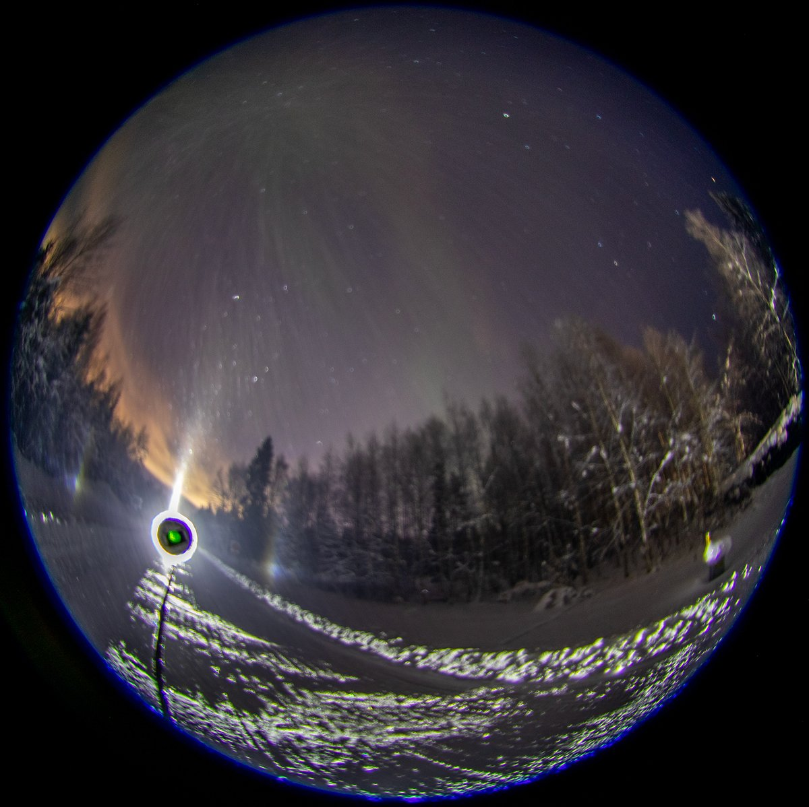
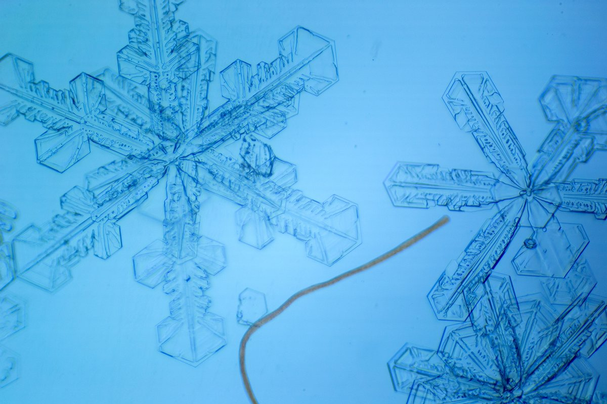
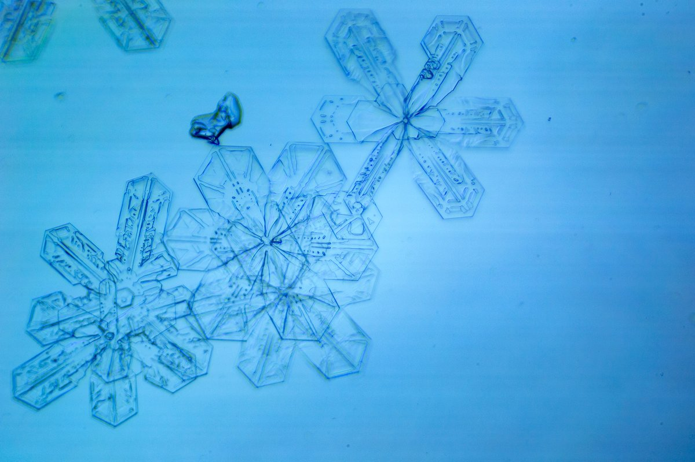
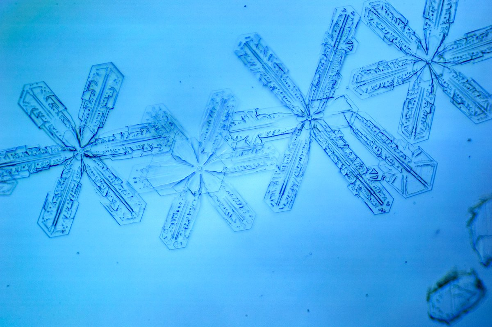

# Thread - 2024-01-16

**Original:** https://x.com/RiikonenMarko/status/1747259566860243009

---

### 1/1 - 2024-01-16 14:08 UTC

Some photos from 14/15 January night. I got three swarms from the Suosila power plant plume, this was the middle one, but they were all pretty similar.

Like I just wrote some time ago, branched crystals may cause parhelia around 46 degrees by double hit through adjacent branches. Here most crystals are probably too deeply branched but in the previous display with such crystals gaps were not as deep (https://t.co/m4hmdtoYq8). So suppose we have a swarm of relatively optimally branched crystals at horizon light source. How effective these are making the outer parhelia compared to traditional multiple scattering? The probability of light ray going through two 60 degree prisms must be much higher in a gapped singular crystals over two separate basic crystals. Even more effective are alternate-Parry oriented crystals that make 46° parhelia by light going through a single 90 degree angle. But this is as yet a theoretical crystal orientation.

All right, so much for the outer parhelia. How good the sampled crystals are in making just the normal parhelia? Notably, they are pretty similar to the crystals in the streetlight Bottlinger display we spectated with Luomanen in Kangasala on the night of 9/10 January 2010 and which had no parhelia:

https://t.co/FO6Ns44qCS

Luomanen also turned on the spotlight and I don't think we saw parhelia in its beam, that would have been noted down:

https://t.co/oGgostDmOf

So maybe in this Rovaniemi display the parhelia were made by some smaller crystals that largely avoided landing on the dish. Unfortunately I didn't remember to check how fast parhelia crystals fell compared to pillar crystals. Parhelia crystals of course make also the pillar, but pillar would be lighted also by crystals incapable of making parhelia, so I might  have been able to discern if there was two different populations. Additionally, I should also simply have looked at the beam from the side to see if there were crystals falling in different speeds.

Many of these crystals are actually doubled – there is a smaller and optically more clean plate in the middle. This would look perfectly capable of making parhelia, but even that doesn't seem to save the day for we see similar doubling in the Kangasala crystals. So possibly I really didn't get the parhelia crystals sampled here.

The night was again cold, the car thermometer displayed constantly 3 degrees lower numbers (-29...-30 C) than the previous night. Yet at the location at the end of the road Paavalniementie the portable thermometer was only at -34 C when I wrapped it up at 1 am – the same that I got the previous night in the Toramo pit. Clearly this was not a cold spot. In the FMI Apukka station it had dropped to -35 C at 3 am.

---

