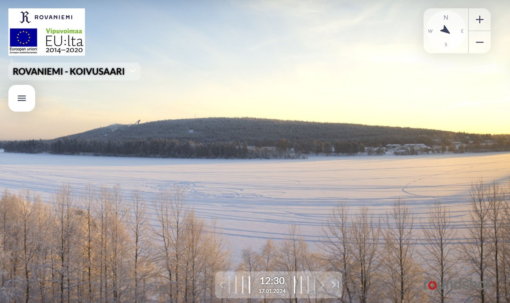
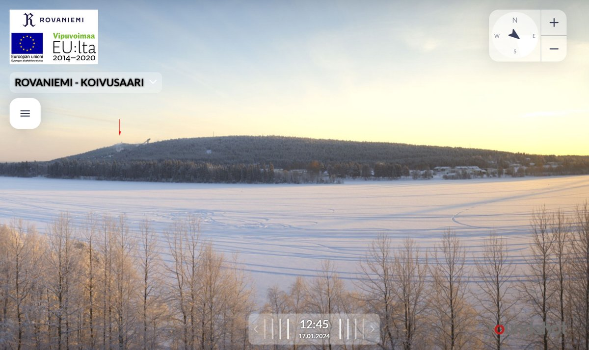
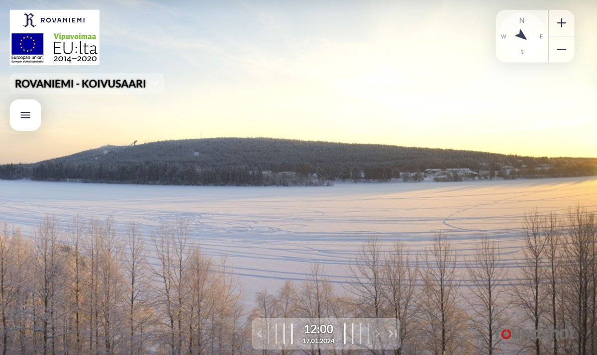
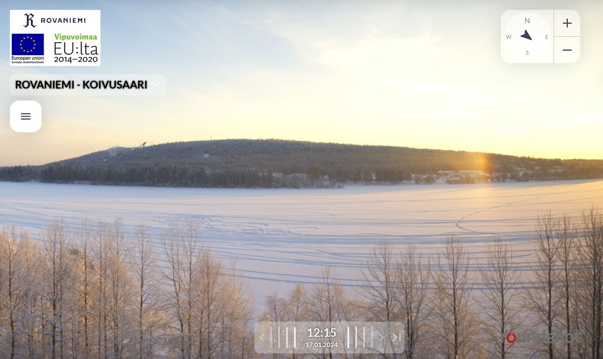

# Thread - 2024-01-17

**Original:** https://x.com/RiikonenMarko/status/1747586282513973292

---

### 1/1 - 2024-01-17 11:46 UTC

Gonna be a cold night and guns are on on the western flanks as betrayed by the white smudges in the photos, one marked by an arrow. In 12:15 image localized parhelion shows up, likely formed from the water fog from the still open river under the Jätkänkynttilä bridge. It tells that conditions are pretty good for ice fog. If it was dry, there would be no fog coming at all. Also, the Suosiola power plant plume looks quite promising outside these photos.

In this consideration the clouds from the guns are awfully tiny, meaning the pressure air is not on. So no ice fog from them expected tonight, again must try to scrape something from the Suosiola plume. It's game over for the Rovaniemi diamond dusts, it's game over. I doubt if we will see any a snow gun display anymore this season.

---

