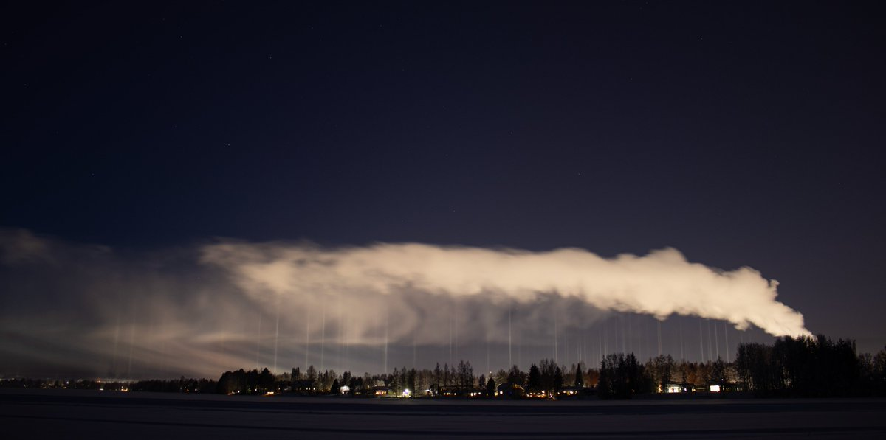

# Thread - 2024-01-18

**Original:** https://x.com/RiikonenMarko/status/1747975775716880830

---

### 1/1 - 2024-01-18 13:34 UTC

The winter smoke stack and snow gun plumes are part and parcel of the arctic cityscape. They make the ice fog halo displays which is why a halo man sees them in an enhanced beauty of the obsessed. This Suosiola power plant plume I photographed last night, 17/18 January, in Paavalniemi, at the beginning of the short ice road crossing the river. If you needed the school book photo, here all the elements are laid out in clarity: the plume, its virga of precipitating of crystals, and light pillars formed in those crystals. A nice bonus is the cirriform bent in the virga.

---

