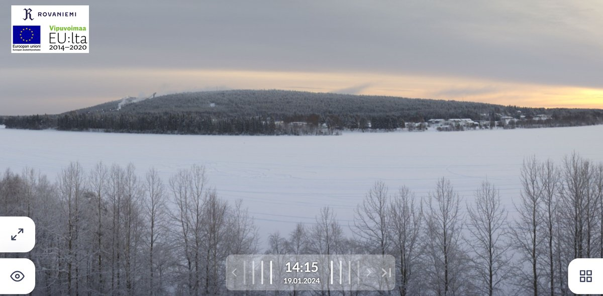

# Thread - 2024-01-19

**Original:** https://x.com/RiikonenMarko/status/1748333193181163971

---

### 1/1 - 2024-01-19 13:14 UTC

Today, 19.1, it is warm enough (now -17 C at the railway station) that they have turned the pressure air on, as seen from the clear plume even in these windy conditions. The two separate ice clouds to the right of the image center are also part of the plume. The forecast says it is getting colder tonight, so probably they will turn off the pressure air at some point.

---

