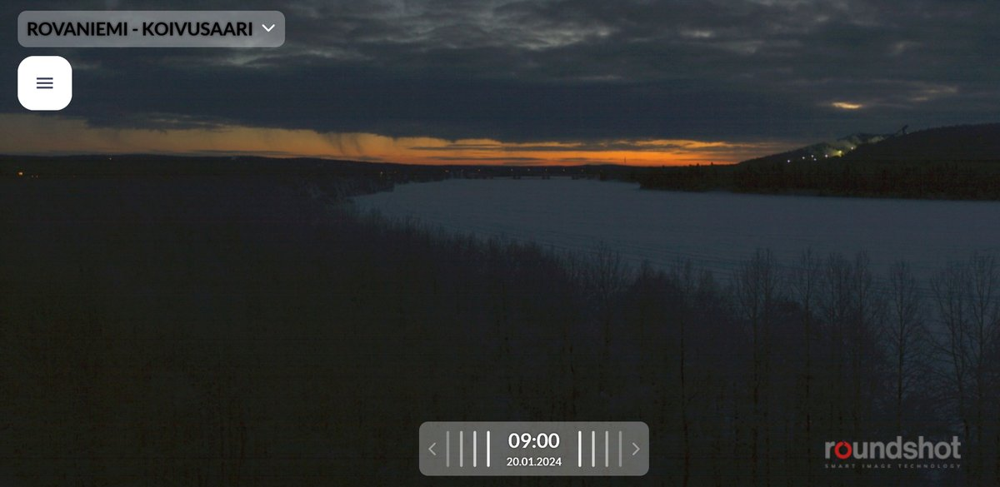
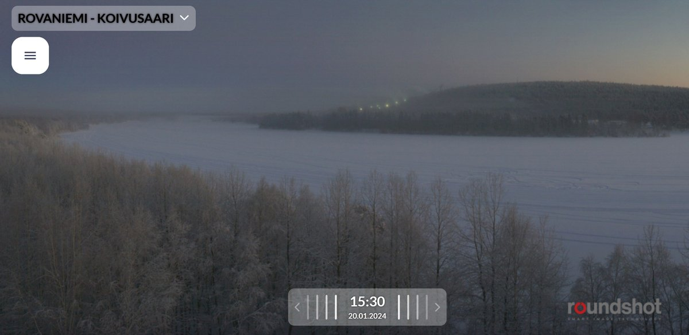

# Thread - 2024-01-20

**Original:** https://x.com/RiikonenMarko/status/1748613962638225898

---

### 1/3 - 2024-01-20 07:50 UTC

It is dawn in Rovaniemi and I haven't slept. Took a little long to get myself going, wasn't out until after 23. Hugely positive thing was that the guns were on with air all night, just like they are in this webcam photo.

The plumes are not big because the air dried up. Got a very basic snow gun display to the east of the slopes at Sieriaapa. It just started to dry up from then on. Only parhelia and pillar. Sampled the crystals as well, clean and thin plates. -34 C at the coldest, it is one of the cold spots. I should of been chasing earlier as the action was right on as I arrived to Sieriaapa. Might have missed something better.

The pay-dirt of the night was on return to the apartment: a massive plate and Parry display on parking slot neighbor's car windshield. Even Hastings arc was visible. Took about 20 videos.

---

### 2/3 - 2024-01-20 14:07 UTC

I slept the daylight but no loss there, it was dry. But now it looks like ice fog is already there. Guns are swishing good, the air is on despite the cold (-25.8 C now at the railway station). Maybe they have returned back to the good old ways and Rovaniemi the diamond dust capital of the world (after Fairbanks) is saved.

After this the weather takes a warm turn. It's been a cold winter all the way from October.

---

### 3/3 - 2024-01-22 16:29 UTC

Actually, the pressure air was not on during at least in the 1530 photo. I learned this from from an old ski center hand as I paid another visit there. He said air was not on and that the previous shift had shut it off at some point in the day. With this hindsight, suddenly I see much less cloud in these photos.

Yet in the evening I got a display with crystals that were 100% snow gun stuff: optically clean, tiny plates, many of them crossed. When conditions are really good, perhaps airless gunning works. After all, the cloud is more prominent in these photos than the almost non-existent fumes of the other day.

The conditions matter. Once I was biking in Joensuu in early spring and city maintenance workers were shoveling earth in some pit. This birthed a narrow tail of crystal glitter that went away with the tiny breeze. It was maybe just two meters or so wide near the pit as I biked through it. Too bad I didn't follow it to see how big it would have grown. But the thing is I have never seen such thing again, it takes special conditions to have a swarm from the earthen stuff, whatever those conditions are.  

I also was informed by the worker that the threshold is actually -20 C and they take their cue from Apukka numbers, which is the cold spot. So it is pretty grim even if the rule is not written in stone, as was evident from the previous night. That night they ran the guns with air even if Apukka was constantly below -20 C, visiting at -28 C.

---

