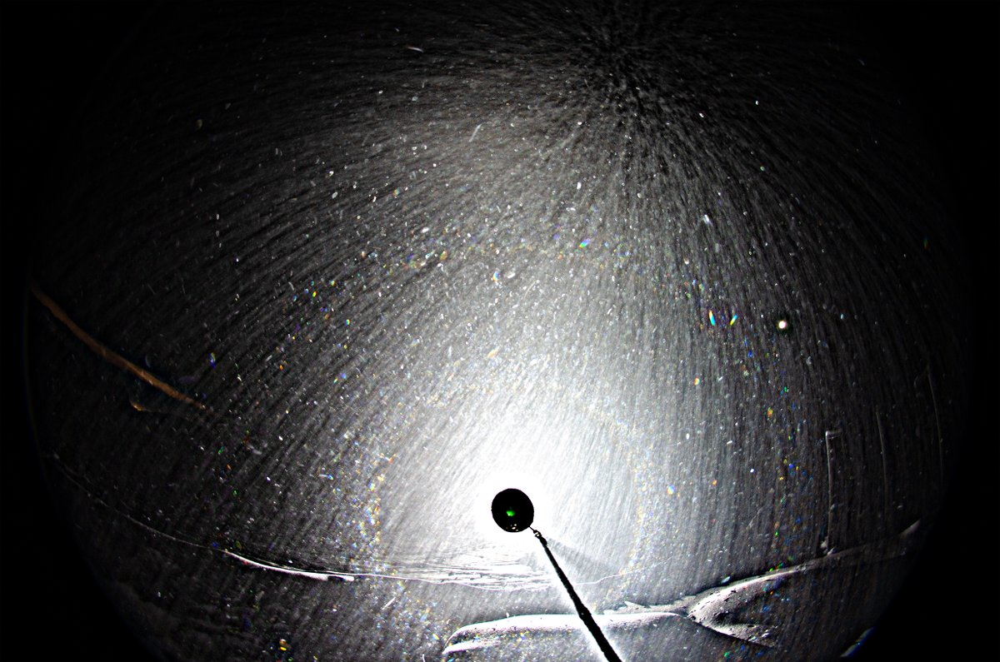
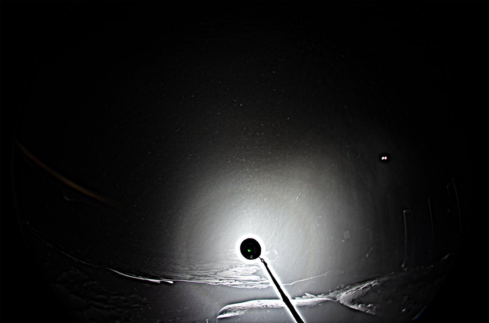
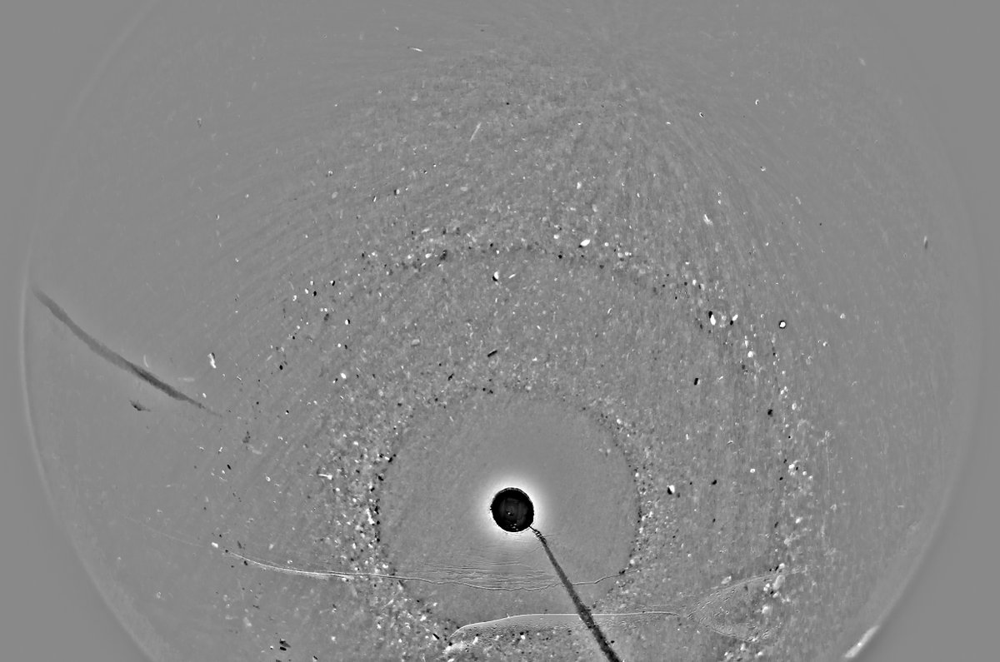
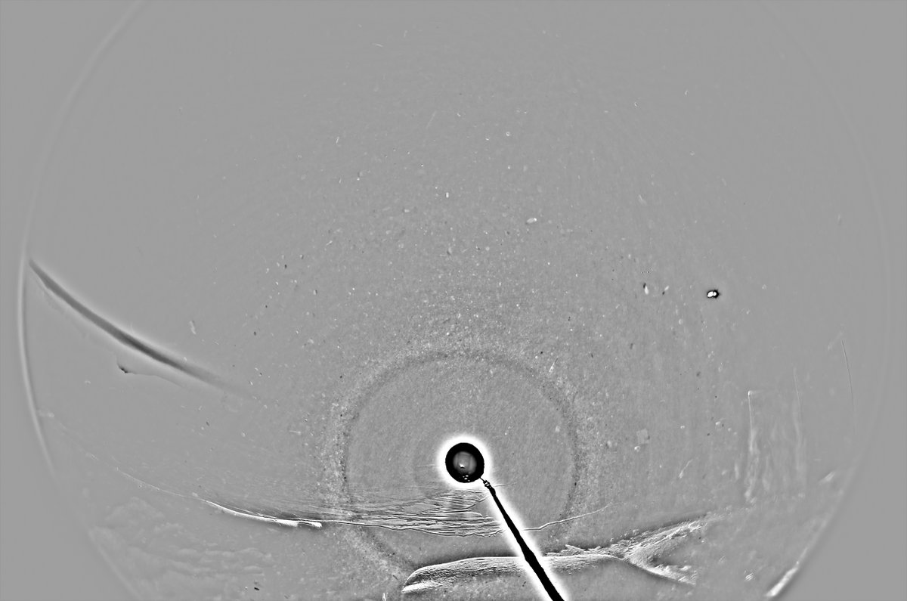

# Thread - 2024-01-24

**Original:** https://x.com/RiikonenMarko/status/1750161293867094437

---

### 1/1 - 2024-01-24 14:19 UTC

A display in thrown up snow on the night of 17/18 January in Anttilanvaara. The upper row image is the best shot I got, having also fine 46° halo. I didn't pay attention to it, but given the visually outstanding 22° halo no doubt I would have seen it had I looked . The lower row image is a stack of around 10 photos. Exposures 1 second, Olight Javelot Turbo.

I don't think there is any odd radii here, what looks like 9° halo is too sharp to be real. But odd radii should be possible given its ubiquitousness on snow surface. The interesting issue is the role of the deeper snow. How much it contributed to the display? Had there been a clear surface display, I most like would have noticed it in the lamp beam. Possibly this was all from the subsurface stuff.

This feels like worth digging some more into. It is also good way to warm up when you are in waiting mode. A crystal sample should be easy to take as the stuff falls down. These were big crystals which is always nice.

---

