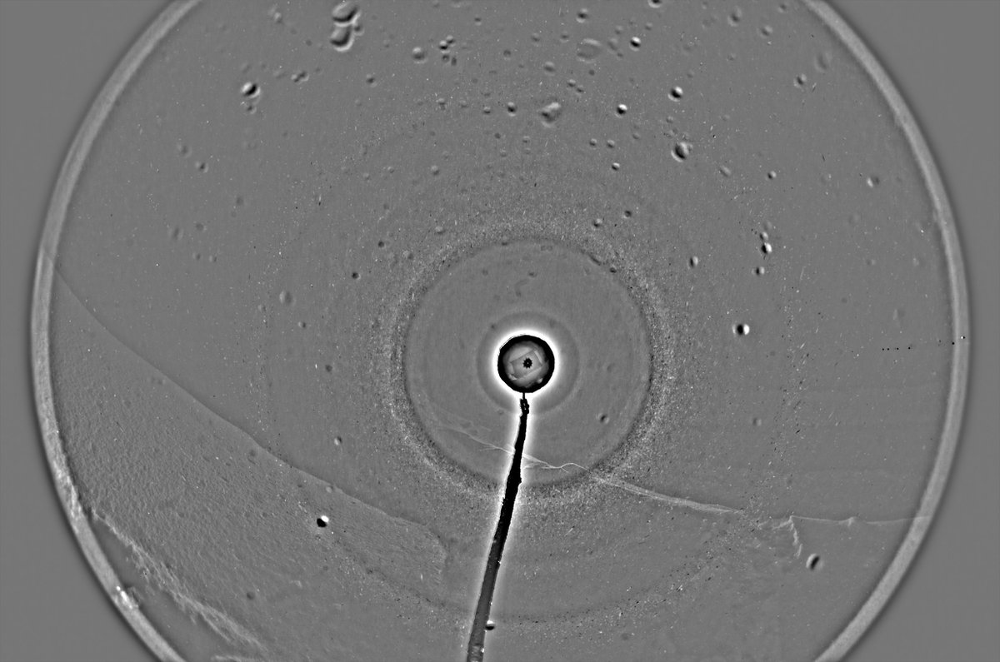
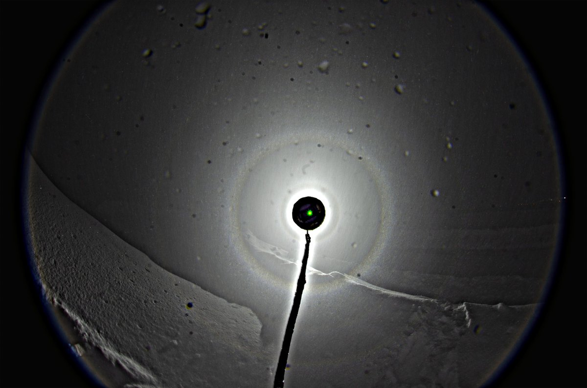
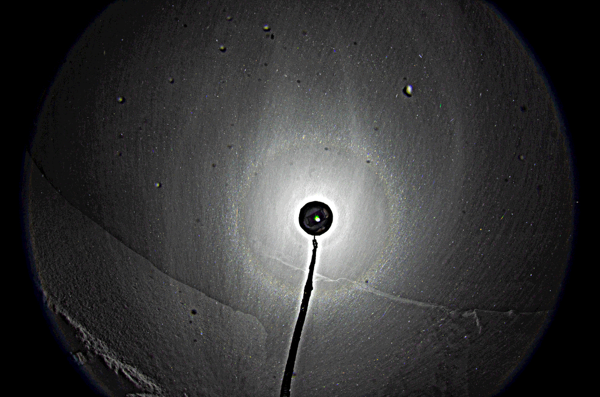
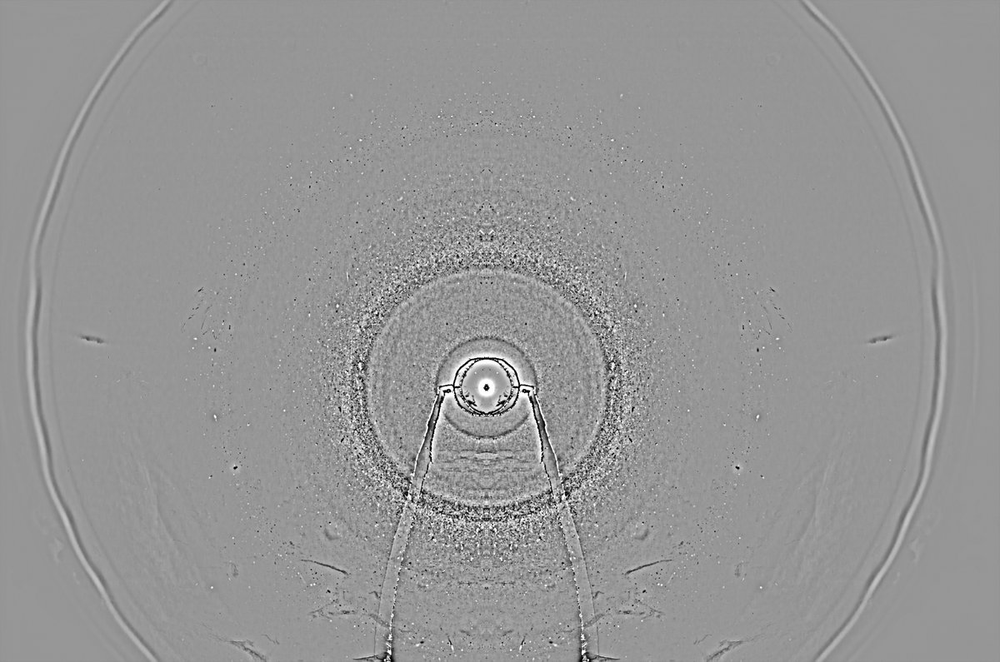
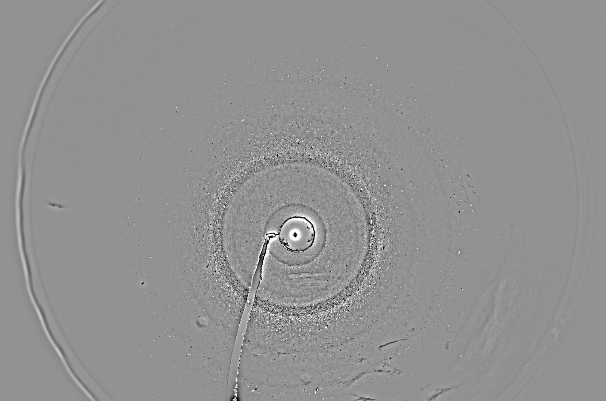
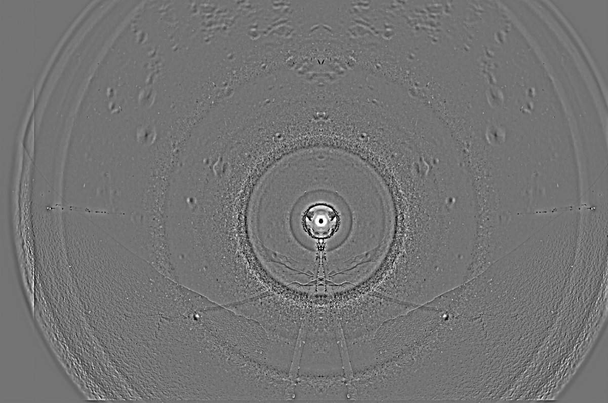
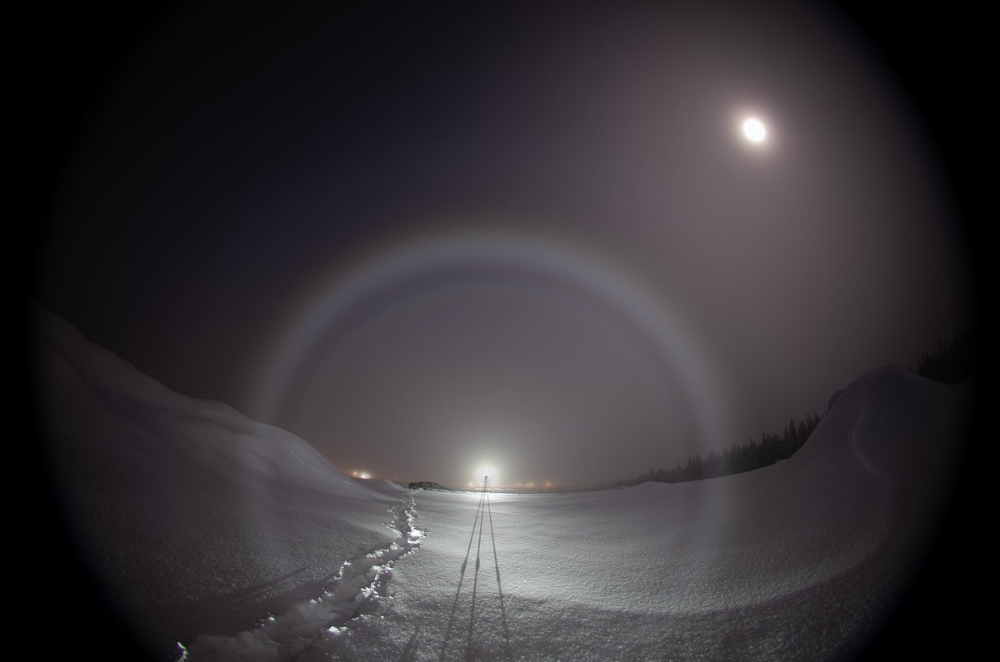

# Thread - 2024-01-25

**Original:** https://x.com/RiikonenMarko/status/1750574872655237501

---

### 1/2 - 2024-01-25 17:42 UTC

A quick result from snow throwing session last night, 24/25 January. Odd radii is indeed part of this game. The 9° halo I saw also visually. I didn't see it always when I looked for it, even if photos suggest it was there pretty much on every throw. I think my brain just wasn't always able to pick it out. The time for admiring these halos after each throw is very brief. I also looked for 46° halo and yeah, its glitter was there but I had to make conscious effort to see it. It was gone almost before I had time to register it. Only 22° halo was obvious outright.

Anyway, this probably means that the 9° halo looking feature in the snow-throw display a week ago was indeed real, not an artefact as I thought in my previous post.

I took a good look at the snow surface in the lamp beam and didn't see any halos – except where the thrown-up snow had landed. In these spots 22° halo glittered clearly. That would appear to tell the snow-throw halos were not from the immediate surface, but from deeper stuff. Today I went back to Anttilanvaara where I took these photos, and while there was a surface display in sun light, it was weak.

I also dug deeper than the uppermost fluffy layer of around 5 cm thickness. Haven't yet looked whether the display from these throws is different.

This opens of course a whole new halo sport. Should I continue the exercises, for sure 28° halo will be there sooner than later. I also took samples from the snow as it landed, but was not certain if I saw any pyramids there. It is the same scourge as with surface displays. Most of them contain odd radii, but for some reason I am often hard pressed to find pyramids in samples. Maybe I just don't recognize them.

The stack has some 30 frames, exposures 2.5 seconds. Also one single frame is included. Water on the lens is because the camera was warm. To have proper angular coverage of the display you basically have to throw the snow over the camera. The objective was dripping wet and I used toilet paper to dry it. Minimum temperature in my portable thermometer was -27 C. The light is Acebeam L19.

---

### 2/2 - 2024-05-30 12:14 UTC

For reference, here is the deeper layer stack mentioned in the 4th paragraph of the above post (24/25 January 2024, Anttilanvaara). The first two images. The third is 59 frame flip-stack that includes the frames from the above post's stack. There was also fogbow that night.

---

