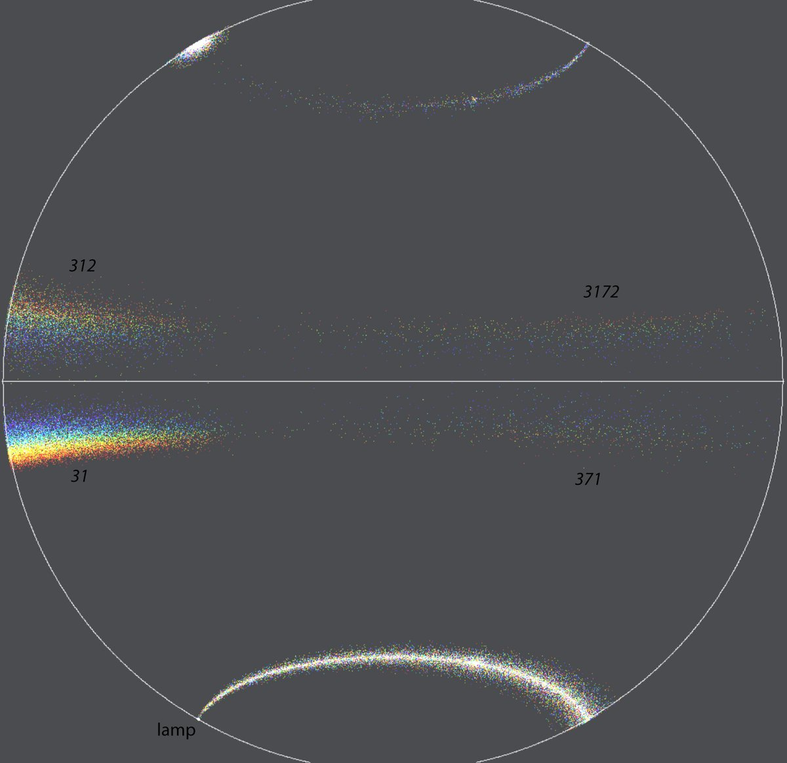

# Thread - 2024-01-26

**Original:** https://x.com/RiikonenMarko/status/1750976835809165742

---

### 1/1 - 2024-01-26 20:19 UTC

There is still plenty of winter left. So here is simulation showing three as yet undiscovered circumhorizon arc related halos that every a halo man with the means should be monomanically striving for. These are low hanging fruits, but are still on the branch because apparently no one in earlier chases have understood to do the simplest of things.

The light is 60 degrees below horizon in the simulation. Of the four halos which raypaths are indicated, only 31 has been observed. It is not the usual circumhorizon arc, which is 32. It might be called the circumhorizon arc B. Or something else.

The easiest of the rest three is 312. In a high quality swarm also 371, 3172 – which are extensions of 31 and 312 – will be visible. They could be named after the observer instead of calling them automatically as another kind of Kern arcs.

So you need a low lamp to catch these guys. But the thing is that not much space around the camera and thus not much distance between the camera and lamp is required for the display to form. How close to lamp the camera can be? This issue has been nagging my mind for some while already and the other night there was fog which got me making a test. I placed Acebeam L19 on the car roof and then placed myself close by, no more than 1.5 meters from it. The fogbow showed up very well in the narrow hot spot of the lamp.

And so would these halos. No high elevated platform, such as a bridge is needed to expand the lit space of crystals by increasing the distance between camera and lamp. It is enough just to photograph from tripod top height with the lamp right next to it on the ground. There will be fewer glints but they are brighter.

A narrow beamed lamp may not light up the whole display, but there is nothing wrong to concentrate on a segment and after having taken some photos adjust the configuration slightly to light up a different segment. Or maybe use floodlight (bright headlamp, for example) to capture it all in one go.

Embarking on a specific quest has of course a good chance of rewarding the seeker with some freebies. If also Parry crystals are involved, one might be the theoretical high elevation Ounasvaara arc. The blue subparhelic circle effect, which is best manifested at 58 degree elevation, is another one.

---

