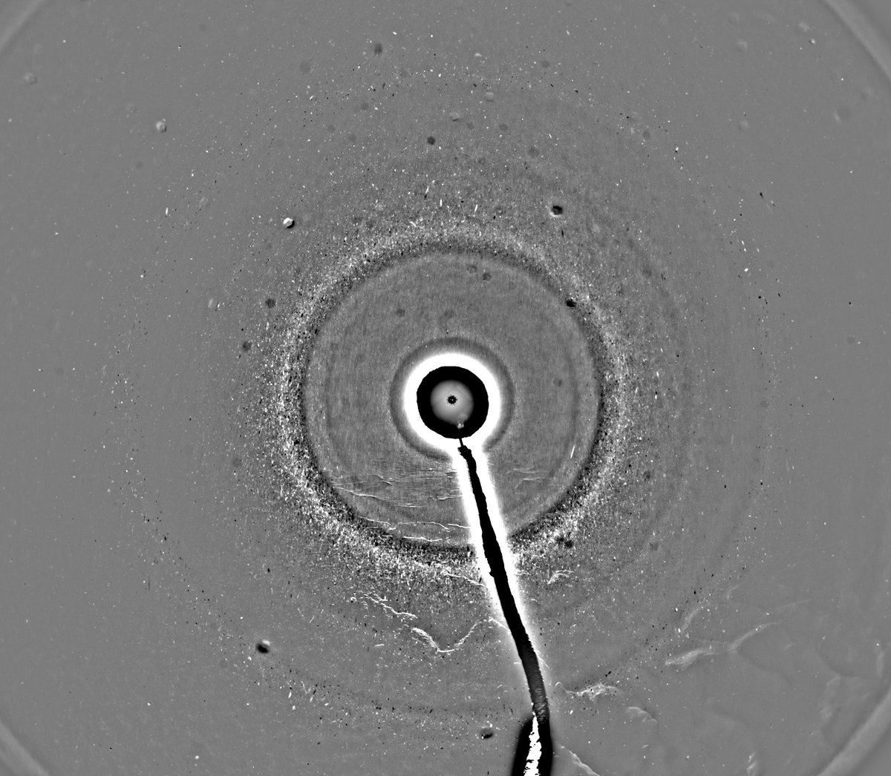
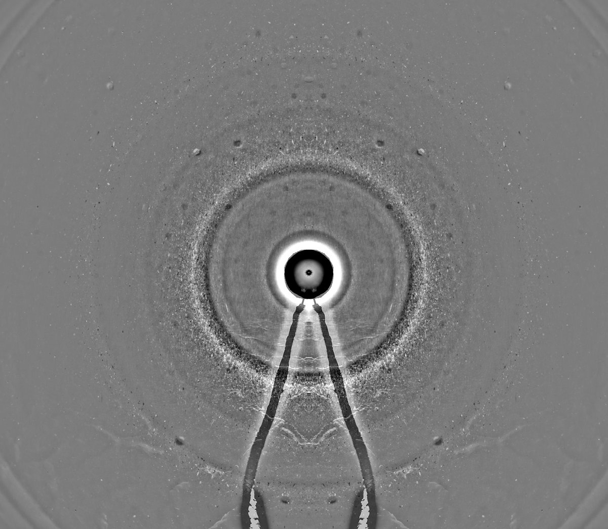
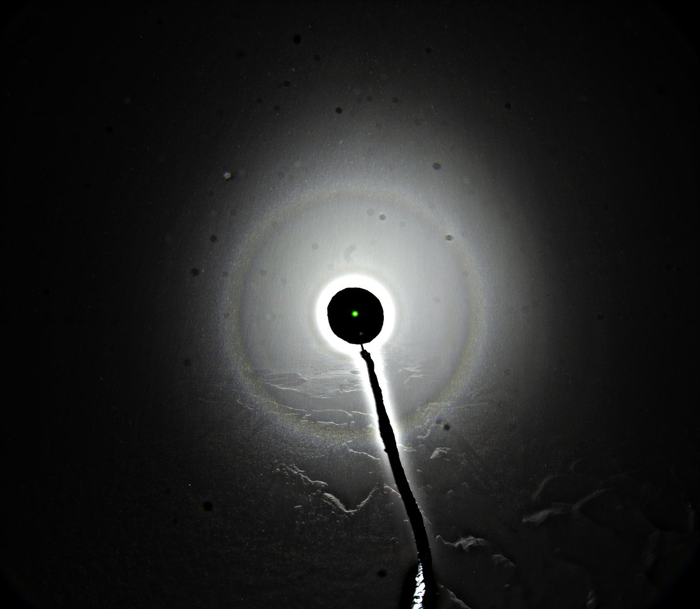
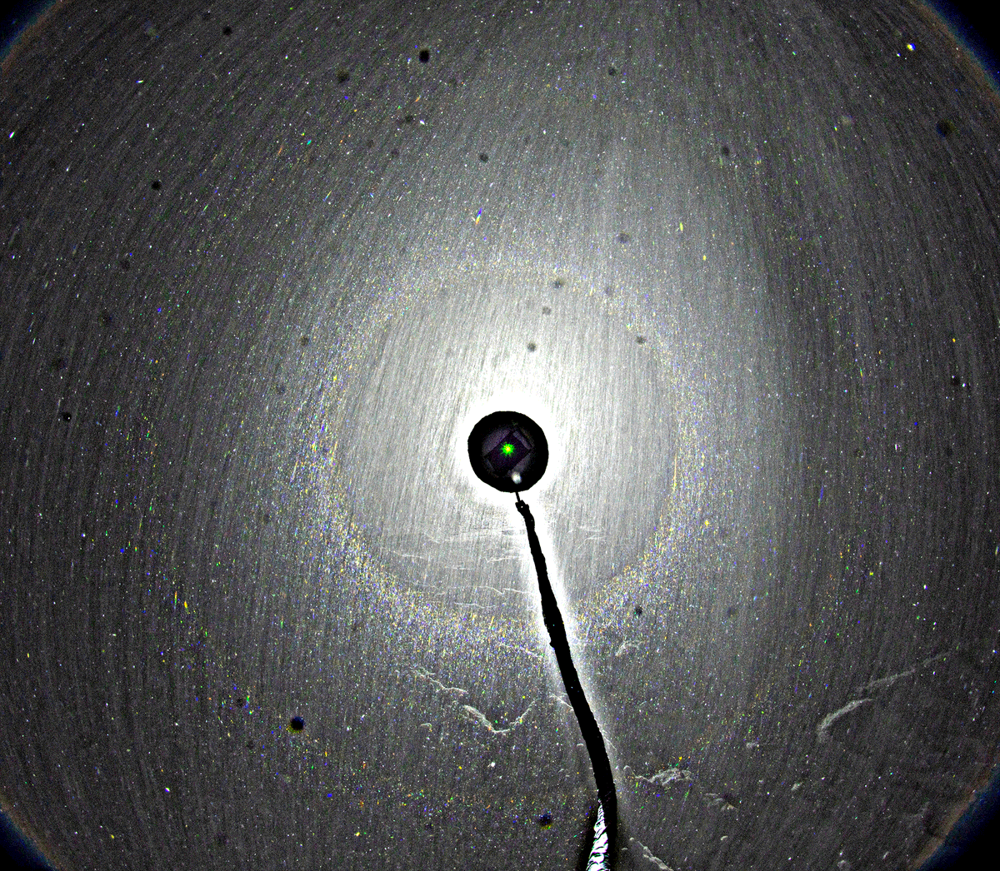
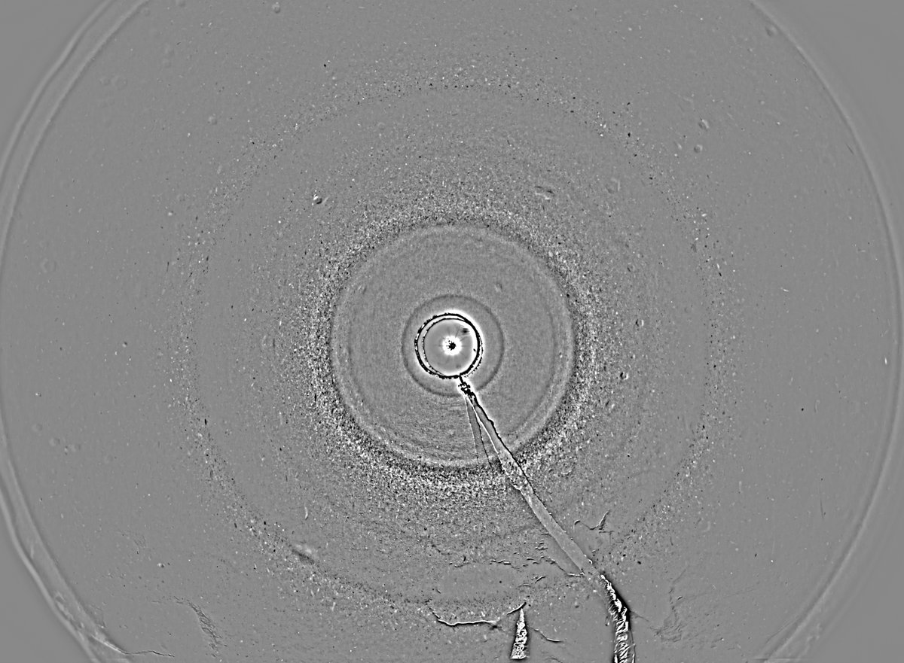
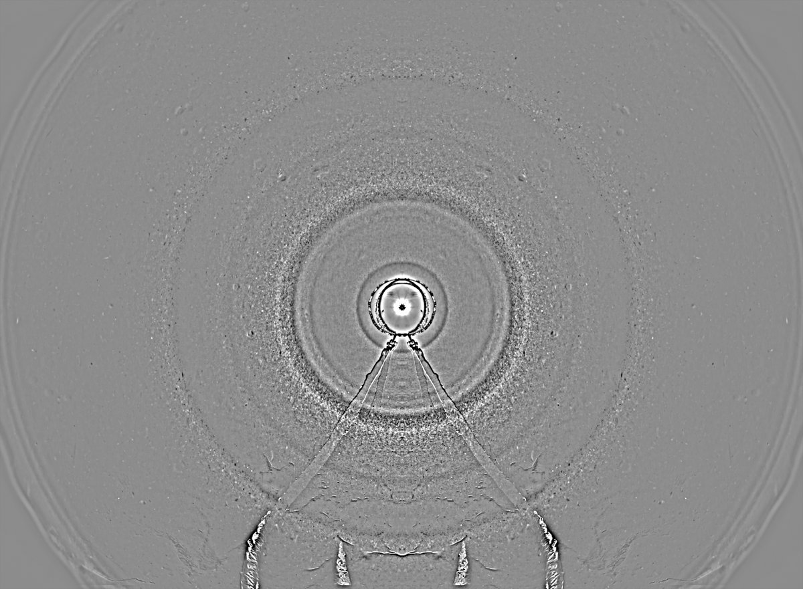

# Thread - 2024-01-26

**Original:** https://x.com/RiikonenMarko/status/1750996988605116730

---

### 1/2 - 2024-01-26 21:39 UTC

I was compelled to return to Anttilanvaara last night, 25/26 January, to fly snow again. Here is a quick stack of 27 frames plus a single frame. Exposures 2.5 seconds, Acebeam L19.

This is the fluffy surface layer, no new snow had fallen since the previous night. I dug again deeper but what I glanced at those frames the display is not as good. The stuff from the deep is also less floaty. It comes down faster and does not spread as easy to give wide and uniform angular coverage. Best to work with the top stuff.

The air was foggy, fogbow and glory were visible in the opposite direction. Temp around -25 C.

---

### 2/2 - 2024-05-30 12:49 UTC

For reference adding here a longer 108 frame stack from the night of the above post (25/26 January 2024, Anttilanvaara). The halos are better defined but nothing more there.

---

