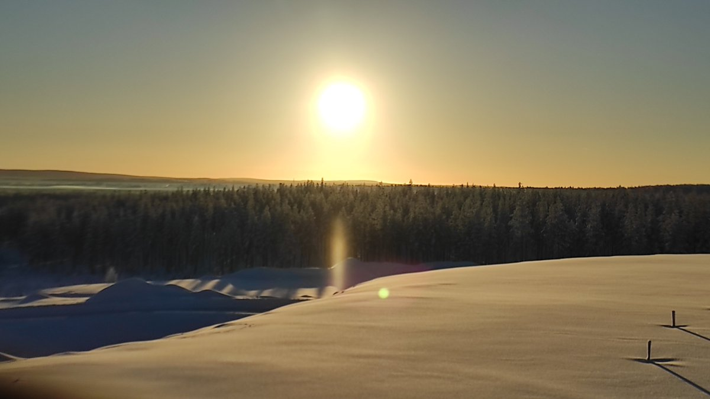
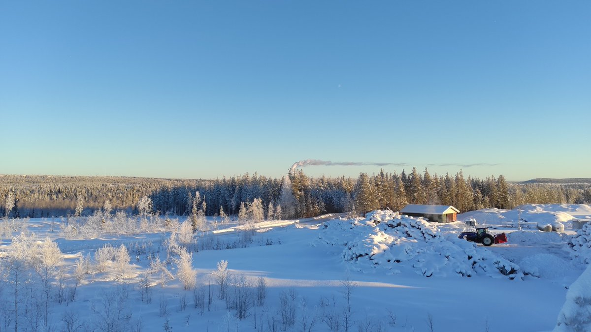

# Thread - 2024-01-27

**Original:** https://x.com/RiikonenMarko/status/1751230534670229998

---

### 1/1 - 2024-01-27 13:07 UTC

A very local subsun in the landfills of Anttilanvaara on 25 January. The air was still, crystals barely moving which made it look like it was a physical object. The nuclei came perhaps from the stirring of snow by the nearby tractor. It had snow blower attached. Had it been in use, we would have gotten much bigger cloud.

---

