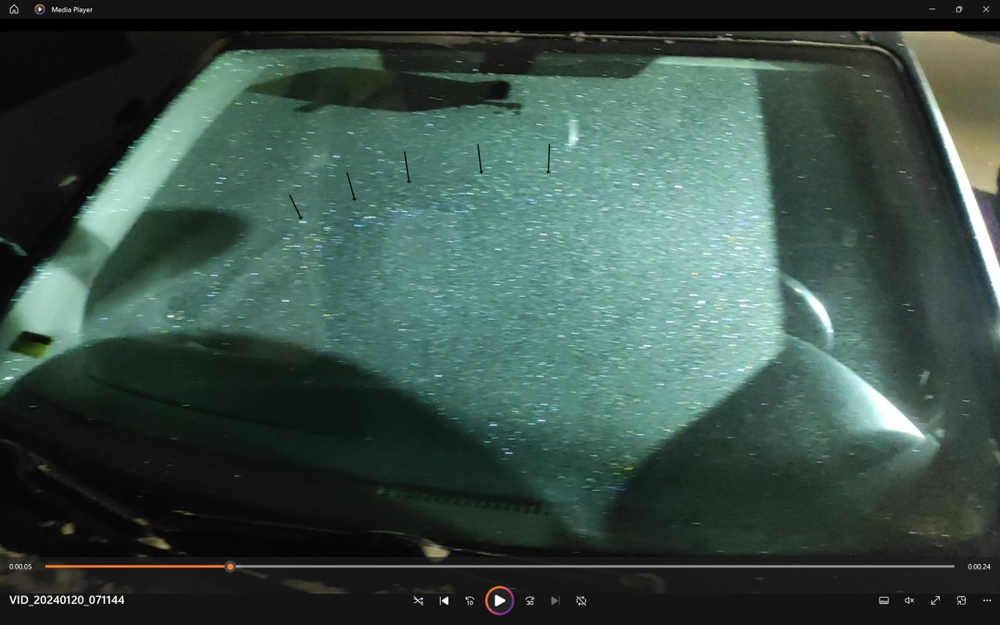
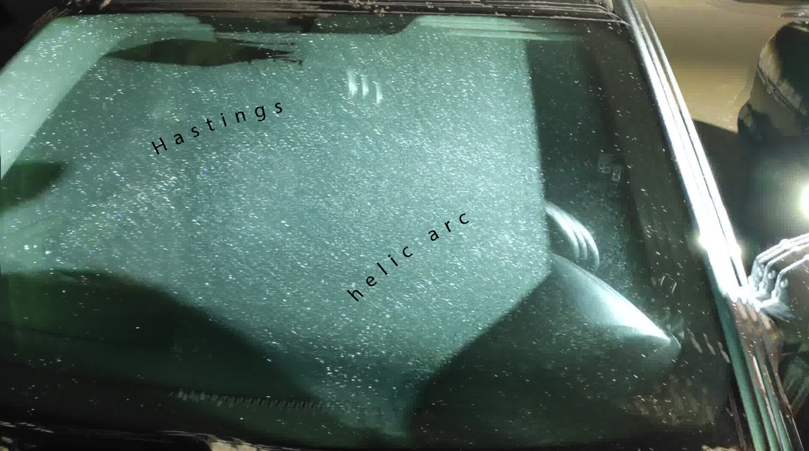
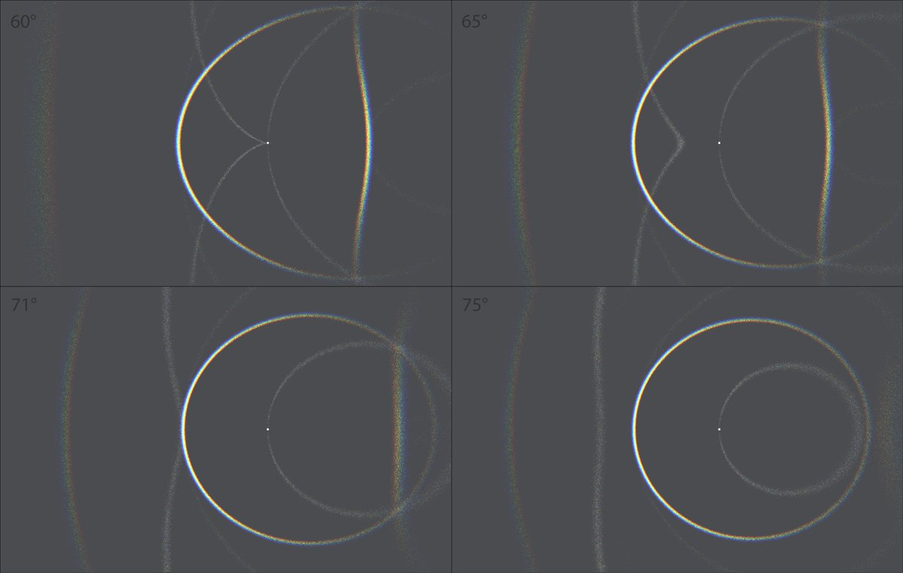

# Thread - 2024-01-28

**Original:** https://x.com/RiikonenMarko/status/1751599214948233360

---

### 1/7 - 2024-01-28 13:32 UTC

A video of the windscreen display on 20 January. Floody headlamp is on tripod behind the front door glass. One of the parking lot lights gives unwelcome glare, would have needed a comrade to hold placard for shadow. We see also some halos from that light intruding.

Helic arc and Tape arcs are present and I seem to see even a glimpse of Hastings arc. But I suspect it will have succumbed to upload compression here. However, on some of the other videos that I will add to this thread Charles Sheldon should be better visible and may survive publication.

I unnecessarily adjust the exposure darker. It seemed live like the stuff might get the a bit overexposed, and maybe some darkening indeed was in place, but I do it to the extent that the display loses some of its dazzle.

[🎬 1751599214948233360--E9X2ELZk5xK9d04.mp4](media/1751599214948233360--E9X2ELZk5xK9d04.mp4)

---

### 2/7 - 2024-02-01 11:27 UTC

Low lamp view of the windscreen display on 20 January. This is the only video I got with uppervex Parry. I took another one, with even lower lamp, but some glitch occurred and it is all black.

I should emphasize that live this display was stunning. If I knew there was diamond dust elsewhere in the city, I would not leave before I had taken my good time with the windscreen. Armed with what Tape has written about the subject in part two of the Streetlight Halos the night will turn into hours of fun doing different configurations and trying to understand what's going on.

Talking of that, due to the light and observer being on the same side of the windscreen in this video, halo identifications get more complex as halos from direct light and from reflected light (off windscreen) are superposed. In reflected light the two Parry arcs would be regarded as plain Parry arcs (like they were Parry arcs from light behind the winscreen), in direct light as sub-Parry arcs. Given how delicately balanced crystal shapes are needed for sub-Parry arcs in simulations, I think we can safely regard these as having arisen pretty much solely from reflected light and their identity is thus Parry arcs, not sub-Parry arcs.

Other separations, such as helic arc / subhelic arc and in particular parhelia / subparhelia are not as obvious. I'll return to these later.

[🎬 1753017189311889594-8IPkb9261BGoL-s8.mp4](media/1753017189311889594-8IPkb9261BGoL-s8.mp4)

---

### 3/7 - 2024-02-01 17:15 UTC

This video of the January 20 windshield display shows right from the beginning a long colored arc that must be a Hastings arc. Closer to the camera a pretty good helic arc is seen trailing past cza.

All halos appearing thus far in these videos have been recognized in earlier windshield displays, but Hastings breaks new ground. With that, our sights are at vaulting an ever higher bar. In the next big one, will we be able to bag subanthelic/Tricker arc? Kern arc and Ounasvaara arc? What I have leafed through the about 30 videos I took of this display, I don't see any of them. Maybe I just didn't have what it takes to get the configurations right. You better have your Tape recited in and out and possess a crystal clear action plan to reap these displays to their fullest when they come about.

[Test uploads revealed video quality issues. Hastings colors are washed out, maybe completely. It is what it is. Next post in this thread has an extracted frame showing the colored glints.]

[🎬 1753104718098841783-mOTJ0gF15tSMdzsN.mp4](media/1753104718098841783-mOTJ0gF15tSMdzsN.mp4)

---

### 4/7 - 2024-02-01 17:18 UTC

An extracted frame from previous post video showing Hastings arc (arrows). The other image has four successive video frames max stacked.

---

### 5/7 - 2024-02-02 12:11 UTC

Another video that in the original file shows a nice colored Hastings arc.

Not sure if in the previous video, near the end, I botched a chance to see if subanthelic arc was tangenting helic arc. I would think subanthelic arc location was indeed covered, but certainly I should have concentrated more on the helic arc vertex. The lamp elevation is around 20 degrees, which is when the tangenting loops of the two arcs are about equal size. In diamond dust displays you wouldn't expect Hastings arc without subanthelic arc.

[🎬 1753390691705606611-01iLsaTUPjFl799H.mp4](media/1753390691705606611-01iLsaTUPjFl799H.mp4)

---

### 6/7 - 2024-02-04 14:07 UTC

A high lamp view of the 20 January windshield display. I think everything we see is mostly if not solely in light reflected from windshield vs direct light from the lamp. With this, the halos are lowercave Parry, circumhorizon arc and helic arc instead of their sub-counterparts. Also uppercave Parry glimpses in the beginning. Light hits the side windows at an increasingly steep angle towards the front of the car which is why, as I move forward, helic arc is seen proceeding completely outside the Parry arc. Had I realized helic arc was there, I would have planed this configuration more thoroughly. In a post that will follow in this thread, I have some simulations made.

[🎬 1754144742982463627-Cr-I6JlL1ATZVVU2.mp4](media/1754144742982463627-Cr-I6JlL1ATZVVU2.mp4)

---

### 7/7 - 2024-03-21 08:19 UTC

Reference simulations for the previous video's helic arc. 20 January 2024, Rovaniemi.

---

