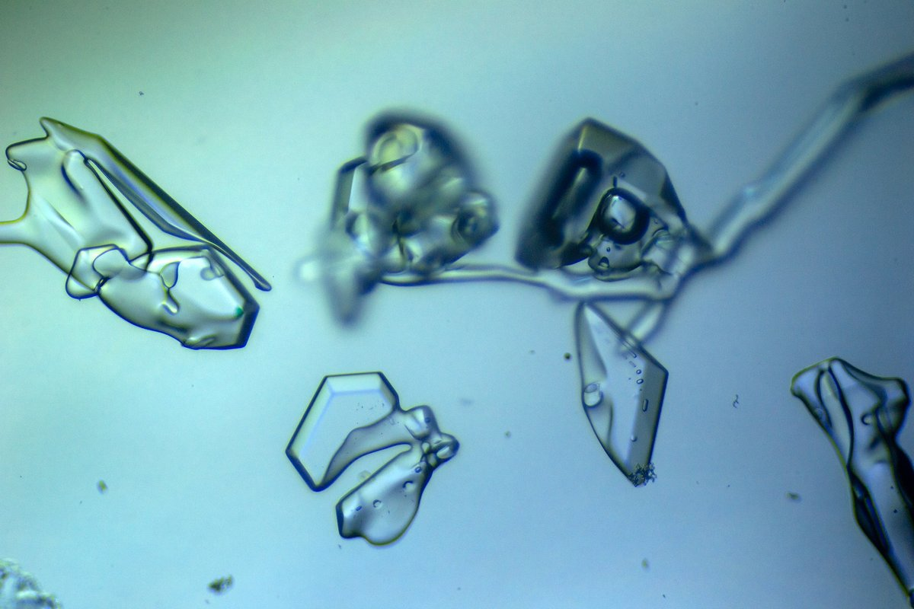
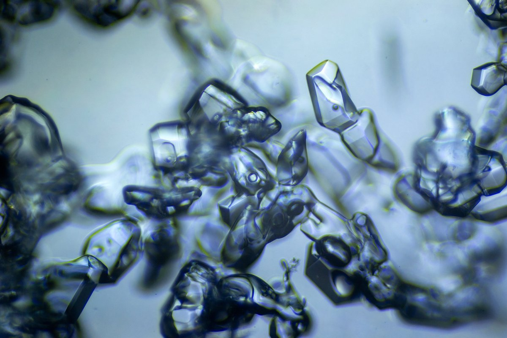
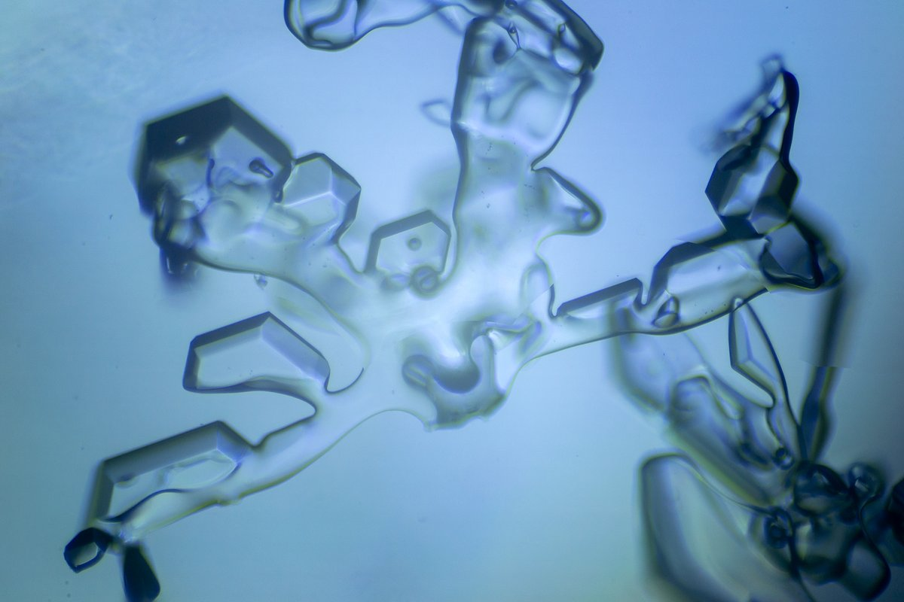
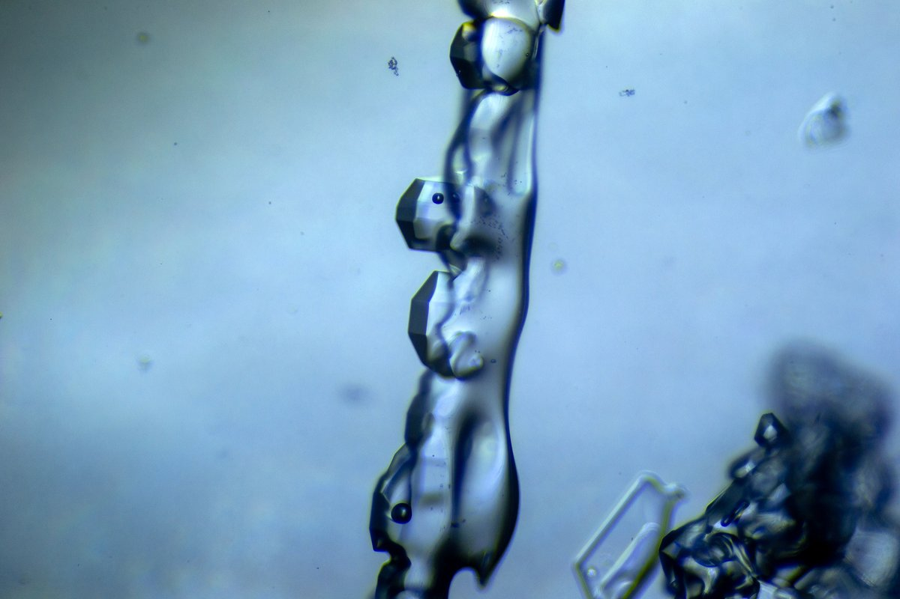

# Thread - 2024-01-29

**Original:** https://x.com/RiikonenMarko/status/1751999506349003200

---

### 1/1 - 2024-01-29 16:03 UTC

Looked whether there are any papers mentioning pyramid crystals in snow packs. Seems like their existence is well known. Found right away paper "Snow Metamorphism as Revealed by Scanning
Electron Microscopy" by Domine et. al. with great ESEM photos (the paper is behind paywall but Sci-Hub has it). The writers mention some of figure 9 crystals as having pyramid faces. To me it looks like figure 3c crystal has some, too. Likewise figure 3e.

Below is a little sample of my photos from 24/25 January night (https://t.co/E2FZhUtlbG). These are crystals that landed from thrown-up snow on a Petri dish that I held in my hand. Some clear pyramids there. They are hard to recognize in the field from the camera lcd-screen, should look with the stereo eyepiece but changing back and forth is too much hassle. The two protruding crystals in the fourth photo would seem to make funny angles, maybe one of the faces is a bit curved in. Similar looking crystals are in the aforementioned paper figure 8.

So far I have sampled on hard ground and on lake ice. Often lake ice snow pack is slushy at the bottom from seeping water. However, on the small lake Norvalampi, where I carried out my first session on 24/25 January night, it was dry all the way. It will be interesting to spin snow from slushy bottomed snow packs.

We have only just started out with the snow-throw displays so the enigmatic 28° halo, which is associated with odd radius displays, has still plenty of chances to show up in upcoming sessions. This may well trump the surface displays as the main approach for getting those crystals photographed and it looks like this needs to be the top priority for the remaining winter. I need to start carrying laptop to do quick stacks to check the display composition. If 28° halo is a show then I know not to leave the place before I have photographed the crystals beyond exhaustion. And who knows what more the quest will turn up. Maybe some night the 9° halo is accompanied by 13° halo. Maybe even something wilder is on the offing for those who indefatigably keep spinning the white stuff?

---

