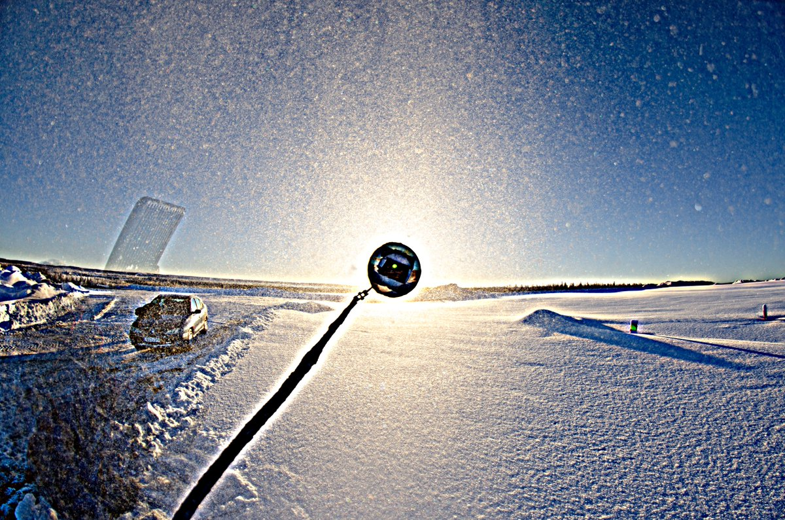
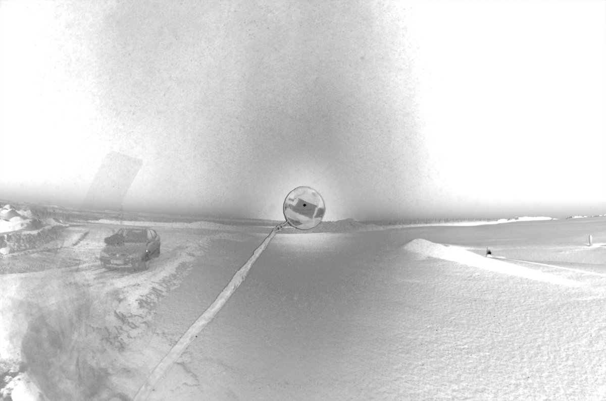
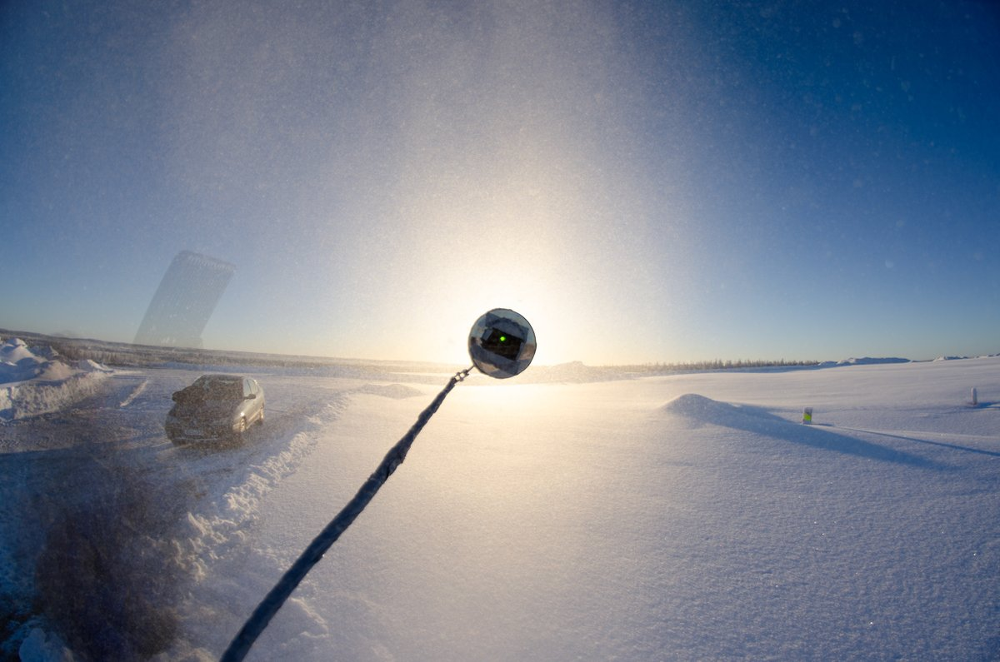
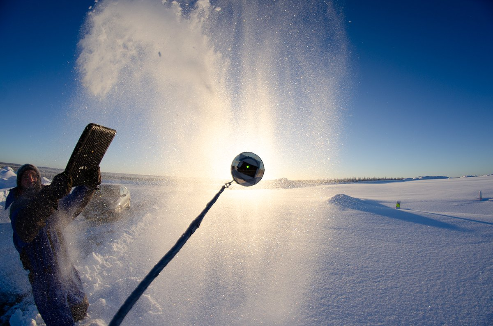

# Thread - 2024-01-30

**Original:** https://x.com/RiikonenMarko/status/1752383929607127375

---

### 1/1 - 2024-01-30 17:31 UTC

Clearly, in sun light you have better things to do than snow-throw. In Anttilanvaara, between the two fine spotlight beam throws, I did this daytime experiment on 25 January. Different versions are provided of 10 frame average stack – br, usm and naturell. Plus a single frame which actually shows the 22° halo best.

---

