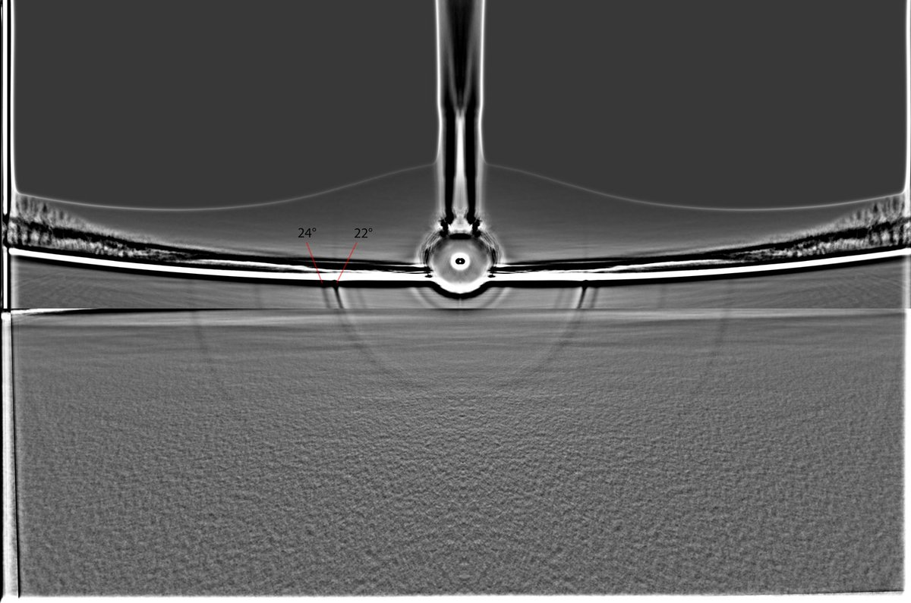
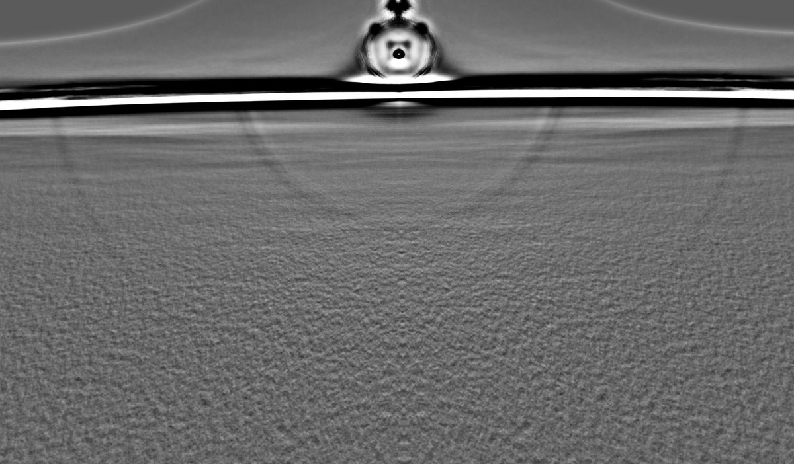
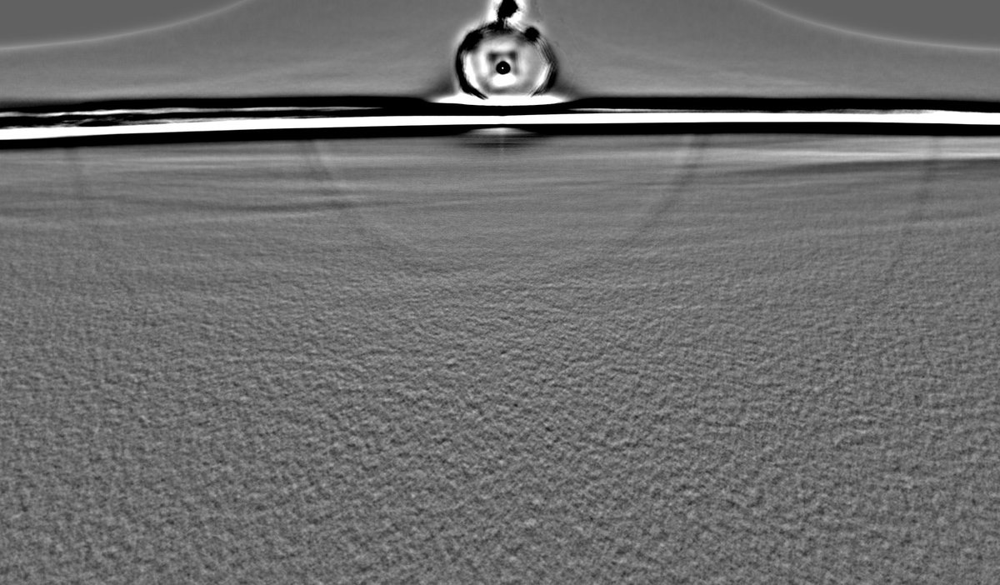
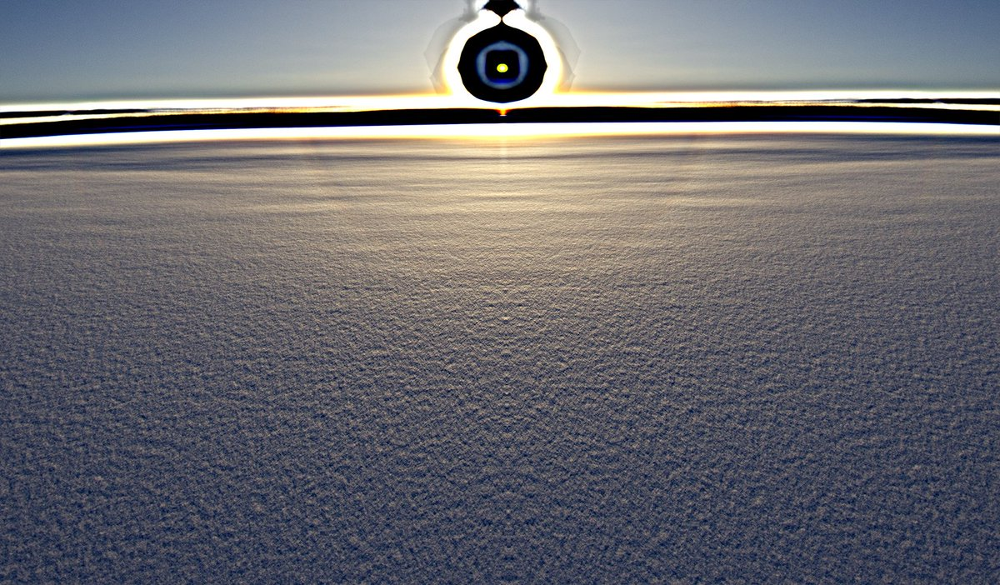
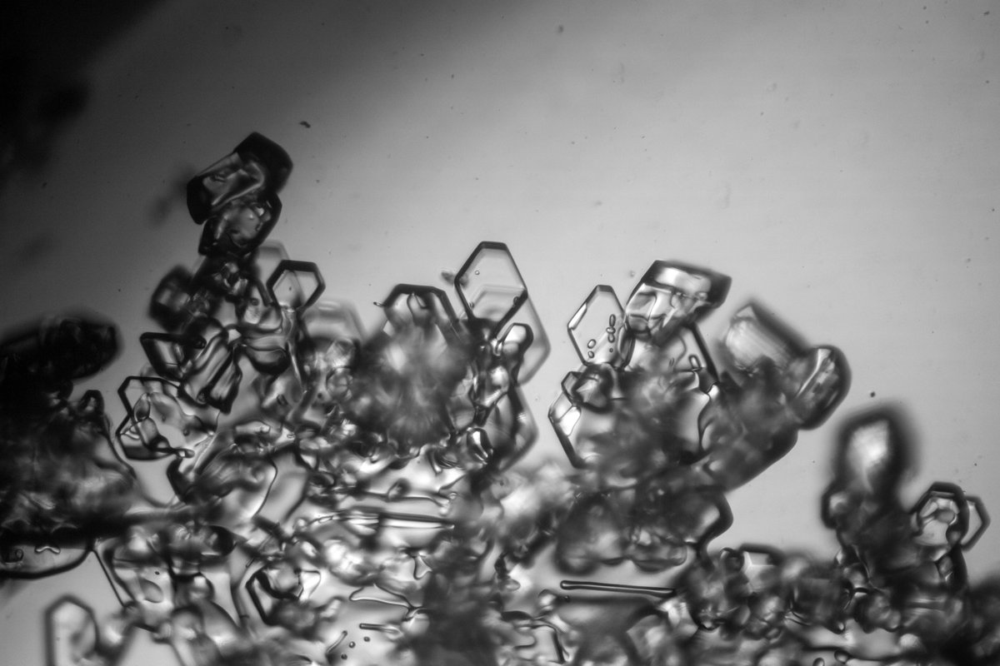
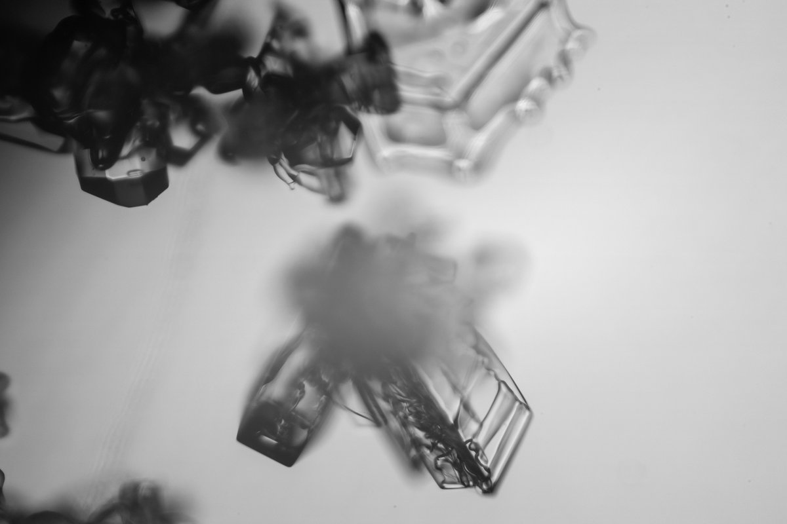
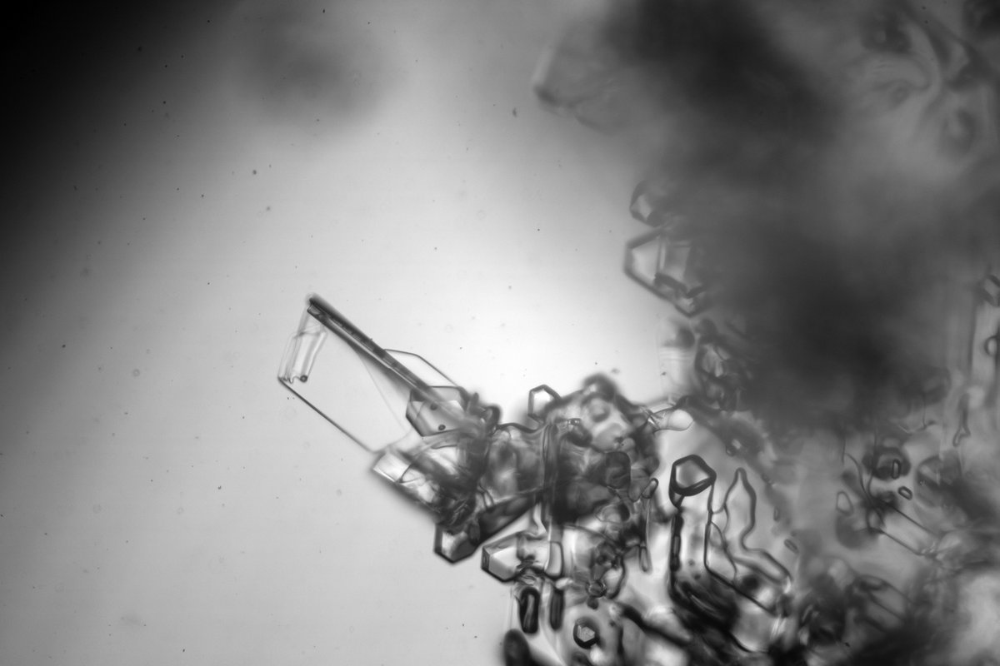
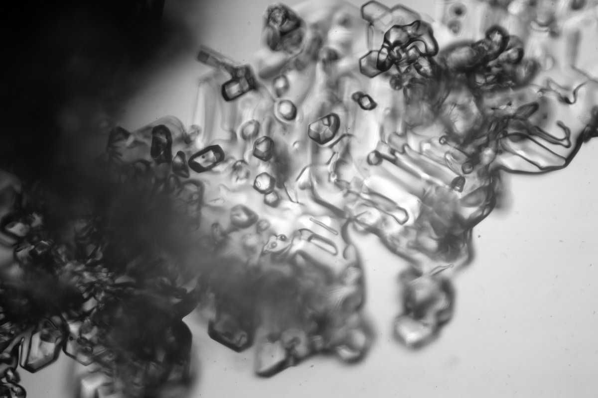

# Thread - 2024-02-05

**Original:** https://x.com/RiikonenMarko/status/1754459712727269761

---

### 1/2 - 2024-02-05 10:59 UTC

1/2. A weak surface display in the (as it is stated in an official paper) "landfill and waste treatment area" of Anttilanvaara between two nights of odd radius snow pack (= snow-throw) displays. Radius check to an earlier bigger display in the last image identifies the two rings as 22 and 23°. However, there was quite a bit of vertical displacement of the sun between the two images, so I still want to check with better alignment.

Because the display was so poor, I went light on it, the stack has only 204 frames. It is quite a difference to the two snow pack displays in spotlight beam:

https://t.co/E2FZhUtlbG
https://t.co/GwPdKN15p8

Other activity associated with this daytime surface session:

https://t.co/FWnQEmYIbn
https://t.co/pWQh7daKvi

---

### 2/2 - 2024-02-05 11:29 UTC

2/2. Given 23° halo is the better defined halo in this January 25 surface display, we should expect to see pyramids. Well, as usual, they don't really jump on you. I didn't take that much crystal photos and only one, here the third one, ticks confidently the box. I am not sure about the crystal on the upper left corner of the first photo. I need to start spending more time on crystals in the coming sessions. You can't really photograph them too much.

---

