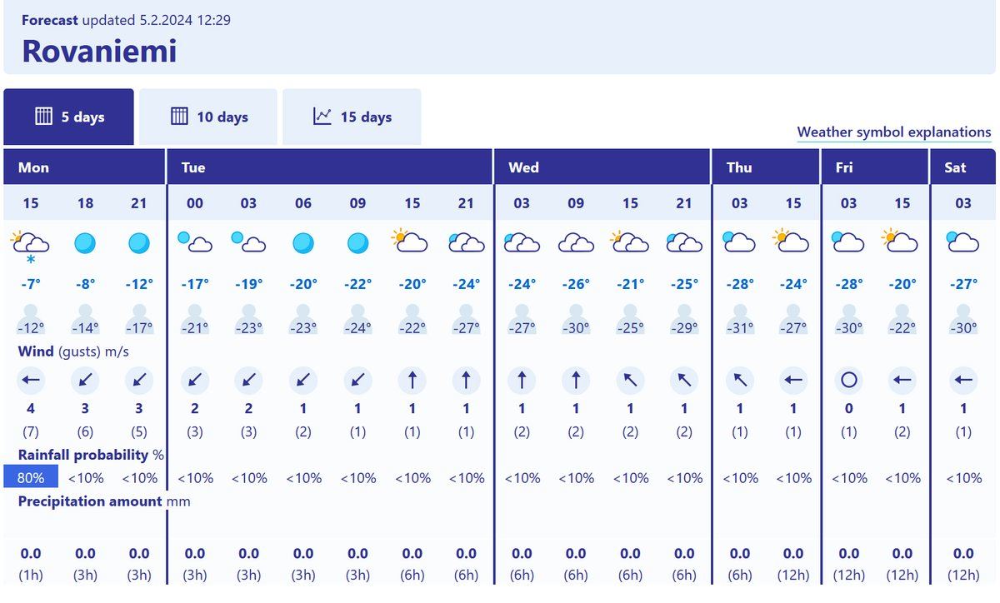

# Thread - 2024-02-05

**Original:** https://x.com/RiikonenMarko/status/1754475609047138649

---

### 1/1 - 2024-02-05 12:02 UTC

After a week or so of warm weather with some days above freezing, we are getting back in business. They still have snow to do at the ski center, however, the temps are so low that they won't be using pressure air. Thus any diamond dusts hang again on the Suosila power plant and those swarms don't make your life easy. Maybe I just concentrate on the snow pack and snow surface displays.

---

