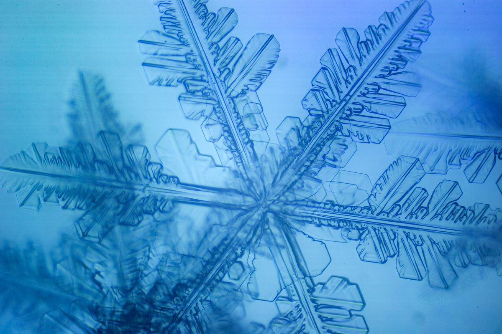
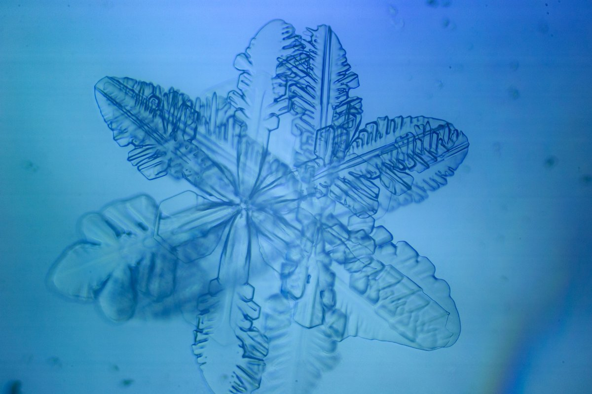
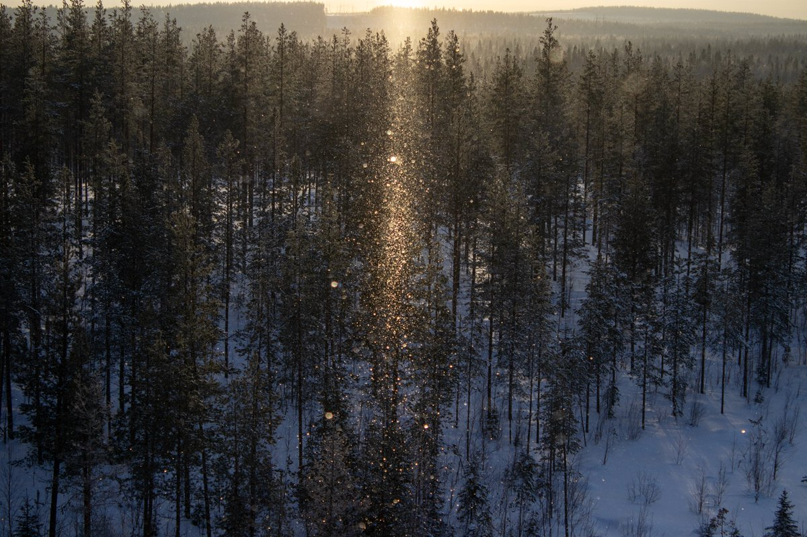
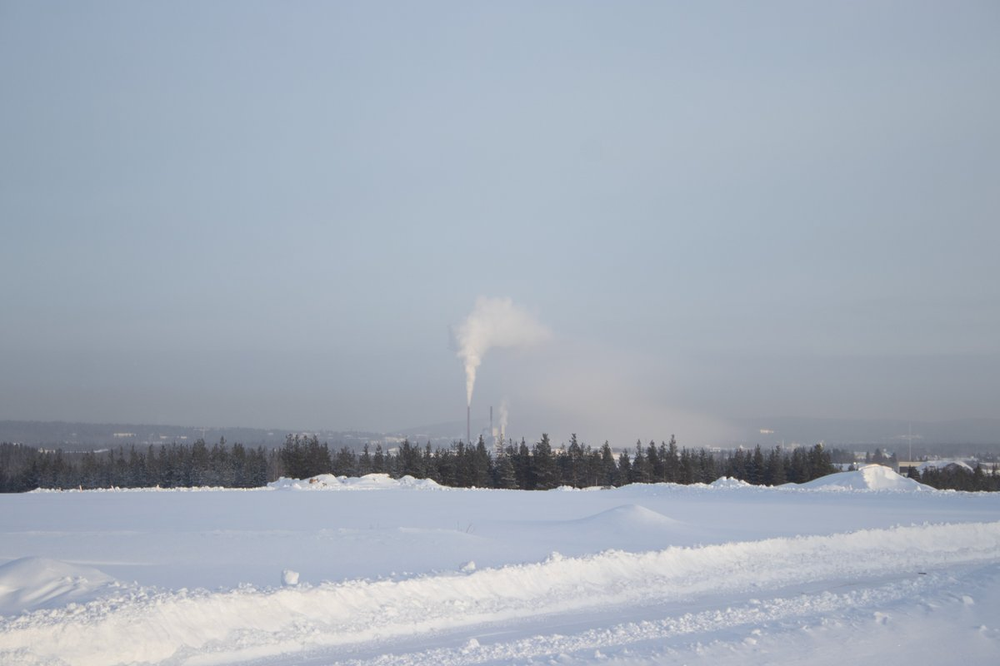

# Thread - 2024-02-06

**Original:** https://x.com/RiikonenMarko/status/1754907510836740188

---

### 1/1 - 2024-02-06 16:38 UTC

Some quick photos today, 6 February, from Anttilanvaara. Subsun's dazzle is suppressed somewhat by dimming cloud on front of the sun. I waited until the cloud disappeared and then took much more photos on tripod just in case max stacking would be necessary to flesh out the subsun better. However, this time the focus was off, so so much for those shots.

I was compelled to photograph the crystals, too. These snow-stars had been falling since morning. The temp in Anttilanvaara was -25 C.

Suosiola plant smoke is seen descending to the ground in the distance. No halos, on my return to apartment I drove through that foggy area, stopping at a gas station to have a better look. In the morning the stuff was better, showing moderate parhelia.

I haven't slept since I left last night. Gotta be going again tonight, it is actually already dark, but an hour or two sleep is probably in place.

---

