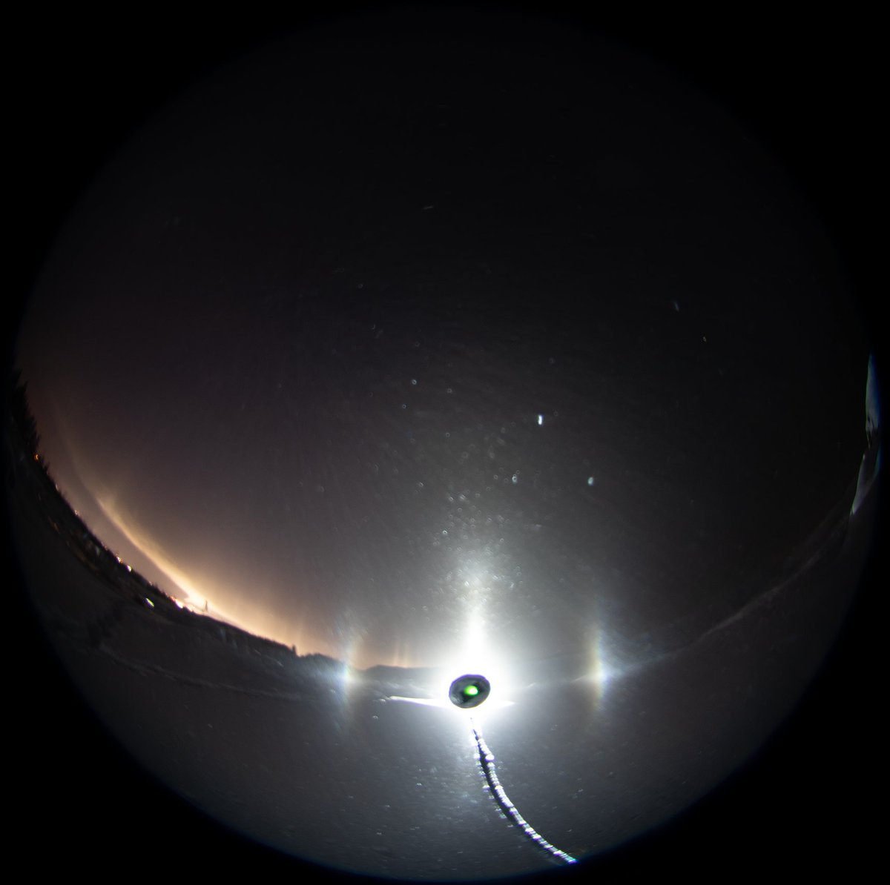
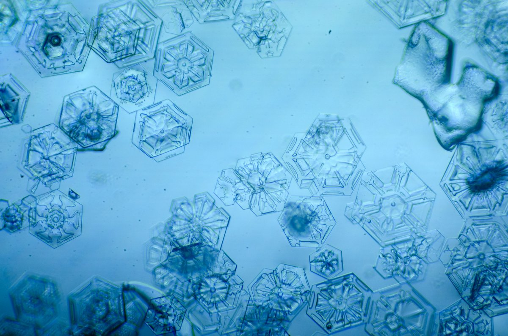
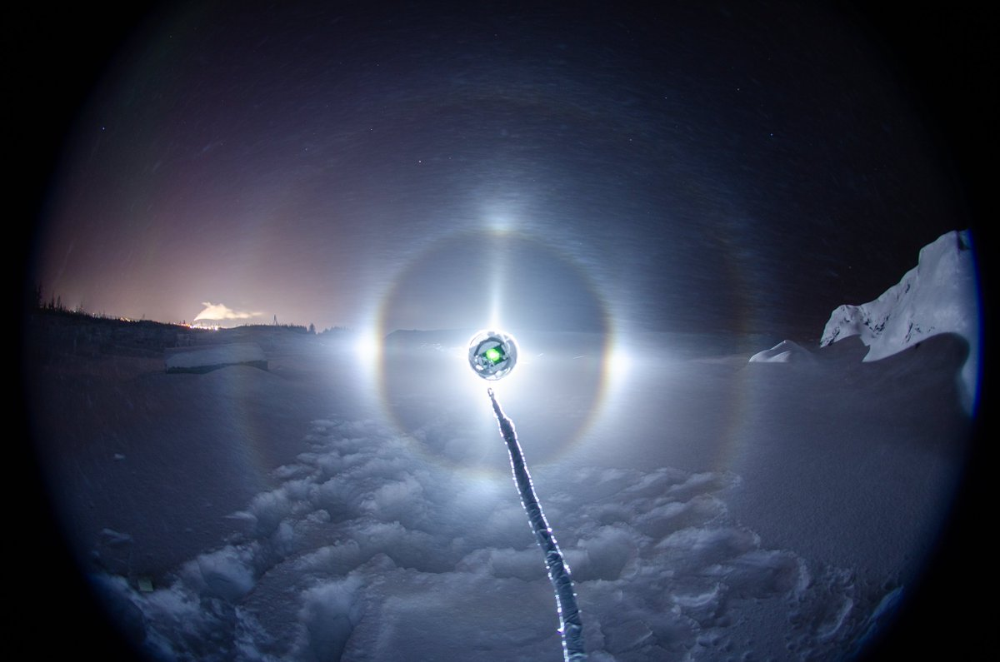
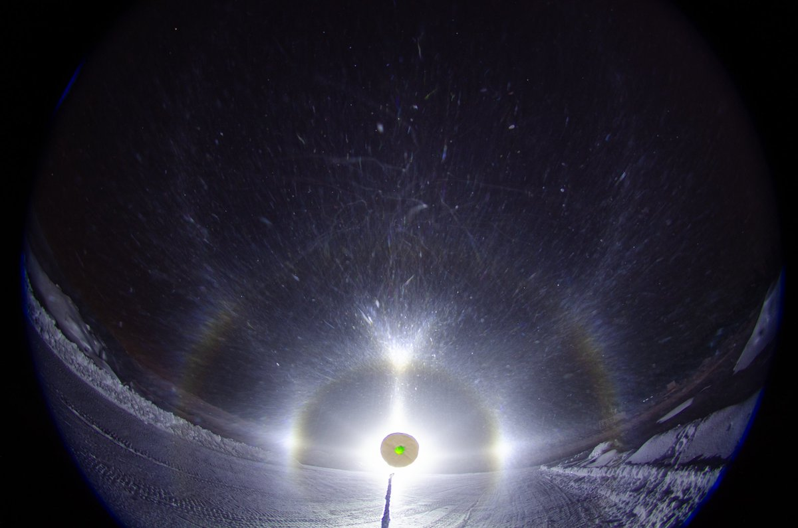

# Thread - 2024-02-06

**Original:** https://x.com/RiikonenMarko/status/1754893277021552708

---

### 1/1 - 2024-02-06 15:42 UTC

Some quick snaps from last night. Lots of things happened, very busy and sweaty night. I left after 22 and came back at twilight. The first photo is the night's last display, this was from the Suosiola plume. All crystals that landed on the dish were these decorated plates. The display in the third image was generated by my snow throwing. I don't know the origin of the fourth image display. It was not snow-throw born nor from Suosiola plume.

Temp settled at -32 C sometime after midnight.

---

