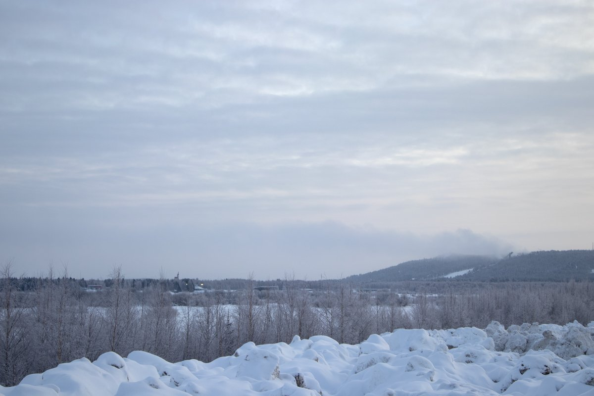
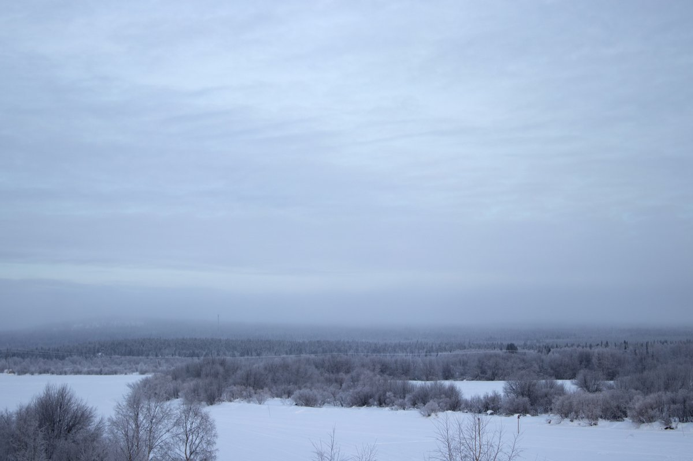
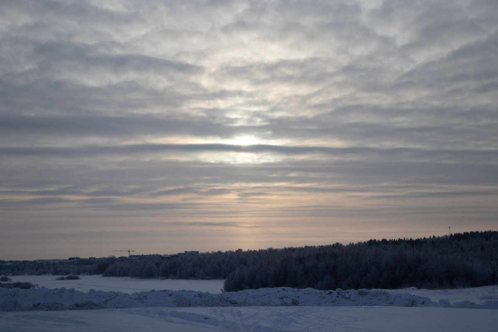
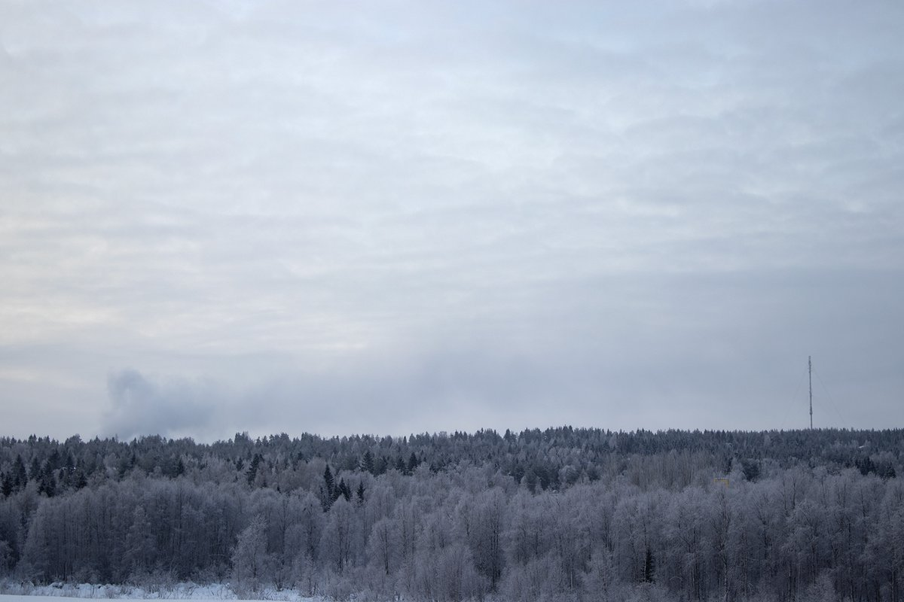
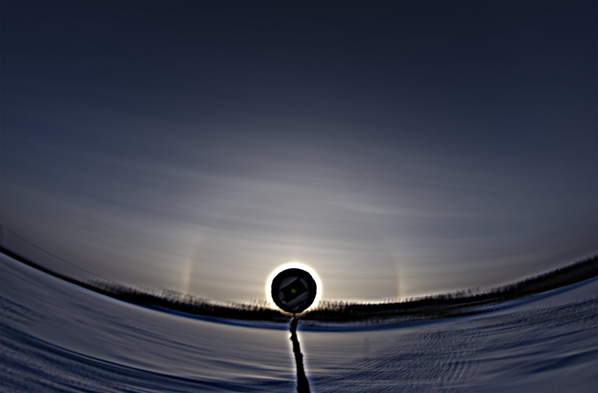
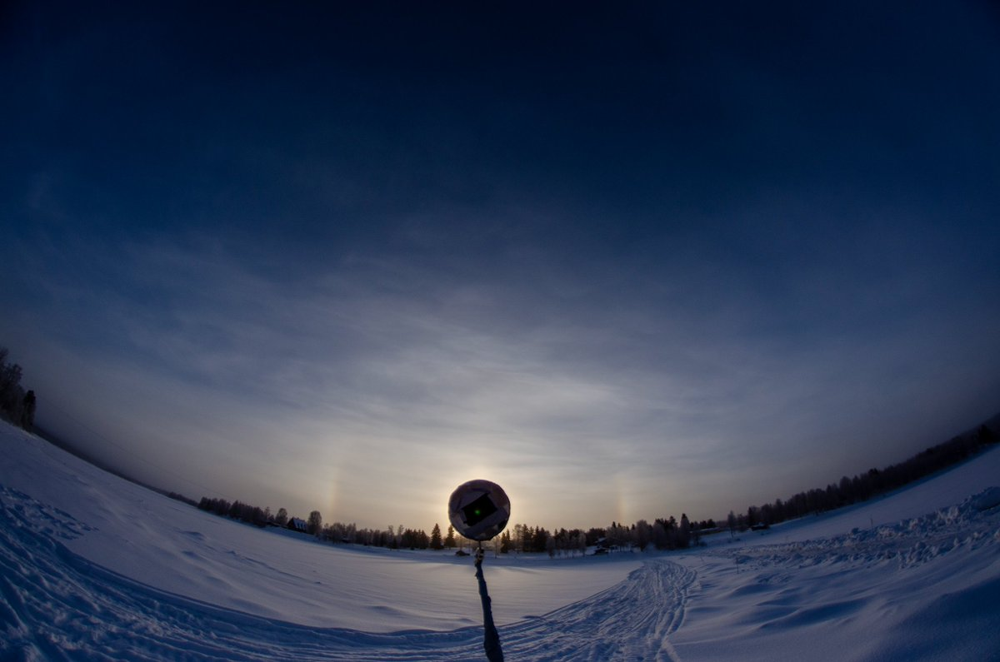
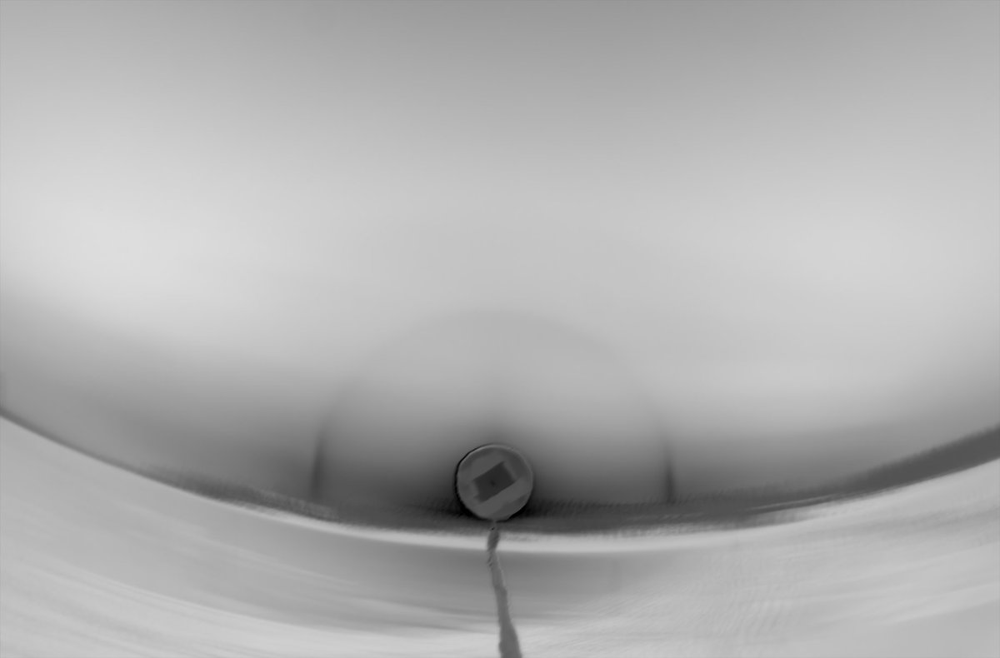
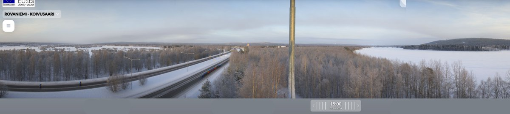

# Thread - 2024-02-07

**Original:** https://x.com/RiikonenMarko/status/1755110925982367839

---

### 1/4 - 2024-02-07 06:07 UTC

Morning impressions from Rovaniemi in the early twilight 7 February. I saw strong pillar from my window which necessitated putting on my Baffin Impacts and going for a stroll.

Last night I didn't go anywhere. I woke up at 3 am after good 8 hours of sleep and nothing was happening. Snow was falling as I went outside to plug the car so I probably had not missed anything important.

Where this swarm came from, well, it is pretty stable (I still see the pillar from my window), so must be I was breathing the Suosiola plant smoke. Other option is snowguns, but I have not seen them running since the weather turned back cold. But then again you may not notice if they are operated without pressure air.

This swarm was pure pillar, no parhelia whatsoever. Looked like it was mixed with natural snowfall.

As to the yesterday's Suosiola plant ice fog, I forgot to mention why there was no halos. It was because the crystals were granules. I didn't microscope them, I could see their rounded shapes as they landed on my jacket sleeve.

[🎬 1755110925982367839-7MpvH9nCPxxVsC6W.mp4](media/1755110925982367839-7MpvH9nCPxxVsC6W.mp4)

---

### 2/4 - 2024-02-07 08:33 UTC

Another video from 7 February morning showing the downward pillars that you see when you are close up to car headlights. Temp both in Apukka and railway station -19 C.

Too bad uploading pixellates the dark sky and rather spoils the pillars seen against it. I am a little baffled about this because the preview that I see before pressing the button to post is just as good as the original.

[🎬 1755147753900920878-Ndgi8m8qLgi_d3YI.mp4](media/1755147753900920878-Ndgi8m8qLgi_d3YI.mp4)

---

### 3/4 - 2024-02-07 10:12 UTC

Looked at the Koivusaari webcam and the direction of the Suosiola plume seemed right to explain the morning ice fog here. Now I walked to the snow deposit to see the overall situation with my own eyes. Snow guns are on and ain't that plume big enough to mean it's air supplied? The cloud seemed to made a landfall in Santavaara, as shown by the second photo. So gotta be going right at dark, later it will be colder and they will turn off the air.

The third photo is the Suosiola plume and fourth shows weak pillar.

---

### 4/4 - 2024-02-07 13:20 UTC

Sun started shining attenuated so I drove to see that foggy area. It was indeed ice fog but the display was poor. All the same, I took 243 frame stack with 10s interval. Nothing extra came out of it. The crystals were mainly a bit higher up, practically I didn't see crystals landing on my jacket sleeve. High cloud in the background was possibly responsible for the 22° halo in the stack. Temp -22 C. The last image shows the plume.

---

