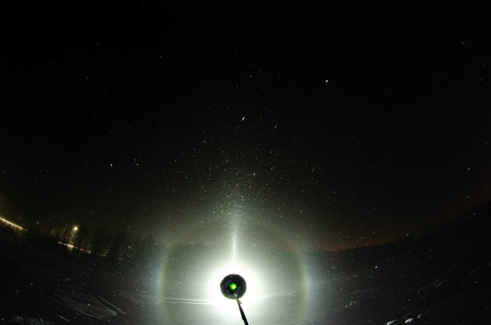

# Thread - 2024-02-09

**Original:** https://x.com/RiikonenMarko/status/1755794047384379834

---

### 1/1 - 2024-02-09 03:21 UTC

Photo of a very basic display on the night of 8/9 February. It is the same place as previous night. I started the night after two hours of sleep around 20. Widespread ice fog, they are still gunning with pressure air despite low temps. Suosiola plume of course also active, but this display is from snow guns. Lowest temp -32 C in this location (which name I still need to check). The display didn't really change that much so at 3 I called it a wrap. Lots of photos to stack. Took also crystal photos.

Little bit of psychedelic colors evident in this photo. I was looking for those colors, but could see only white glints.

---

