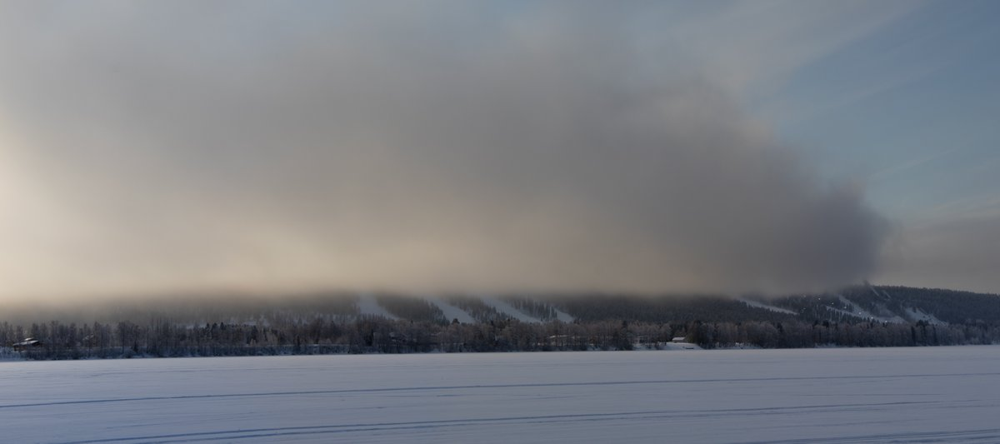
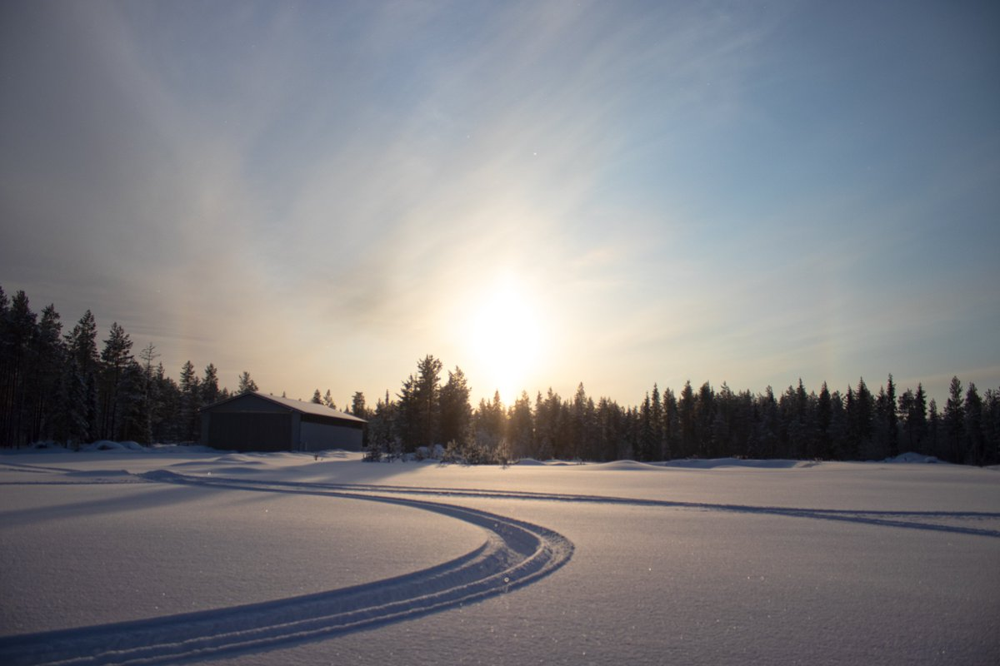
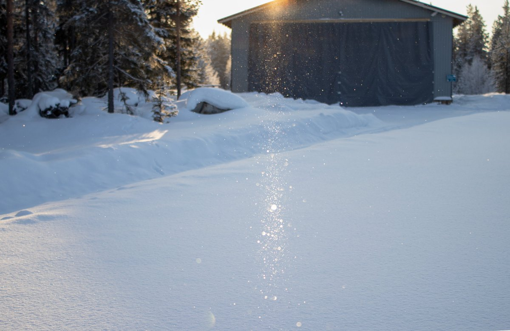

# Thread - 2024-02-10

**Original:** https://x.com/RiikonenMarko/status/1756340946633912754

---

### 1/1 - 2024-02-10 15:34 UTC

Cloudy in the morning but cleared up somewhat at midday, 10 February. A huge cloud from ski center headed east. I followed it. First it was too thick for sun to shine through and when it thinned up, there was not much to see. The subsun image is a max stack of 6 frames.

Quite mild, -20...-18 C in Apukka around midday.

---

