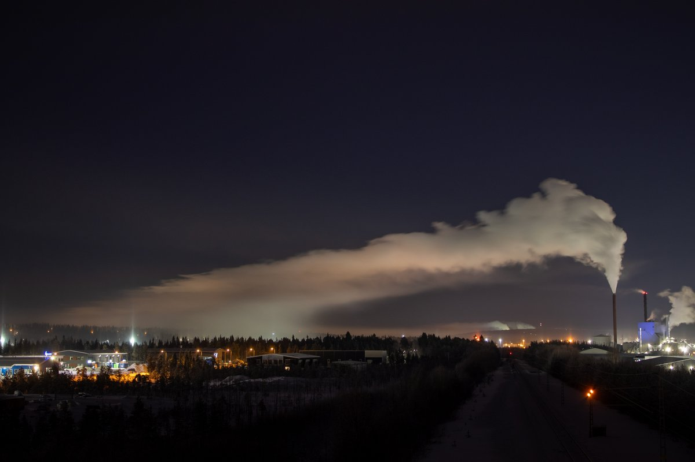
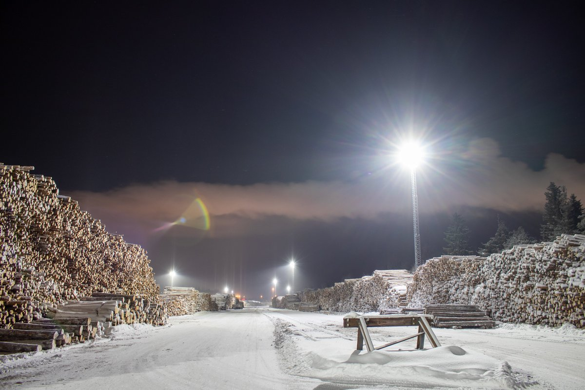
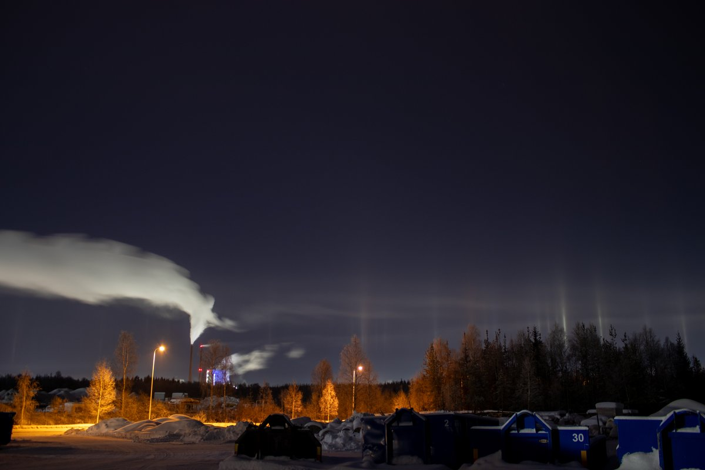
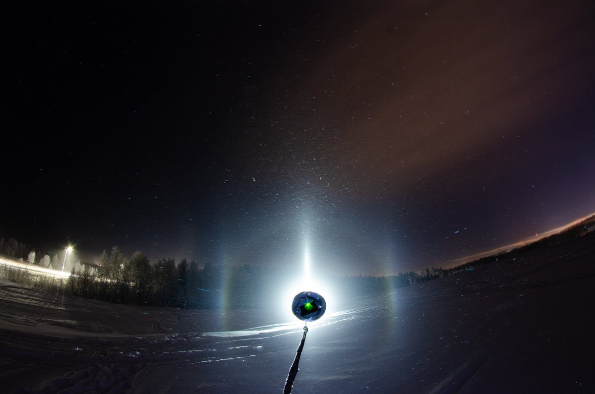

# Thread - 2024-02-10

**Original:** https://x.com/RiikonenMarko/status/1756248282576175545

---

### 1/1 - 2024-02-10 09:26 UTC

Last night's chase was not much to go by. I was just some hours out and around 23 decided it is time to get some sleep. When I parked the car, diamond dust had turned into glittery snowfall.

I just took one stack in the spotlight beam, a single photo is shown here. Then I photographed the Suosiola plume. The shot with logs is where it is dropping its load. Fourth photo shows how at some point a little bit of the plume escapes to an opposite direction, possibly contributing to those pillars together with the feeble plume from the other chimney. I didn't take out the thermometer, but in Apukka the night's mininum -30 C was around the time I started at 19.

---

