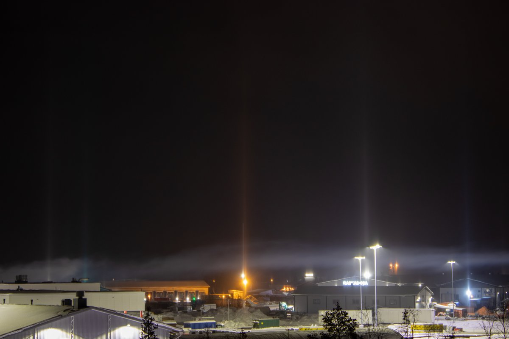
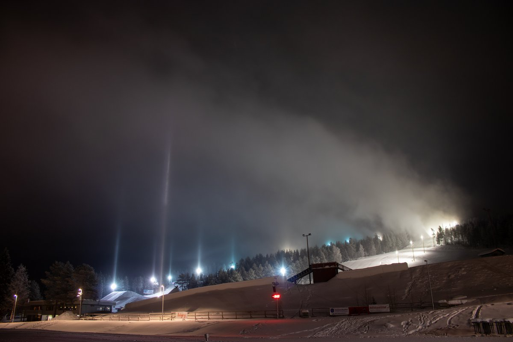
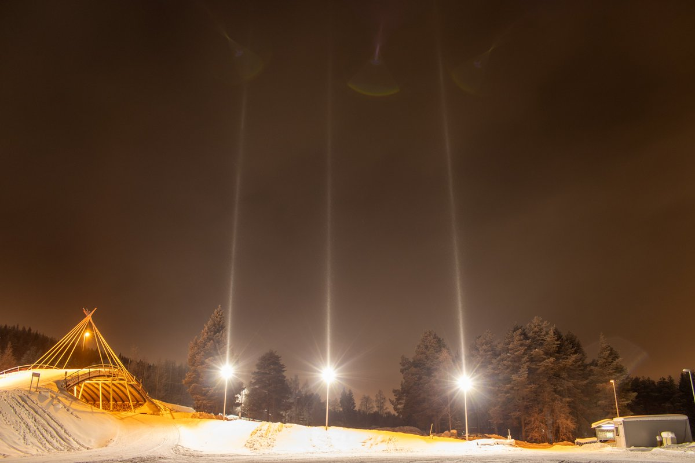

# Thread - 2024-02-10

**Original:** https://x.com/RiikonenMarko/status/1756423371628138930

---

### 1/1 - 2024-02-10 21:02 UTC

Natural snowfall from stratus was making pillars all over Rovaniemi. At the ski center likely also the plume contributed. In the first image a white cloud is seen right above the roofs. This was free-floating, not plume. It passed across the bridge where I was taking photos, giving "industrial" smell. Would have been nice to know its origin.

I did not wait if things get better. They haven't gotten better for several nights and days already.

---

