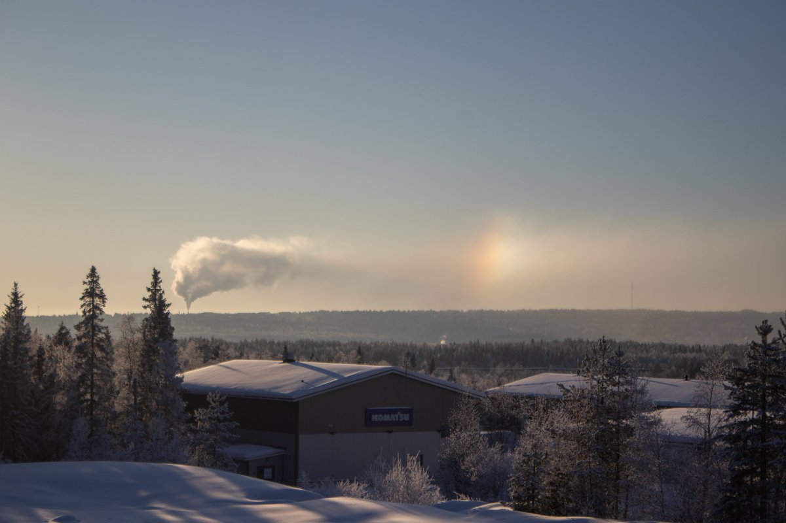
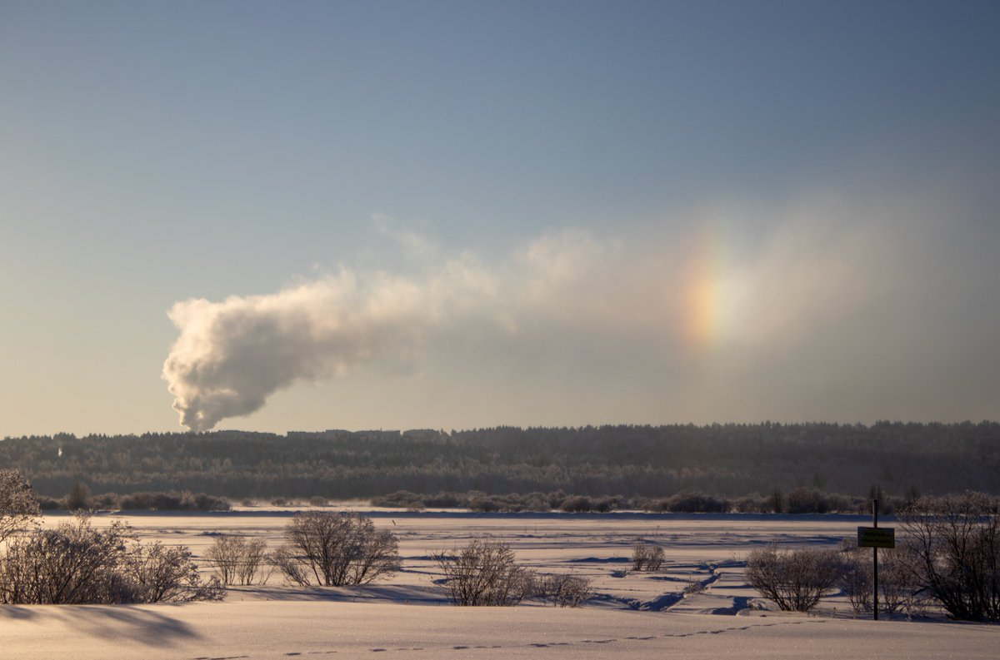
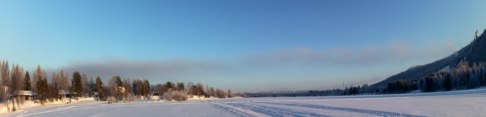

# Thread - 2024-02-11

**Original:** https://x.com/RiikonenMarko/status/1756713621898379704

---

### 1/1 - 2024-02-11 16:15 UTC

The plume theme must of course continue. Today, 11 February, a parhelion caught my attention in the distant Suosiola plant plume upon returning from Santa Claus Village area. The first photo is taken from road Rekkatie, the other closer by to the plume from road Vitikanpääntie.

The poor halo theme also continues. I drove some around, in vain. All today's plumes could offer were parhelia, pillar and 22° halo. But I got nice big plates photographed when the snow gun swarm was pillar only. Not sure if photos are sharp, shutter action jerked the crystals on the dish.

Temp was -29 C when I first started photographing halos and crystals around 1030.

The third photo shows the snow gun plume in the afternoon when sun has already warmed up the air several degrees. Quite innocent looking at the start, but then grows to big dark mass as it heads towards the airport and Santa Claus Village area. I have never seen before snow gun plume reach this elevated area. I told my friend earlier this winter that snow gun plumes never go to high areas in Rovaniemi, but this cold snap has demolished that misconception.

---

