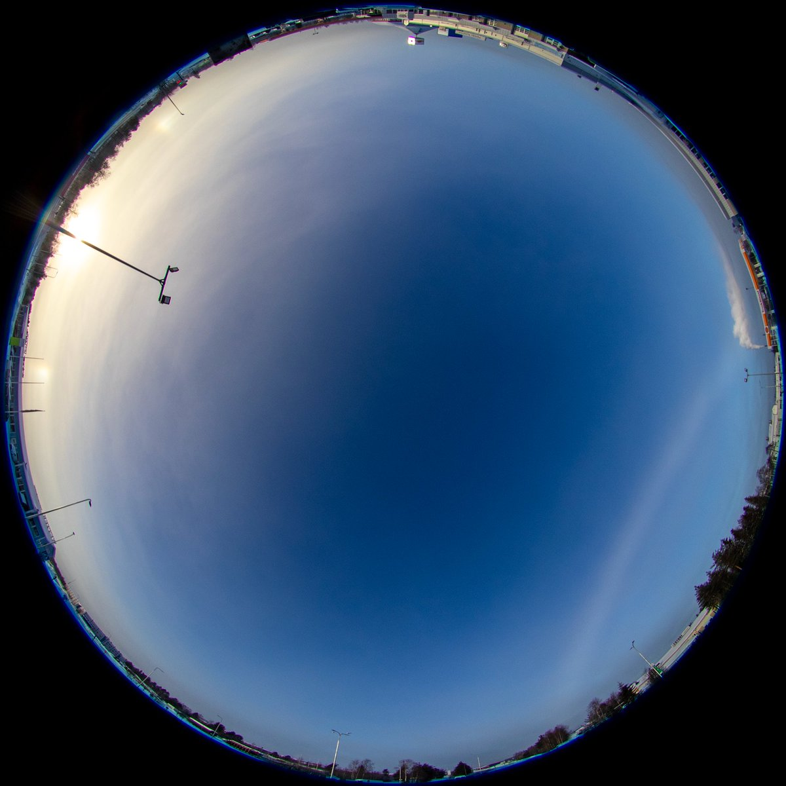
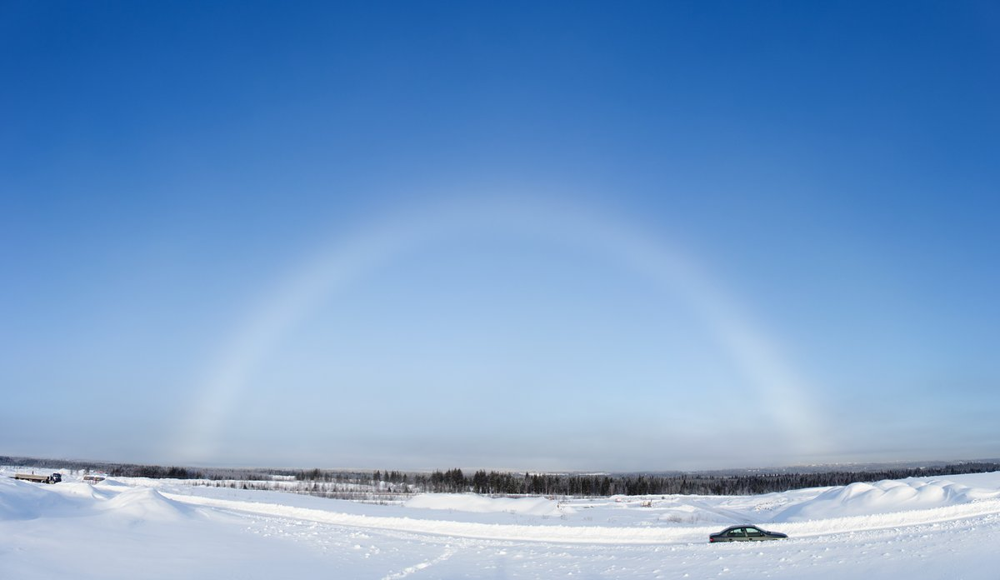
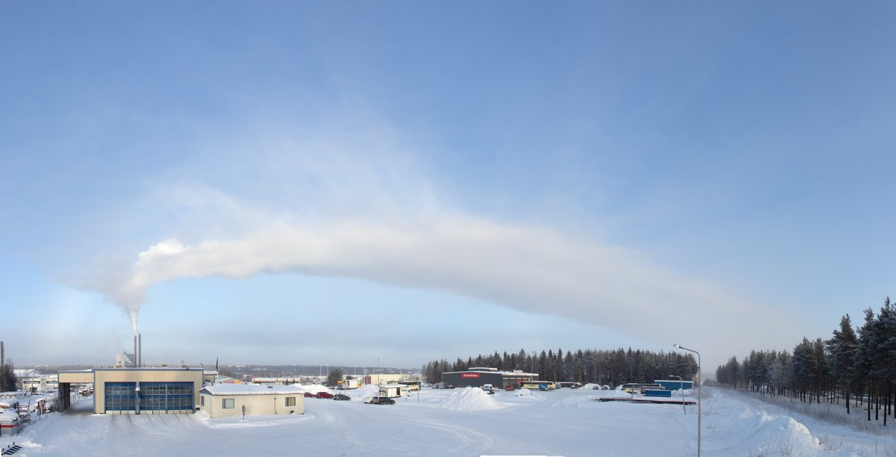

# Thread - 2024-02-12

**Original:** https://x.com/RiikonenMarko/status/1757077905912258637

---

### 1/1 - 2024-02-12 16:23 UTC

Today, 12 February, it was foggy, which gives big displays when warmer than about -12 C. But below -20 C fog just craps everything. Anyway, a "Bouguer's halo" appeared. That's just a term used sometimes for fogbow when it appears with halo(s), here parhelia. At 3 the Suosiola plume is seen. It don't know if the parhelia were from that or from snow guns. The latter enveloped big areas of the city.

The third photo is the Suosiola plume from yet another angle.

---

