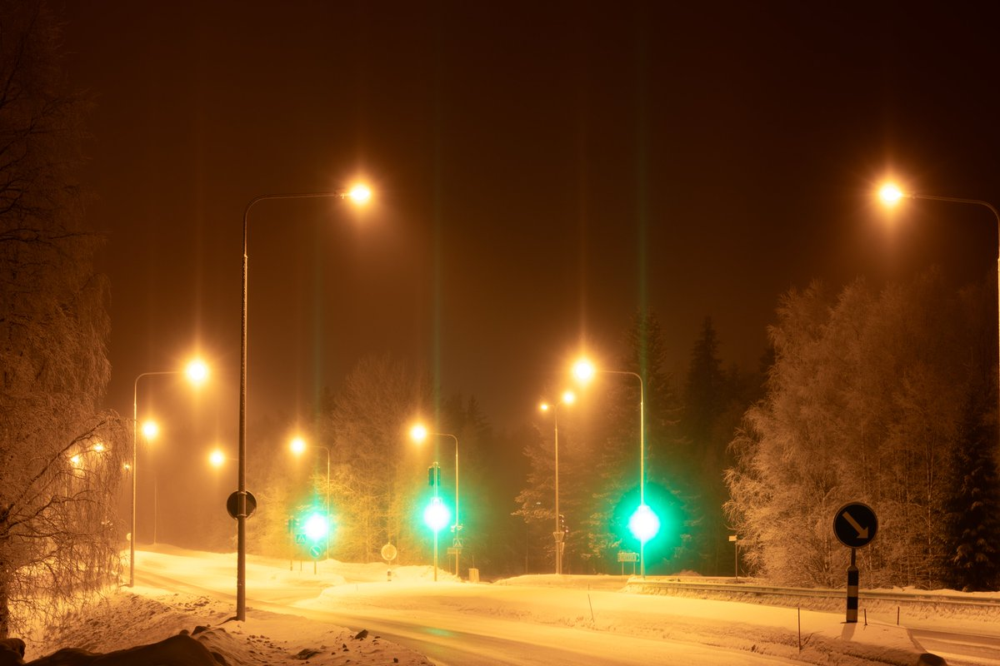
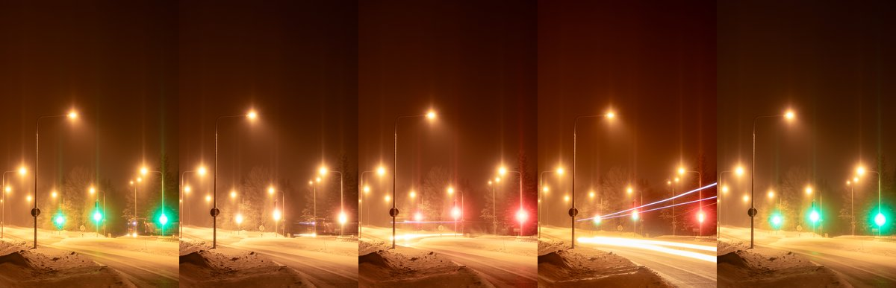
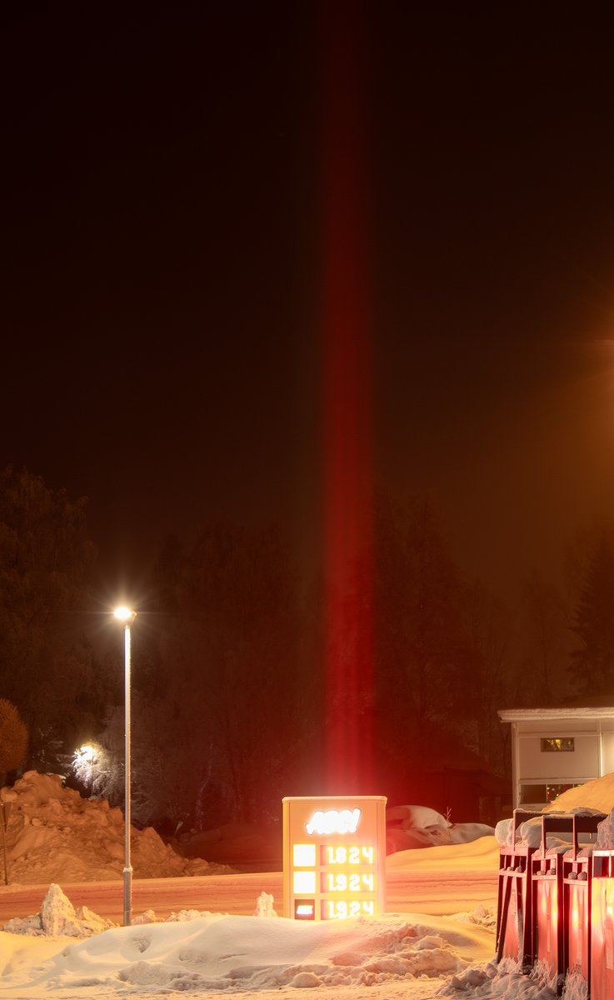

# Thread - 2024-02-12

**Original:** https://x.com/RiikonenMarko/status/1756939099787632934

---

### 1/1 - 2024-02-12 07:11 UTC

Last night I didn't go chasing as my corporeal being said – in no uncertain terms – that now you better rest. That might have finally been the night with proper swarm. That's because it looked like it was mostly clear skies. I think the poor quality of this cold snap is much due to the low thin cloud that has been ever-present, leading to too high saturations and crapping of crystals.

So here as a substitute some photos from 8/9 February night. I have always wanted to do traffic lights. The pillars were only mediocre and the car might have rather turned the other way and some other issues, but it qualifies as a practice run if nothing else.

---

