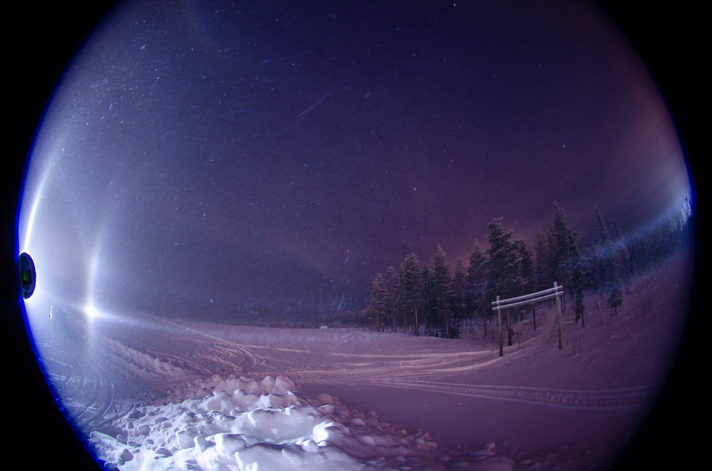
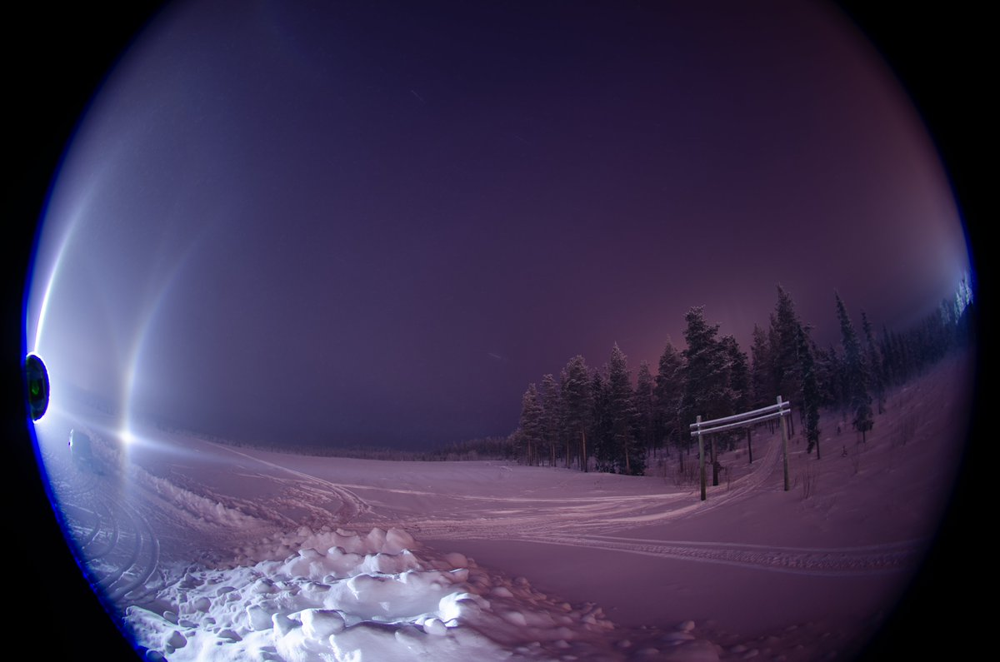
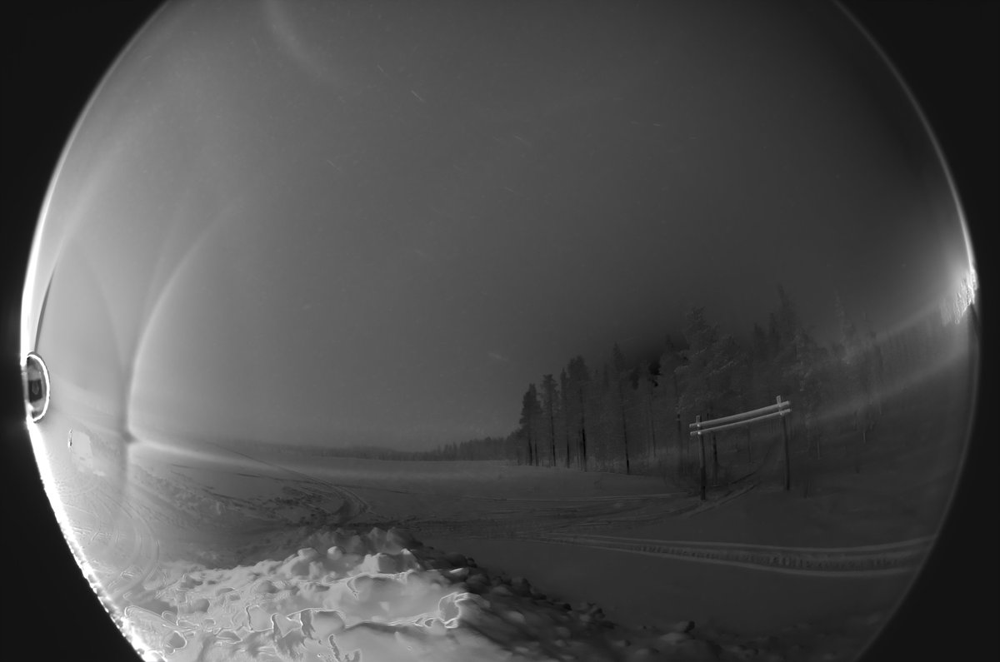
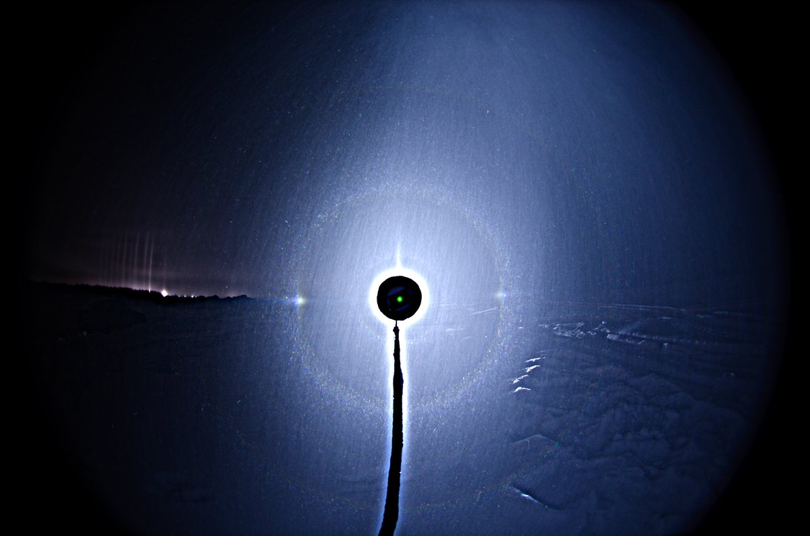
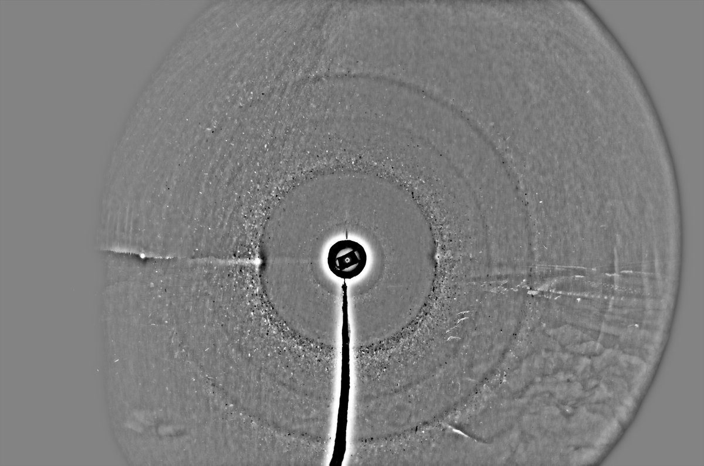

# Thread - 2024-02-15

**Original:** https://x.com/RiikonenMarko/status/1758057297681555763

---

### 1/2 - 2024-02-15 09:14 UTC

Action from the 12/13 February night. Just when I wrote in the previous post that fog below -20 C craps everything, we get this at around -25 C. But you always have the exception and this was one, I still maintain that fog is indeed not good at low temps.

Due to what I had thought as concerning health issues for some days already I just made this short visit and then came back to apartment. Well, I got myself checked and all was fine, after all.

Anyway, back to this display, I saw well defined Liljequist and counter-Liljequist parhelia with the eye, but in the photos they are not so clearly separated from the corresponding parhelic circles. The first image here is a single frame, 30s exposure. It is the first and best photo in the series of 31 photos, which are average stacked in the next two images. There is also counter-Kern faintly and at the counteranthelic point we the diffraction pillar. This "Mikkilä's Soul", as I have heard it also called, is quite common feature, coming and going, never lasting long.

As to the side-view, I have become to view it as the best view. It is best to capture as much of the halo sphere as possible. Besides, often the other side will be more light polluted, like was the case here, so it is not really necessary to include it.

---

### 2/2 - 2024-02-15 09:47 UTC

I started my short visit on 12/13 February night with snow-throw but switched almost immediately to photographing the ice fog display (which is making the parhelia in these images). Anyway, just stacking those 6 usable throw-frames that I got gave this. I need to be doing this more. It probably does not matter much what the air temperature is / has been. But you can't do this on any night, it need to be calm to have some control to make the stuff rain down right on front of the camera.

---

